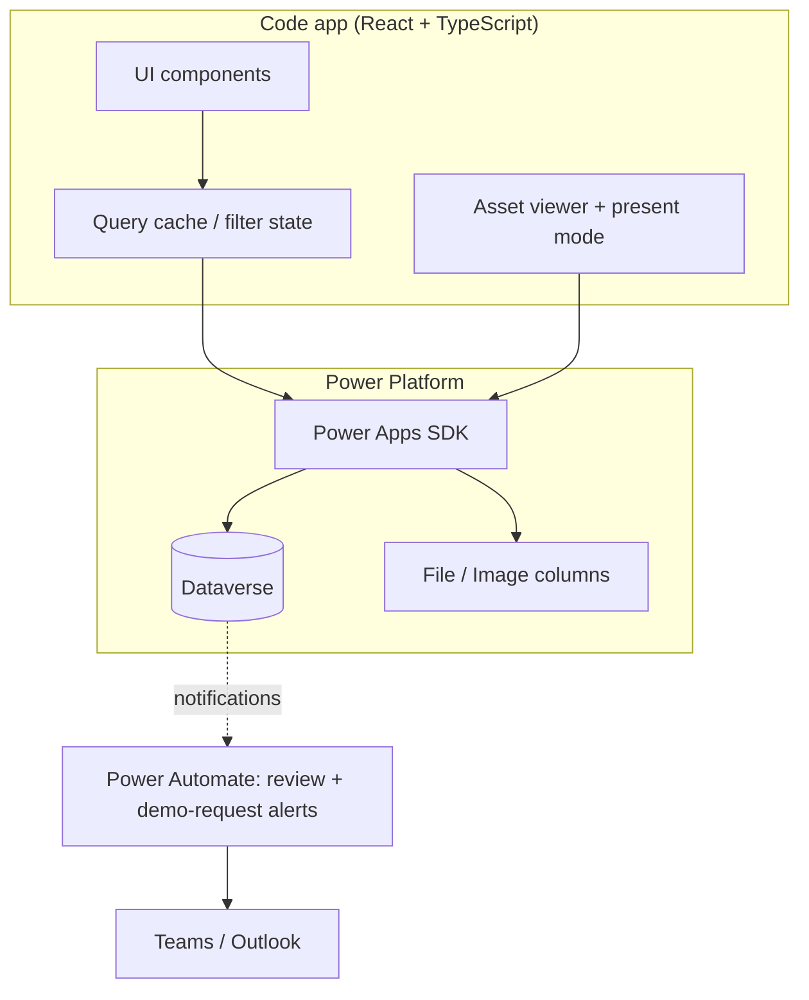

# Technical architecture

**Status:** Draft for review; code-based US calendar policy approved, app alignment pending · **Last updated:** 2026-09-21
**Source:** [End-to-end design §7](../design/end-to-end-design.md#7-technical-architecture)

**Confirmed stack:** Power Platform code app (React + TypeScript) over Dataverse, Microsoft Entra ID SSO, internal Nextant users only, Nextant brand standards.

## System shape

## Key decisions

Each carries an ADR — see [decision records](decisions/README.md).

| Decision | ADR |
|---|---|
| Dataverse is the single source of truth; no separate search index in v1 | [ADR-0001](decisions/adr-0001-dataverse-single-source-of-truth.md) |
| Client-side search over an in-memory published catalogue | [ADR-0002](decisions/adr-0002-client-side-search.md) |
| Hash routing, because a published code app never owns the path segment | [ADR-0003](decisions/adr-0003-hash-routing.md) |
| Assets live in Dataverse File and Image columns — no external blob storage | [ADR-0004](decisions/adr-0004-assets-in-dataverse.md) |
| Present mode is enforced server-side as well as client-side | [ADR-0005](decisions/adr-0005-present-mode-server-side-enforcement.md) |
| Power Automate for notifications only — no business logic in flows | [ADR-0006](decisions/adr-0006-power-automate-notifications-only.md) |
| Contributor-level effort derived from inclusive dates and allocation, excluding observed US federal holidays in code for 2020-2035 without calendar tables | [ADR-0007](decisions/adr-0007-contributor-effort.md) |

## Contributor data

The current [schema](../data_model/SchemaV2.md) contains 11 tables, including the existing, unchanged `cr6b0_project`. `nx_solutioncontributor` carries each builder's dates/allocation and derives Calendar-mode effort from Monday-Friday dates excluding observed US federal holidays calculated in code, with no calendar tables or contributor calendar lookup. The `Solution`↔`cr6b0_project` link is a native N:N relationship — no junction table — connecting reusable offerings to existing delivery evidence without modifying Project columns.

The PoC computes hours in `app/src/lib/effort.ts` from mock rows using its 2026 in-memory US federal holiday calendar. The agreed code-based 2020-2035 policy and removal of calendar IDs are pending app alignment; existing 2026 totals must remain unchanged. Person search is local name/email matching in the submission form, not a live-directory query. Production still requires Dataverse services, child ownership/sharing and validation enforcement; no persistence or deployment is implied by this documentation change.

## Code app constraints

The app stays inside what [code apps support](https://learn.microsoft.com/en-us/power-apps/developer/code-apps/) — see the [app README](../../app/README.md) for the working list. Highlights:

- Single-page app; official `@microsoft/power-apps-vite` plugin; hash routing.
- No `initialize()` (client library v1.0+); only SDK call is `getContext()`.
- No server-side code, SSR, or build-time secrets; relative asset references.
- Nothing sensitive in the bundle — real data comes from Dataverse post-auth.
- Not available in code apps: Power BI `PowerBIIntegration`, SharePoint form integration, Power Platform Git integration.

## Search approach

At expected scale (~40 solutions year one) the published catalogue fits in memory. v1 loads published records once per session and performs search and faceting client-side — instant results, trivial typo-tolerance and multi-field matching, no latency in the hero flow.

**Documented ceiling:** does not scale past a few thousand records. Revisit with Dataverse full-text search or an external index if the catalogue grows an order of magnitude beyond projections. ([ADR-0002](decisions/adr-0002-client-side-search.md))

## Routing map

| Logical route | Hash route (PoC) |
|---|---|
| Home + catalogue (search, tabs, facet rail share the grid) | `#/` |
| Solution detail | `#/s/:id` |
| Full-screen asset viewer | `#/s/:id/demo/:assetId` |
| Guided submission | `#/submit` |
| Present mode | A mode over every route, not a route — keeps its state persistent |
| My submissions / review queue / reference-data admin | Not yet in the PoC |

## Notifications

Power Automate handles review-queue alerts and demo-request handoffs to Teams/Outlook. No business logic lives in flows.
