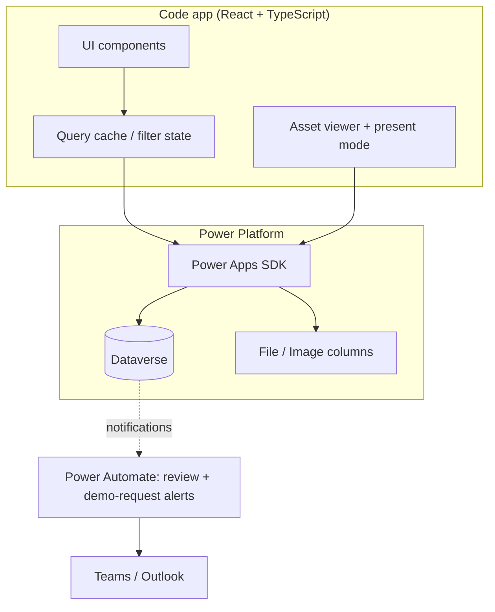

# Technical architecture

**Status:** Connected lifecycle and bounded catalogue hydration verified; URL storage mismatch, browser acceptance and least-privilege gates remain open · **Last updated:** 2026-09-22
**Source:** [End-to-end design §7](../design/end-to-end-design.md#7-technical-architecture)

**Confirmed stack:** Power Platform code app (React + TypeScript) over Dataverse, Microsoft Entra ID SSO, internal Nextant users only, Nextant brand standards.

## Environment and solution

The Power Platform solution **`PRISMA_Dev`** exists in **Nextant Pulse**, environment ID **`ce09ad9b-57d1-e5df-9400-8ce973c86213`** (not Nextant Pulse Prod). In the Power Apps maker portal, select that environment and open **Solutions > PRISMA_Dev**.

This Power Platform solution is distinct from both the published code app **PRISMA PoC** and the catalogue's `nx_solution` records. PAC CLI inspection on 2026-09-21 confirmed unmanaged solution version `1.0.0.1`, solution ID `adddc940-98ff-4b2f-9c8a-e89245c2fc33`, publisher `nx`, customization prefix `nx`, and choice-value prefix `12506`. The Dataverse URL is `https://nextantpulse.crm.dynamics.com/`.

The export includes **PRISMA PoC** (`cr6b0_prismapoc_c440f`, CodeApp type 4); `pac code list` returned only the existing PoC app. Its connection/database references are empty. App IDs, publishing commands and verification status are maintained in the [deployment details](../../app/README.md#poc-deployment). No connected PRISMA app was published during inspection.

### Verified solution inventory

Evidence: `pac solution list`, FetchXML queries through `pac env fetch`, and an unmanaged `pac solution export` inspected as XML. The following is the initial read-only snapshot from 2026-09-21, before the approved core-draft deployment below; its zero counts and absent components are historical. The temporary export includes the PoC package and is not a schema-only artifact to commit.

| Live logical table | Rows visible to inspection caller | UI mapping / integration note |
|---|---:|---|
| `nx_solution` | 0 | Core catalogue; `nx_solutionname`, `nx_onelinesummary`, `nx_whatitdoes`, `nx_businessvalue`, `nx_usecase`; specialization and capability are lookups, not string enums/N:N capability tags |
| `nx_solutioncontributor` | 0 | `nx_builtby` references `cr6b0_consultant`; direct/calendar effort fields; no calendar lookup |
| `nx_solutionimage` | 0 | Gallery image column `nx_imagefile`, caption and sort order |
| `nx_demoasset` | 0 | File column `nx_filemedia`, asset choice, external URL and embedding fields; name column is `nx_demoassetid1` |
| `nx_demorequest` | 1 | Requester references Consultant; do not delete or replace the existing row when seeding |
| `nx_specializationarea` | 3 | Resolve Dataverse IDs to UI area keys explicitly |
| `nx_capability` | 2 | Single capability lookup per Solution |
| `nx_technology` | 8 | Native N:N with Solution |
| `nx_industry` | 4 | Native N:N with Solution |
| `cr6b0_consultant` | Not queried | Reused people directory; fetch only name/email/ID and agreed eligibility fields |
| `cr6b0_project` | Not queried | Reused delivery evidence; native N:N with Solution; preserve existing security and schema |

The export has 11 table definitions; the solution-component query reports 14 Entity components, including relationship infrastructure. Native N:N definitions include `nx_Solution_nx_Technology_nx_Technology`, `nx_Solution_nx_Industry_nx_Industry` and `nx_Solution_cr6b0_Project_cr6b0_Project`. Do not implement the PoC's historical `nx_solutionproject` junction model.

The **PRISMA Librarian** field-security profile grants read/create/update for `nx_publicationstatus`, `nx_clientsafereviewed` and `nx_librarynote`. This is not a table security role or proof of user membership. Review Outcome/Comments are present in the schema but absent from that profile's exported permissions. No security-role, plug-in or Custom API components were found in this solution. The export also carries two existing Project business rules, not PRISMA transition handlers. Environment-wide components and effective permissions require separate verification; absence from this solution is not proof of absence from the environment.

### Live-schema gaps to resolve

- All 11 exported tables are **UserOwned**, including the four reference tables and Consultant. The design's organization-owned assumption is not the deployed model. Prefer explicit organization-level reference Read privileges with controlled writes; do not recreate tables or change existing Consultant/Project security without approval.
- Review Outcome/Comments were unsecured in the initial inventory. The approved core-draft deployment secured both and created unassigned read profiles; effective non-admin permissions remain unverified. Publication status, clearance and Library Notes were already secured.
- Capability was ApplicationRequired; deployment made it optional for Draft. Submit/approve enforce completeness. Product limits are name 100; summary/use case/internal and redacted context 200; what-it-does/business-value 4000. Live name metadata remains 850. Generated max lengths are not product limits.
- Publication and maturity choices have no configured default (`AppDefaultValue=-1`); creation must supply the agreed state. Publication values are Published `125060000`, Retired `125060001`, Pending review `125060002`, Draft `125060003`. Maturity values are Live in production `125060000`, Idea / concept `125060001`, Client demo `125060002`, Retired `125060003`, Working prototype `125060004`.
- Child-to-parent relationships currently use `NoCascade` for Assign/Share/Unshare and `RemoveLink` for Delete. A parent lookup does not propagate access or guarantee child cleanup. Define and enforce ownership, sharing/revocation and deletion for every child and file.

Track decisions and required owners in the [decision log](../delivery/decision-log.md). These observations do not authorize changes to shared environment security or destructive table recreation.

## Connected-app integration plan

Keep **PRISMA PoC** as the live UI test app. Create **PRISMA** with a separate configuration and eventual app ID in the same environment. Separate app IDs isolate deployments, not Dataverse security or environments. Never copy the PoC app ID into the new target or add live data sources to the PoC configuration.

**Connected slice (2026-09-22):** [app/connected/power.config.json](../../app/connected/power.config.json) registers the 11 business tables and generated controlled APIs, with no app ID or publication. The private upload table is not a client data source. Reads paginate and fail closed. Present mode remounts, server-filters eligibility, omits internal fields/projects/individual effort, blocks contribution/review routes and discards late results. Graph editing, mediated media, submission/review controls and published detail/viewer are implemented; notifications are not.

The frontend baseline has 16 PoC, 34 connected and 8 rendered UI checks; the latest backend lifecycle fix passes 40 server tests. Shared views preserve PoC interactions without mock persistence. Local Play verified saves, protected media, captions, linked assets, return/resubmit/approval, a published catalogue/detail/HTML viewer and present-mode redaction. Explicit reader-team parent/child shares changed from Read to zero on withdrawal; the disposable fixture and children were deleted. See [lifecycle evidence](../workflows/contribution-and-review.md#verified-lifecycle). These privileged-owner/Librarian checks do not establish effective non-admin access, cross-account review or revocation denial. Populated-catalogue performance, document delivery, external launches, retirement and hosted acceptance remain open. Neither app was published.

### Deployed core draft backend

Latest single-account evidence and limits are in the [eight-area acceptance results](../workflows/contribution-and-review.md#eight-area-acceptance-pass). Catalogue hydration now uses batches of four solutions, each reading independent tags/credits in parallel, with ordering and batch-failure cancellation tests. Twelve records retain 39 requests but measured 7,992ms before and 1,518ms after; this is a local single-run comparison, not an SLA. Current suites are 16 PoC, 38 connected, 9 rendered UI and 41 backend tests. `inspect-asset-columns` on Prisma.Deploy is read-only and compares published/editable metadata. It found 4000-character URL metadata despite repeated physical `nx_ExternalURL` truncation for a 163-character approved URL. No schema fix or deployment was attempted in this acceptance pass.

User-approved scope: retain the existing tables and PoC; add PRISMA-only components and protections; use labelled non-sensitive test drafts; do not assign users or publish the app. [Prisma.Plugins](../../backend/Prisma.Plugins/DraftApi.cs) provides `nx_SaveCoreDraft` and `nx_GetMyCoreDrafts`, both verified as components of `PRISMA_Dev`. Save uses the authenticated initiating caller for ordinary writes, checks ownership/Draft state and an exact string row version, performs an optimistic-concurrency update, then narrowly elevates only to set Draft and clear clearance in the same transaction. It rejects owner/protected/unsupported payload fields. List returns only the caller's active Draft records with paging and string row versions.

Synchronous guards reject direct Solution Create/Update outside controlled APIs and reject Delete/Assign/SetState. Scoped guards also protect contributor rows, the three native N:N relationships, media metadata and upload sessions. `nx_TransitionSubmission` now mediates owner deletion in every state and Draft-only caption/order edits and technology creation/reuse, with exact-version checks and no new API/schema generation. Native file messages cannot be guarded directly; [ADR-0009](decisions/adr-0009-mediated-media-and-publication-access.md) specifies private staging and read-only media access. The existing Librarian profile and Consultant/Project security/data were preserved.

Additional APIs: `nx_GetDraftGraph`, `nx_SaveDraftGraph`, `nx_GetDraftMedia`, `nx_BeginMediaUpload`, `nx_UploadMediaBlock`, `nx_FinishMediaUpload`, `nx_RemoveDraftMedia`, `nx_GetSubmissions`, `nx_GetSubmission`, `nx_TransitionSubmission`, `nx_GetPublishedDetail`. Review requires the explicit PRISMA Librarian role. Approval requires independent safety confirmation and complete stored graph/files. Publication sharing/revocation is transactional with state; file bytes are not.

The approved linked-asset assembly update adds `nx_TransitionSubmission` action `asset` for Draft-only hosted URL, Power Apps, Power BI and desktop-guidance create/edit. It reuses existing asset fields and completed zero-byte private lifecycle records, with no schema, API registration or permission changes. Returned media includes a validated optional `linkedAsset` object; clients never attempt file downloads for those records. Existing sharing/revocation/deletion paths cover their protected rows, not access to external applications. See [ADR-0009](decisions/adr-0009-mediated-media-and-publication-access.md) for the contract, deployment evidence and unverified acceptance gates.

The [deployment utility](../../backend/Prisma.Deploy/Program.cs) checks the organization ID before operating. `inspect` is read-only; `apply` changes remote components and is not transactional across registration steps; `smoke` creates and retains a labelled draft. Run only with explicit deployment authorization. Use the .NET DLL host if Windows blocks the generated executable:

`assign-acceptance` is a read-only preview of the four specifically approved pilot accounts and existing roles/profiles/readers team. `assign-acceptance --execute` applies only missing associations in one transaction, then verifies required membership and preservation of preexisting associations. It does not call `apply` or change role definitions, schema, plugin registration or app publication. The 2026-09-22 user-approved run added eight associations; repeat preview found zero missing. Account mapping and privilege limitations are recorded in the [security model](security-model.md#approved-pilot-assignments). Future use still requires explicit approval of the exact assignments.

```powershell
dotnet test backend/Prisma.Plugins.Tests/Prisma.Plugins.Tests.csproj --configuration Release
dotnet build backend/Prisma.Deploy/Prisma.Deploy.csproj --configuration Release
dotnet backend/Prisma.Deploy/bin/Release/net10.0/Prisma.Deploy.dll inspect
```

The SDK utility also supports `smoke-graph`, `smoke-media` and `smoke-review` against labelled test data. Graph smoke replaces the test graph; media smoke creates/removes temporary file/image rows; review smoke submits and withdraws without publication. Three labelled drafts are retained; browser fixture `595ea718-1cb6-f111-aaac-6045bd049fba` has one contributor and two non-sensitive media files. Checks used the privileged owner. The capability-probe API was removed after verification.

`smoke-delete` creates and removes its own disposable parent/children/media/sessions and test-created technology. It verifies technology reuse, thumbnail/caption operations, direct/stale rejection and preservation of preexisting shared references. The deployed assembly passed this check; browser-created temporary technology and deletion fixtures were also removed, leaving the three original drafts.

1. **Isolate the app target.** Reuse the existing React views/design tokens through a shared source boundary. Give the connected target its own Power Apps configuration, generated services, entry point and output. Preserve existing PoC commands and browser storage. Confirm both builds and ensure the connected bundle excludes the mock catalogue and IndexedDB submission adapter.
2. **Generate and verify contracts.** Generate Dataverse models/services from live metadata in the new target. Map real logical names, GUIDs, choice integers, lookup navigation names and native N:N relationships to the UI model. Unknown choices must fail explicitly, not silently use a default. Paginate reads; use explicit column selections; handle permission failures distinctly from empty results. Update the mock-era project assumptions without copying their persistence model; the business-day policy is already code-based and has no persistence model to copy.
3. **Close backend security gaps before writes.** Verify ownership types, effective roles and field permissions. Implement published-row/child sharing and revocation; Dataverse roles do not express a predicate such as 'Published only'. Protect review fields and internal notes while allowing authorized contributors to read their feedback. Confirm a least-privilege librarian identity and a contributor/CSM test identity; builder credit is not record ownership.
4. **Implement controlled writes.** Deliver the synchronous Custom APIs and direct-write/child/media guards specified in [ADR-0008](decisions/adr-0008-controlled-submission-transitions.md). Save incomplete named drafts, submit, return, approve and invalidate approval on material edits. Use caller identity and expected row versions, not browser email keys or client approval flags. Define authorized deletion and child cleanup explicitly. Enforce US holidays for 2020-2035 on the server as well as the client.
5. **Connect the complete UI.** Load catalogue/reference data; hydrate authorized contributors, tags, media and internal delivery context. Connect own submissions and librarian review to authorized services. Stage images/files while Draft; report failed/partial uploads and clean up safely. Replace Data URLs with authenticated downloads/object URLs and revoke them. Keep user HTML sandboxed. No mock fallback, no local-only successful saves, and no assumption that Consultant IDs are systemuser IDs.
6. **Verify and publish only the new app.** Test save/reload from another session, incomplete drafts, media round-trips, submit/return/resubmit/approve, edit withdrawal, permission denials, direct-write bypass attempts, stale-version conflicts, child access and deletion. Verify present-mode server filters and projection, with no transient internal data on mode changes. Test with non-admin identities and approved non-sensitive fixtures. Then build, publish PRISMA, add/verify its solution membership, configure sharing, and run the authenticated hosted smoke test. Full read/write is the chosen first-release gate; do not publish a read-only placeholder.

Reference-data counts do not prove vocabulary completeness. Review the two live capabilities against the submission UI before any seed migration. Do not seed the mock catalogue automatically or modify existing Consultant/Project records. File/image operations and invocation of the controlled APIs through the installed SDK must be proven in Local Play before selecting the final client transport. The current Microsoft SDK documents generated file/image helpers as preview; verify the installed generator rather than assuming those helpers exist.

## System shape



## Key decisions

Each carries an ADR — see [decision records](decisions/README.md).

| Decision | ADR |
|---|---|
| Dataverse is the single source of truth; no separate search index in v1 | [ADR-0001](decisions/adr-0001-dataverse-single-source-of-truth.md) |
| Client-side search over an in-memory published catalogue | [ADR-0002](decisions/adr-0002-client-side-search.md) |
| Hash routing, because a published code app never owns the path segment | [ADR-0003](decisions/adr-0003-hash-routing.md) |
| Assets live in Dataverse File and Image columns — no external blob storage | [ADR-0004](decisions/adr-0004-assets-in-dataverse.md) |
| Present mode is enforced server-side as well as client-side | [ADR-0005](decisions/adr-0005-present-mode-server-side-enforcement.md) |
| Power Automate for notifications only — no business logic in flows | [ADR-0006](decisions/adr-0006-power-automate-notifications-only.md) |
| Contributor-level effort derived from inclusive dates and allocation, excluding observed US federal holidays in code for 2020-2035 without calendar tables | [ADR-0007](decisions/adr-0007-contributor-effort.md) |

## Contributor data

The current [schema](../data_model/SchemaV2.md) contains 12 tables after the private upload-session extension. `nx_solutioncontributor` carries dates/allocation, enforces one row per person through the `nx_solutioncontributorkey` alternate key, and derives calendar effort from weekdays minus observed US federal holidays computed in code, without calendar tables. The native Solution-to-Project N:N links existing delivery evidence without changing Project columns/security. The original 11 tables remain UserOwned; the new upload-session table is organization-owned.

Effort hours are computed in `app/src/lib/effort.ts`. The connected app derives the observed-holiday set for 2020-2035 in code via `usBusinessCalendar(2020, 2035)`; the look-and-feel PoC still uses its hardcoded 2026 list for illustrative totals, which is a PoC data detail rather than a schema or policy gap. Person search is local name/email matching in the submission form, not a live-directory query. Production still requires Dataverse services, child ownership/sharing and validation enforcement; no persistence or deployment is implied by this documentation change.

## Code app constraints

The app stays inside what [code apps support](https://learn.microsoft.com/en-us/power-apps/developer/code-apps/) — see the [app README](../../app/README.md) for the working list. Highlights:

- Single-page app; official `@microsoft/power-apps-vite` plugin; hash routing.
- No `initialize()` (client library v1.0+); `getContext()` provides identity and generated SDK services perform connected data operations.
- No server-side code, SSR, or build-time secrets; relative asset references.
- Nothing sensitive in the bundle — real data comes from Dataverse post-auth.
- Not available in code apps: Power BI `PowerBIIntegration`, SharePoint form integration, Power Platform Git integration.

## Search approach

At expected scale (~40 solutions year one) the published catalogue fits in memory. v1 loads published records once per session and performs search and faceting client-side — instant results, trivial typo-tolerance and multi-field matching, no latency in the hero flow.

**Documented ceiling:** does not scale past a few thousand records. Revisit with Dataverse full-text search or an external index if the catalogue grows an order of magnitude beyond projections. ([ADR-0002](decisions/adr-0002-client-side-search.md))

## Routing map

| Logical route | Hash route (PoC) |
|---|---|
| Home + catalogue (search, tabs, facet rail share the grid) | `#/` |
| Solution detail | `#/s/:id` |
| Full-screen asset viewer | `#/s/:id/demo/:assetId` |
| Guided submission | `#/submit` |
| Present mode | A mode over every route, not a route — keeps its state persistent |
| My submissions / edit | `#/my-submissions` / `#/submit/:id` (browser-local) |
| Review queue / record / asset | `#/review` / `#/review/:id` / `#/review/:id/demo/:assetId` (simulated librarian access) |
| Reference-data admin | Not yet in the PoC |

## Submission transitions

The PoC uses IndexedDB and does not enforce production roles or concurrency. Connected controlled operations are deployed under [ADR-0008](decisions/adr-0008-controlled-submission-transitions.md) and [ADR-0009](decisions/adr-0009-mediated-media-and-publication-access.md). Connected routes include `#/submit?draft=:id`, `#/my-submissions`, `#/submission/:id`, `#/review` and `#/review/:id`; review media previews are embedded. Published viewer routes remain `#/s/:id/demo/:assetId`. Trusted handlers run only in Dataverse.

## Notifications

Power Automate handles review-queue alerts and demo-request handoffs to Teams/Outlook. No business logic lives in flows.
