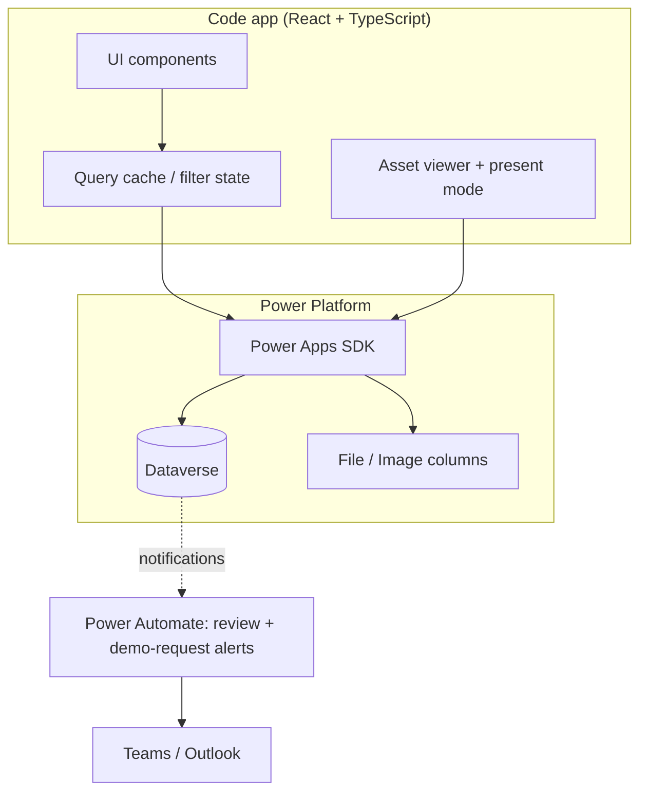

# Technical architecture

**Status:** Living; all six local media-preparation items completed, including offline byte verification/checkpoint recovery/rollback reports and compiled private-storage infrastructure templates; local HTML/document/MP4 Edge acceptance passed; a development-only Azure lab storage account now backs the workbench on request; production remains on Dataverse and Azure Blob Storage transition is still proposed; hosted/browser-matrix, production cloud deployment and least-privilege acceptance remain open · **Last updated:** 2026-09-29
**Source:** [End-to-end design §7](../design/end-to-end-design.md#7-technical-architecture)

**Confirmed stack:** Power Platform code app (React + TypeScript) over Dataverse, Microsoft Entra ID SSO, internal Nextant users only, Nextant brand standards.

## Environment and solution

The Power Platform solution **`PRISMA_Dev`** exists in **Nextant Pulse**, environment ID **`ce09ad9b-57d1-e5df-9400-8ce973c86213`** (not Nextant Pulse Prod). In the Power Apps maker portal, select that environment and open **Solutions > PRISMA_Dev**.

This Power Platform solution is distinct from both the published code app **PRISMA PoC** and the catalogue's `nx_solution` records. PAC CLI inspection on 2026-09-21 confirmed unmanaged solution version `1.0.0.1`, solution ID `adddc940-98ff-4b2f-9c8a-e89245c2fc33`, publisher `nx`, customization prefix `nx`, and choice-value prefix `12506`. The Dataverse URL is `https://nextantpulse.crm.dynamics.com/`.

The export includes **PRISMA PoC** (`cr6b0_prismapoc_c440f`, CodeApp type 4); `pac code list` returned only the existing PoC app. Its connection/database references are empty. App IDs, publishing commands and verification status are maintained in the [deployment details](../../app/README.md#poc-deployment). No connected PRISMA app was published during inspection.

### Verified solution inventory

Evidence: `pac solution list`, FetchXML queries through `pac env fetch`, and an unmanaged `pac solution export` inspected as XML. The following is the initial read-only snapshot from 2026-09-21, before the approved core-draft deployment below; its zero counts and absent components are historical. The temporary export includes the PoC package and is not a schema-only artifact to commit.

| Live logical table | Rows visible to inspection caller | UI mapping / integration note |
|---|---:|---|
| `nx_solution` | 0 | Core catalogue; current narrative columns are `nx_solutionname`, `nx_onelinesummary`, `nx_whatitdoes`, `nx_businessvalue`; specialization and capability are lookups, not string enums/N:N capability tags |
| `nx_solutioncontributor` | 0 | `nx_builtby` references `cr6b0_consultant`; direct/calendar effort fields; no calendar lookup |
| `nx_solutionimage` | 0 | Gallery image column `nx_imagefile`, caption and sort order |
| `nx_demoasset` | 0 | File column `nx_filemedia`, asset choice, external URL and embedding fields; name column is `nx_demoassetid1` |
| `nx_demorequest` | 1 | Requester references Consultant; do not delete or replace the existing row when seeding |
| `nx_specializationarea` | 3 | Resolve Dataverse IDs to UI area keys explicitly |
| `nx_capability` | 2 | Single capability lookup per Solution |
| `nx_technology` | 8 | Native N:N with Solution |
| `nx_industry` | 4 | Native N:N with Solution |
| `cr6b0_consultant` | Not queried | Reused people directory; fetch only name/email/ID and agreed eligibility fields |
| `cr6b0_project` | Not queried | Reused delivery evidence; native N:N with Solution; preserve existing security and schema |

The export has 11 table definitions; the solution-component query reports 14 Entity components, including relationship infrastructure. Native N:N definitions include `nx_Solution_nx_Technology_nx_Technology`, `nx_Solution_nx_Industry_nx_Industry` and `nx_Solution_cr6b0_Project_cr6b0_Project`. Do not implement the PoC's historical `nx_solutionproject` junction model.

The **PRISMA Librarian** field-security profile grants read/create/update for `nx_publicationstatus`, `nx_clientsafereviewed` and `nx_librarynote`. This is not a table security role or proof of user membership. Review Outcome/Comments are present in the schema but absent from that profile's exported permissions. No security-role, plug-in or Custom API components were found in this solution. The export also carries two existing Project business rules, not PRISMA transition handlers. Environment-wide components and effective permissions require separate verification; absence from this solution is not proof of absence from the environment.

### Live-schema gaps to resolve

- All 11 exported tables are **UserOwned**, including the four reference tables and Consultant. The design's organization-owned assumption is not the deployed model. Prefer explicit organization-level reference Read privileges with controlled writes; do not recreate tables or change existing Consultant/Project security without approval.
- Review Outcome/Comments were unsecured in the initial inventory. The approved core-draft deployment secured both and created unassigned read profiles; effective non-admin permissions remain unverified. Publication status, clearance and Library Notes were already secured.
- Capability was ApplicationRequired; deployment made it optional for Draft. Submit/approve enforce completeness. Product limits are name 100; summary/internal and redacted context 200; what-it-does/business-value 4000. Live name metadata remains 850. Generated max lengths are not product limits.
- Publication and maturity choices have no configured default (`AppDefaultValue=-1`); creation must supply the agreed state. Publication values are Published `125060000`, Retired `125060001`, Pending review `125060002`, Draft `125060003`. Maturity values are Live in production `125060000`, Idea / concept `125060001`, Client demo `125060002`, Retired `125060003`, Working prototype `125060004`.
- Child-to-parent relationships currently use `NoCascade` for Assign/Share/Unshare and `RemoveLink` for Delete. A parent lookup does not propagate access or guarantee child cleanup. Define and enforce ownership, sharing/revocation and deletion for every child and file.

Track decisions and required owners in the [decision log](../delivery/decision-log.md). These observations do not authorize changes to shared environment security or destructive table recreation.

### Story-column retirement

The approved 2026-09-22 model retains only What It Does and Business Value in the story section. The app, search, draft/recovery contracts, plug-in responses and generated schema no longer reference the retired column. Older recovery payloads discard it rather than restoring it.

Live preflight found one populated value and one isolated row on the Solution Information form. The user approved publishing the current connected app (including existing profile-photo changes), updating the existing plug-in, removing that form row and permanently deleting the column. All steps completed in Nextant Pulse; repeated metadata reads confirm absence in published/editable definitions, and form readback retains every other control. Hosted creation/save/reopen of both narrative values passed; disposable draft `ca8e071a-c2b6-f111-aaac-6045bd049fba` was deleted. Existing published search/detail, present-mode redaction, images/fonts and interactive HTML passed. Package and test results are recorded in the [deployment record](../../app/README.md#pilot-deployment-2026-09-22).

`Prisma.Deploy remove-story-field` is read-only by default; `--execute` checks the organization, exact column/form IDs, editable XML and dependencies, publishes only `nx_solution`, and verifies absence in published/editable metadata. It refuses unrelated dependencies or more populated records than approved; subsequent previews are no-ops. Other columns, existing records, roles, CSP and the PoC deployment are unchanged. Existing app tabs must refresh after rollout. The earlier hosted lifecycle narrative revision was in the now-retired field; that historical check does not imply its value was migrated into either remaining narrative.

## Connected-app integration plan

Keep **PRISMA PoC** as the live UI test app. Create **PRISMA** with a separate configuration and eventual app ID in the same environment. Separate app IDs isolate deployments, not Dataverse security or environments. Never copy the PoC app ID into the new target or add live data sources to the PoC configuration.

**Connected slice (2026-09-22):** [app/connected/power.config.json](../../app/connected/power.config.json) registers the 11 business tables and generated controlled APIs, with no app ID or publication. The private upload table is not a client data source. Reads paginate and fail closed. Present mode remounts, server-filters eligibility, omits internal fields/projects/individual effort, blocks contribution/review routes and discards late results. Graph editing, mediated media, submission/review controls and published detail/viewer are implemented; notifications are not.

The frontend baseline has 16 PoC, 34 connected and 8 rendered UI checks; the latest backend lifecycle fix passes 40 server tests. Shared views preserve PoC interactions without mock persistence. Local Play verified saves, protected media, captions, linked assets, return/resubmit/approval, a published catalogue/detail/HTML viewer and present-mode redaction. Explicit reader-team parent/child shares changed from Read to zero on withdrawal; the disposable fixture and children were deleted. See [lifecycle evidence](../workflows/contribution-and-review.md#verified-lifecycle). These privileged-owner/Librarian checks do not establish effective non-admin access, cross-account review or revocation denial. Populated-catalogue performance, document delivery, external launches, retirement and hosted acceptance remain open. Neither app was published.

### Deployed core draft backend

### URL storage repair

On 2026-09-22, controlled create/readback probes established a 100-character effective boundary on `nx_demoasset.nx_externalurl`: 99/100 saved exactly, while 101/163/500/2000 failed with SQL truncation `0x80090429`. Both published and editable metadata reported MaxLength=4000 for attribute `16b74fe9-2575-4897-a3ca-bdd6cebc26cd`. The plug-in preserved input unchanged; the fault was a Dataverse storage/metadata inconsistency, not client shortening.

The user separately approved two scoped operations. Reapplying the unchanged 4000 definition and publishing `nx_demoasset` did not resolve it. A guarded metadata change 4000 -> 3999 -> 4000, restoring 4000 before table publication, did. Preflight paged all existing assets: one row, no stored URL, so no existing value exceeded the temporary limit. The utility attempts restoration in `finally` and stops on unexpected metadata or any stored URL above 3999. Table publication may include other pending customizations on that table; this was disclosed and approved. No URL row values were truncated, no roles changed, and no code app or plug-in assembly was uploaded.

Afterward, protected writes and independent readback preserved 101- and 2000-character URLs and the original MyPortal URL (230 characters, including query parameters). Updating an existing link from a short URL to the full MyPortal URL and reopening also passed. A 2001-character API input was rejected without advancing the row version, preserving the existing 2000-character application contract. Final metadata remains 4000; storage beyond the application's 2000-character contract was not probed. All disposable probes were removed, including final fixture `1085a433-92b6-f111-aaac-6045bd049fba`, leaving the three original drafts.

The utility command `repair-asset-url` previews only; `--execute` reapplies unchanged metadata and `--execute-resize` performs the guarded resize. These are incident-specific operations requiring fresh explicit approval, not routine provisioning. Actual external app launch from PRISMA remains unverified because the integrated browser exposed no new-tab event. Regression suites passed 39 connected and 42 backend tests, including exact query/fragment preservation and URL length boundaries.

### Core backend implementation

Latest single-account evidence and limits are in the [eight-area acceptance results](../workflows/contribution-and-review.md#eight-area-acceptance-pass). Catalogue hydration now uses batches of four solutions, each reading independent tags/credits in parallel, with ordering and batch-failure cancellation tests. Twelve records retain 39 requests but measured 7,992ms before and 1,518ms after; this is a local single-run comparison, not an SLA. Current suites are 16 PoC, 38 connected, 9 rendered UI and 41 backend tests. `inspect-asset-columns` on Prisma.Deploy is read-only and compares published/editable metadata. It found 4000-character URL metadata despite repeated physical `nx_ExternalURL` truncation for a 163-character approved URL. No schema fix or deployment was attempted in this acceptance pass.

User-approved scope: retain the existing tables and PoC; add PRISMA-only components and protections; use labelled non-sensitive test drafts; do not assign users or publish the app. [Prisma.Plugins](../../backend/Prisma.Plugins/DraftApi.cs) provides `nx_SaveCoreDraft` and `nx_GetMyCoreDrafts`, both verified as components of `PRISMA_Dev`. Save uses the authenticated initiating caller for ordinary writes, checks ownership/Draft state and an exact string row version, performs an optimistic-concurrency update, then narrowly elevates only to set Draft and clear clearance in the same transaction. It rejects owner/protected/unsupported payload fields. List returns only the caller's active Draft records with paging and string row versions.

Synchronous guards reject direct Solution Create/Update outside controlled APIs and reject Delete/Assign/SetState. Scoped guards also protect contributor rows, the three native N:N relationships, media metadata and upload sessions. `nx_TransitionSubmission` now mediates owner deletion in every state and Draft-only caption/order edits and technology creation/reuse, with exact-version checks and no new API/schema generation. Native file messages cannot be guarded directly; [ADR-0009](decisions/adr-0009-mediated-media-and-publication-access.md) specifies private staging and read-only media access. The existing Librarian profile and Consultant/Project security/data were preserved.

Additional APIs: `nx_GetDraftGraph`, `nx_SaveDraftGraph`, `nx_GetDraftMedia`, `nx_BeginMediaUpload`, `nx_UploadMediaBlock`, `nx_FinishMediaUpload`, `nx_RemoveDraftMedia`, `nx_GetSubmissions`, `nx_GetSubmission`, `nx_TransitionSubmission`, `nx_GetPublishedDetail`. Review requires the explicit PRISMA Librarian role. Approval requires independent safety confirmation and complete stored graph/files. Publication sharing/revocation is transactional with state; file bytes are not.

The approved linked-asset assembly update adds `nx_TransitionSubmission` action `asset` for Draft-only hosted URL, Power Apps, Power BI and desktop-guidance create/edit. It reuses existing asset fields and completed zero-byte private lifecycle records, with no schema, API registration or permission changes. Returned media includes a validated optional `linkedAsset` object; clients never attempt file downloads for those records. Existing sharing/revocation/deletion paths cover their protected rows, not access to external applications. See [ADR-0009](decisions/adr-0009-mediated-media-and-publication-access.md) for the contract, deployment evidence and unverified acceptance gates.

The [deployment utility](../../backend/Prisma.Deploy/Program.cs) checks the organization ID before operating. `inspect` is read-only; `apply` changes remote components and is not transactional across registration steps; `smoke` creates and retains a labelled draft. Run only with explicit deployment authorization. Use the .NET DLL host if Windows blocks the generated executable:

`assign-acceptance` is a read-only preview of the four specifically approved pilot accounts and existing roles/profiles/readers team. `assign-acceptance --execute` applies only missing associations in one transaction, then verifies required membership and preservation of preexisting associations. It does not call `apply` or change role definitions, schema, plugin registration or app publication. The 2026-09-22 user-approved run added eight associations; repeat preview found zero missing. Account mapping and privilege limitations are recorded in the [security model](security-model.md#approved-pilot-assignments). Future use still requires explicit approval of the exact assignments.

```powershell
dotnet test backend/Prisma.Plugins.Tests/Prisma.Plugins.Tests.csproj --configuration Release
dotnet build backend/Prisma.Deploy/Prisma.Deploy.csproj --configuration Release
dotnet backend/Prisma.Deploy/bin/Release/net10.0/Prisma.Deploy.dll inspect
```

The SDK utility also supports `smoke-graph`, `smoke-media` and `smoke-review` against labelled test data. Graph smoke replaces the test graph; media smoke creates/removes temporary file/image rows; review smoke submits and withdraws without publication. Three labelled drafts are retained; browser fixture `595ea718-1cb6-f111-aaac-6045bd049fba` has one contributor and two non-sensitive media files. Checks used the privileged owner. The capability-probe API was removed after verification.

`smoke-delete` creates and removes its own disposable parent/children/media/sessions and test-created technology. It verifies technology reuse, thumbnail/caption operations, direct/stale rejection and preservation of preexisting shared references. The deployed assembly passed this check; browser-created temporary technology and deletion fixtures were also removed, leaving the three original drafts.

1. **Isolate the app target.** Reuse the existing React views/design tokens through a shared source boundary. Give the connected target its own Power Apps configuration, generated services, entry point and output. Preserve existing PoC commands and browser storage. Confirm both builds and ensure the connected bundle excludes the mock catalogue and IndexedDB submission adapter.
2. **Generate and verify contracts.** Generate Dataverse models/services from live metadata in the new target. Map real logical names, GUIDs, choice integers, lookup navigation names and native N:N relationships to the UI model. Unknown choices must fail explicitly, not silently use a default. Paginate reads; use explicit column selections; handle permission failures distinctly from empty results. Update the mock-era project assumptions without copying their persistence model; the business-day policy is already code-based and has no persistence model to copy.
3. **Close backend security gaps before writes.** Verify ownership types, effective roles and field permissions. Implement published-row/child sharing and revocation; Dataverse roles do not express a predicate such as 'Published only'. Protect review fields and internal notes while allowing authorized contributors to read their feedback. Confirm a least-privilege librarian identity and a contributor/CSM test identity; builder credit is not record ownership.
4. **Implement controlled writes.** Deliver the synchronous Custom APIs and direct-write/child/media guards specified in [ADR-0008](decisions/adr-0008-controlled-submission-transitions.md). Save incomplete named drafts, submit, return, approve and invalidate approval on material edits. Use caller identity and expected row versions, not browser email keys or client approval flags. Define authorized deletion and child cleanup explicitly. Enforce US holidays for 2020-2035 on the server as well as the client.
5. **Connect the complete UI.** Load catalogue/reference data; hydrate authorized contributors, tags, media and internal delivery context. Connect own submissions and librarian review to authorized services. Stage images/files while Draft; report failed/partial uploads and clean up safely. Replace Data URLs with authenticated downloads/object URLs and revoke them. Keep user HTML sandboxed. No mock fallback, no local-only successful saves, and no assumption that Consultant IDs are systemuser IDs.
6. **Verify and publish only the new app.** Test save/reload from another session, incomplete drafts, media round-trips, submit/return/resubmit/approve, edit withdrawal, permission denials, direct-write bypass attempts, stale-version conflicts, child access and deletion. Verify present-mode server filters and projection, with no transient internal data on mode changes. Test with non-admin identities and approved non-sensitive fixtures. Then build, publish PRISMA, add/verify its solution membership, configure sharing, and run the authenticated hosted smoke test. Full read/write is the chosen first-release gate; do not publish a read-only placeholder.

Reference-data counts do not prove vocabulary completeness. Review the two live capabilities against the submission UI before any seed migration. Do not seed the mock catalogue automatically or modify existing Consultant/Project records. File/image operations and invocation of the controlled APIs through the installed SDK must be proven in Local Play before selecting the final client transport. The current Microsoft SDK documents generated file/image helpers as preview; verify the installed generator rather than assuming those helpers exist.

## System shape


```mermaid
flowchart TB
    subgraph Client["Code app (React + TypeScript)"]
        UI[UI components]
        State[Query cache / filter state]
        Viewer[Asset viewer + present mode]
    end
    subgraph Platform["Power Platform"]
        SDK[Power Apps SDK]
        DV[(Dataverse)]
        FILE[File / Image columns]
    end
    UI --> State --> SDK --> DV
    Viewer --> SDK
    SDK --> FILE
    DV -.notifications.-> Flow[Power Automate: review + demo-request alerts]
    Flow --> Teams[Teams / Outlook]
```

## Key decisions

Each carries an ADR — see [decision records](decisions/README.md).

| Decision | ADR |
|---|---|
| Dataverse is the single source of truth; no separate search index in v1 | [ADR-0001](decisions/adr-0001-dataverse-single-source-of-truth.md) |
| Client-side search over an in-memory published catalogue | [ADR-0002](decisions/adr-0002-client-side-search.md) |
| Hash routing, because a published code app never owns the path segment | [ADR-0003](decisions/adr-0003-hash-routing.md) |
| Assets live in Dataverse File and Image columns — no external blob storage | [ADR-0004](decisions/adr-0004-assets-in-dataverse.md) |
| Present mode is enforced server-side as well as client-side | [ADR-0005](decisions/adr-0005-present-mode-server-side-enforcement.md) |
| Power Automate for notifications only — no business logic in flows | [ADR-0006](decisions/adr-0006-power-automate-notifications-only.md) |
| Contributor-level effort derived from inclusive dates and allocation, excluding observed US federal holidays in code for 2020-2035 without calendar tables | [ADR-0007](decisions/adr-0007-contributor-effort.md) |

## Azure Blob Storage transition plan

**Status:** Draft proposal; not approved for implementation or production deployment. A development-only lab storage account was deployed on 2026-09-29. **Last updated:** 2026-09-29.

### Objective and scope

Keep Dataverse as the authority for catalogue metadata, ownership, permissions, publication and client-safe clearance. Move uploaded file bytes to private Azure Blob Storage, preserving the search -> detail -> viewer flow and existing submission/review controls.

Start with videos, then HTML/PDF/PowerPoint attachments. Keep thumbnails and gallery images in Dataverse initially; consider their migration separately against measured savings and complexity. External demo links remain unchanged. Do not migrate the mock catalogue or alter the separate PRISMA PoC.

This proposal does not change the current storage policy. Approval would require updating the [end-to-end design](../design/end-to-end-design.md) first, recording an ADR superseding [ADR-0004](decisions/adr-0004-assets-in-dataverse.md), and revising the affected controls in [ADR-0009](decisions/adr-0009-mediated-media-and-publication-access.md). Provisioning, schema/security/CSP changes, remote test writes, publication and destructive cleanup each require explicit authorization.

### Proposed architecture

| Component | Responsibility |
|---|---|
| Power Apps code app | Existing submission, review and viewer experience; no secrets or server-side code in the app bundle |
| Dataverse | Ownership, publication, client-safe flags, asset metadata, protected storage references and controlled transitions |
| Azure media API | Authenticate callers, enforce effective Dataverse access and requested mode, coordinate uploads and serve bounded protected file ranges |
| Private Blob Storage | Unique staged uploads and finalized, version-specific files |
| Background worker | Integrity checks, malware scanning, migration reconciliation and retryable cleanup |

The Azure API and worker are new separately hosted services, not API routes inside the code app. Select their Azure hosting plan after the hosted integration spike. Use managed identities and least-privilege access; no storage keys in the frontend, anonymous containers or permanent signed URLs. Apply [Microsoft's Blob security recommendations](https://learn.microsoft.com/en-us/azure/storage/blobs/security-recommendations), including HTTPS, disabled Shared Key access where supported, and deliberate retention/recovery settings.

**Recommended read path:** an authenticated streaming API, initially retaining authorization checks for each bounded range and periodic checks while playback is buffered or paused. Resolve asset IDs to protected storage references on the server; never trust a browser-supplied blob path or caller ID. Verify target membership, file readiness/version, effective caller access and the requested submission/published/present mode. Fail closed if authorization cannot be established. An application identity's broad Dataverse access is not evidence that the end user may read an asset.

**Alternative requiring explicit acceptance:** short-lived, single-blob read SAS URLs. Changing Dataverse permissions does not automatically revoke an already-issued SAS. Ordinary SAS URLs are bearer credentials, and a browser playback check does not revoke a copied URL. Agree the residual access window and revocation procedure before choosing this path; prefer user delegation SAS over account-key signing. Neither approach can recall bytes already delivered, downloaded or captured.

### Phase 1: Scope and baseline

- Inventory actual files, byte sizes, formats, publication states and unfinished uploads; do not use historical row counts as the migration inventory.
- Agree Azure subscription/resource ownership, region, data residency, environment isolation, retention, recovery objectives and acceptable revocation delay.
- Measure current upload time, playback startup, seeking, failures and Dataverse capacity use. Compare capacity savings against Blob storage, transfer, API hosting, scanning, logging and operational costs. Do not promise savings or faster playback before measurement.
- Define performance/security acceptance targets and assign implementation, security and operational owners. Track unresolved approvals in the [decision log](../delivery/decision-log.md).

**Exit gate:** agreed scope, owners, cost baseline and measurable acceptance targets.

### Phase 2: Hosted integration spike

- Prove a supported authentication path from the published Power Apps app to the Azure API, including token audience, tenant, caller mapping and effective Dataverse authorization. Do not extract host tokens or assume the Power Apps session token is reusable.
- Use one approved non-sensitive video to prove upload, authenticated bounded reads, seeking and withdrawal denial with non-admin owner, CSM and reviewer accounts. Include cross-owner and draft-in-present-mode denial.
- Verify narrowly scoped CSP/CORS requirements in the actual published host, not only Local Play. The recorded hosting policy does not allow arbitrary Azure connections; environment-wide CSP changes require approval. CORS is not authorization.
- Choose the network path explicitly. A private container is not a private endpoint. Private-endpoint-only Blob Storage requires reachable server-side access or approved client network connectivity; direct browser uploads cannot assume that connectivity.

**Exit gate / first milestone:** one Blob-backed video uploaded and played inside the published app, with least-privilege access and withdrawal tests passing. Stop and revise the transport design if supported authentication or hosting constraints block this milestone.

### Phase 3: Infrastructure and compatible contracts

- Provision environment-isolated storage and identities, private staging/final containers, HTTPS, monitoring and agreed soft-delete/version-retention settings through repeatable infrastructure configuration. Validate restoration, not just retention settings.
- Add server-protected metadata for storage provider, opaque blob key and exact version, verified byte size, MIME type, SHA-256 and readiness state. Final logical names and schema changes remain subject to review. Do not store SAS tokens in asset records.
- Introduce a storage adapter so Dataverse-backed and Blob-backed assets can coexist. Preserve asset IDs, routes, captions, order, attachment limits and external-link behavior. Unknown providers or invalid references must fail explicitly.
- Keep old reads and uploads available until the new path passes its gates; do not remove the current Dataverse file columns at this stage.

**Exit gate:** both providers satisfy the same asset contract without changing the user journey or exposing storage credentials.

### Phase 4: Upload and lifecycle controls

- Preserve owner-only Draft uploads, exact-version concurrency checks, resumability and approval invalidation. Reauthorize resume and finalization; never blindly replay an ambiguous write.
- If direct uploads are chosen, issue short-lived access only to a unique staging object, with no final-container, list or delete access. Enforce declared limits at authorization and verify actual size/type server-side; a SAS alone does not enforce the product's byte-size limit. Rate-limit sessions and clean up rejected/abandoned objects.
- Pin the uploaded version or ETag before verification; compute the destination SHA-256 and scan those exact bytes. Promote only the verified version to a server-controlled final object that the uploader cannot overwrite. Scanning failure or uncertainty must block readiness. Malware scanning does not replace librarian confidentiality review.
- Recheck Draft state and expected version before attaching the finalized object through a controlled Dataverse transition. Advance the version and clear safety acknowledgment/clearance as required by the existing lifecycle. Submit/approve may use only ready assets.
- Model completion as idempotent, recoverable steps: Blob and Dataverse do not share a transaction. Reconcile failed promotions, stale commits and orphaned objects. On withdrawal or deletion, deny reads through authoritative state before retrying physical cleanup; retained backup versions must not remain application-readable.
- Preserve the restrictive HTML sandbox and network policy. Do not turn uploaded HTML into public static websites. Preserve audio, captions and original-file download behavior; transcoding is outside the migration scope.

**Exit gate:** lost responses, expired uploads, stale versions, post-submission writes, failed scans and partial cross-service operations are handled safely.

### Phase 5: Reversible migration

- Build a read-only inventory/dry-run mode and a durable migration ledger. Record source asset/provider/version, destination key/version, verified hash/size, checkpoint and outcome without logging credentials.
- Copy files in bounded-memory, restartable batches without transcoding. Independently verify destination SHA-256 and size; switch the protected reference only if the source identity/version and relevant record state are unchanged. Preserve existing IDs, ownership, shares, captions and ordering.
- Pilot videos first, then expand to documents and HTML after reconciliation. Existing unfinished uploads should finish on their original provider or explicitly expire/restart; do not silently move their session state.
- Keep original Dataverse bytes for an agreed rollback period. Rollback may restore an exact verified source reference only after current authorization checks; never use old storage as a fallback after access denial or serve an obsolete file revision.
- Keep Blob-capable readers available for Blob-native uploads during rollback, unless those files have been explicitly copied back and verified. Turning off new Blob uploads is not a complete data rollback.

**Exit gate:** every switched asset reconciles, concurrent edits are detected, and rollback has been demonstrated before expanding the batch size.

### Phase 6: Cutover and retirement

- Enable new Blob uploads gradually while retaining legacy reads. Validate submit/review/publish, withdrawal/retirement, present mode, cross-user denials, resume, maximum-size video, captions/audio, HTML isolation and authenticated OS downloads in the hosted browser/device matrix.
- Benchmark the same source files and comparable networks before claiming improvements. Include sustained playback and API/Dataverse authorization load, not only time to first frame.
- Alert on failed finalization, missing objects, orphaned uploads, access-denial anomalies and cost growth. Redact tokens and signed query strings from logs. Assign cleanup, incident-response and restore ownership.
- After acceptance and the rollback retention window, obtain explicit approval to remove migrated Dataverse bytes. Reconcile again before deletion; keep metadata and legacy-reader compatibility until no references require them. Retention in either system can delay capacity savings.
- Update the [schema](../data_model/SchemaV2.md), [security model](security-model.md), [demo workflow](../workflows/demo-assets.md), [roadmap](../delivery/roadmap.md) and [operations runbook](../operations/librarian-runbook.md) to reflect the accepted implementation and recovery procedure.

**Exit gate:** signed-off hosted acceptance, least-privilege security evidence, reconciliation and recovery evidence before destructive cleanup.

### Infrastructure template runbook

**Status:** Locally compiled preparation, not deployment approval. **Last updated:** 2026-09-28.

The [resource-group-scoped Bicep template](../../infra/media/main.bicep) and [example parameters](../../infra/media/example.bicepparam) define a **new environment-isolated storage foundation**. The example's region and LRS redundancy are illustrative; all placeholder IDs/names and policy choices need IT review. Never apply this template to an existing account as an incidental update. No resources, identities, roles or networking were provisioned while preparing it.

| Required IT input | Review needed |
|---|---|
| Subscription and dedicated resource group | Environment isolation, resource ownership, policy/provider registration, deployment authorization |
| Region, globally unique account name and redundancy SKU | Residency, availability, infrastructure-encryption support, quotas and costs |
| Owner, cost center and recovery/log-retention periods | Operational responsibility, data classification, budget and recovery objectives |
| Existing private endpoint subnet ID | Available IP capacity, regional compatibility, approved server-side connectivity and endpoint permissions |
| Existing Blob private DNS zone ID | `privatelink.blob.core.windows.net`, linked VNet/resolver, zone-group permissions and DNS resolution |
| Existing tested Monitor action group ID | Named on-call owner, notification destinations and alert tuning |

The account disables public network access, anonymous blobs, Shared Key, cross-tenant replication, SFTP/NFS and local users; requires HTTPS/TLS 1.2 and infrastructure encryption; and has private `staging`, `quarantine` and `final` containers. Blob CORS is empty because the proposed path is server-mediated. This does not configure the future API's CORS or the Power Apps host's CSP.

The API identity receives Blob Data Contributor **only on staging** and Blob Data Reader **only on final**. The separate worker identity receives Blob Data Contributor on each of the three containers for scanning/promotion/cleanup. Neither identity receives account-wide storage access or any Dataverse permission. Future hosting must attach the correct identity and preserve these responsibilities; finalization cannot simply run under the API identity. Worker access is privileged and must be separately protected. Versioning does not make worker-writable objects immutable.

Defaults enable 30-day blob/container soft delete and change-feed retention, plus versioning. No lifecycle deletion policy is supplied: old versions can accumulate and cost money until an approved retention/cleanup policy exists. A `CanNotDelete` account lock protects control-plane deletion, **not blob deletion or overwrites**. Log Analytics uses workspace-scoped access, disables local authentication and collects Blob reads/writes/deletes with 30-day default retention. Availability and storage authorization-error alerts route to the supplied action group. These are not API/Dataverse denial, scanner, finalization, orphan or cost alerts; application telemetry, redaction, rate limits and cost budgets remain required.

Local validation from the repository root is `npm --prefix app run check:infra`, using standalone Bicep on PATH or `BICEP_BIN` pointing to its executable. Bicep **0.47.16.16243** compiled the template and parameter file without diagnostics; six compiled-ARM assertion groups passed. The check uses temporary outputs and no Azure login, resource-manager validation, what-if or deployment.

Before any authorized deployment, IT must inspect the rendered plan and run Azure validation/what-if against the **approved subscription, resource group and reviewed parameters**. Deployment needs resource create/update permissions in that group, role-assignment write authority at the target container scopes, and the relevant subnet/private-DNS/action-group permissions; application runtime identities must not inherit deployment privileges. Confirm policy, region/SKU support, network/DNS permissions, storage diagnostics/metric availability and lock behavior against the actual tenant. Local compilation cannot establish these.

After separately authorized provisioning, verify private DNS and endpoint reachability from the chosen hosts, reject public/key/anonymous access, prove API/worker effective least privilege after RBAC propagation, exercise diagnostic delivery and action-group notifications, and restore exact retained versions in an approved test. The hosted authentication/Dataverse/CSP spike must still choose and validate API/worker hosting, real malware scanning and application monitoring before live media use. No hosting service, secret, deployment pipeline, live migration engine or production storage-policy change is included in this foundation.

### Implementation boundaries

**Local development progress (2026-09-28):** an isolated MP4 workbench exercises a loopback-only media API and the real Blob SDK against Azurite. SQLite persists checkpoints, expiry, versions, final references and simulated access state; the development workspace retains emulator data and rejects simultaneous owners. Upload/finalization process exits and normal full shutdown/restart pass recovery tests, without incomplete reads or duplicate final assets. Browser restart/resume also passed. An offline cleanup report plus explicit fingerprint-confirmed execution rechecks references under workspace/database locks, protects completed assets and uses conditional Blob operations; crash/retry tests preserve published bytes. Completed uploads remain quarantined until an explicit **simulated** scan pass bound to their asset ID, ETag and digest. Scan requests now enqueue durable jobs; a supervised child worker claims a lease, scans outside database transactions and commits only against the matching job/token/session/asset and unexpired lease. Five-second deadlines, three attempts, bounded backoff and lease recovery handle outages/crashes without releasing stale results. Automatic browser refresh exposes progress and exhaustion. Tests cover verdict-save failure, ignored cancellation/late results, removal/replacement, retry limits, actual worker kill/restart, byte-identical recovery and desktop/mobile acceptance. The fake scanner performs no malware detection. Details are maintained in the [quarantine/worker runbook](../../app/README.md#simulated-quarantine), [cleanup runbook](../../app/README.md#offline-cleanup) and [local acceptance evidence](../../app/README.md#local-blob-media-workbench). Identities/review remain simulated; real scanning, production distributed orchestration, scheduled cleanup, live migration execution and Azure integration are not implemented. Interrupted finalization requires explicit reopen/resume; interrupted cleanup requires a fresh report/review/retry, and emulator power-loss durability is not certified. Published apps are unchanged. This is preparation for the hosted spike, not completion of Phase 2 or a change to accepted storage/security decisions.

**Compatibility preparation (2026-09-28):** a [shared MP4 contract and adapters](../../app/README.md#shared-mp4-contract) now normalize draft snapshots, digest-bound upload/resume, binary blocks, finalization/removal and protected ranges across the existing Dataverse and local lab protocols. Shared fixture tests exercise both adapters, while the lab player uses the local adapter for actual HTTP range reads. The connected factory is bound only to Dataverse; its existing upload/playback orchestration is unchanged. Unknown providers fail explicitly and access failures never trigger fallback. Completion is distinct from quarantine/readiness; Dataverse preserves its legacy policy with scan evidence unreported, and the local adapter labels simulated results explicitly. This does not implement a production Azure provider, schema discriminator, mixed-provider catalogue routing, metadata writes or hosted authentication. It prepares a testable client boundary without satisfying the Phase 2 hosted feasibility gate. See the [verification evidence](../../app/README.md#verification-on-2026-09-28).

**Offline migration preparation (2026-09-28):** [inventory/reconciliation and ledger tooling](../../app/README.md#offline-migration-dry-runs) consumes strict complete source/destination evidence manifests. Default runs write nothing; explicit recording appends immutable fingerprinted reports to a separate SQLite ledger. A maximum-100-entry MP4 verification pilot independently streams source/destination snapshot bytes, checks size/SHA-256 and file changes, rereads source bytes, and durably records each stage. Resume requires the same plan and rechecks bytes. Rollback reports compare a completed baseline with fresh verified snapshots, block missing/changed evidence, and retain the current provider for nonbaseline assets. All reports have `canSwitch: false`; rollback reports also have `canRollback: false`. Sixteen synthetic tests include real process exits, checkpoint recovery, idempotency and denial cases. The live exporter, cloud exact-version reads, copy engine, copy/switch execution checkpoints, conditional reference updates and actual rollback remain unimplemented. These offline reports and the [compiled infrastructure foundation](#infrastructure-template-runbook) complete local preparation, not Phase 2/5 exit gates or permission to migrate production data.

**Repeatable browser acceptance (2026-09-28):** the [headed Edge runner](../../app/README.md#repeatable-edge-acceptance) passed twice in fresh local workspaces. It generates a multi-block MP4/AAC fixture, loses a committed block response, restarts the full lab and resumes without replay, checks quarantine, publishes through simulated roles, plays to the end at normal speed, seeks with nonblank pixels, verifies a real browser download checksum and withdraws through another page while the reader player is open. The expanded attachment run also passed; current regression totals are 31 local and 65 connected tests, with local types, lint and both builds passing. This resolves the local short-fixture regular-Edge playback uncertainty, not audible output, maximum-size/device coverage or hosted authentication. Existing labs and published applications are unchanged; the Phase 2 and Phase 6 Azure/hosted gates remain open.

**Local document/HTML extension (2026-09-28):** the same durable upload, quarantine and protected-range path now accepts HTML/HTM, PDF, PPT and PPTX up to 25 MiB, alongside 500 MiB MP4. MIME is derived server-side; basic file signatures and UTF-8 HTML checks are not full-format validation or malware clearance. HTML uses the connected viewer's restrictive CSP in an `allow-scripts` sandbox without same-origin access; documents remain download-only. Original bytes are preserved. Headed Edge verifies all four downloads by hash, quarantine and post-withdrawal denial, plus interactive HTML isolation and desktop/mobile preview removal. The synthetic PPT fixture proves container transfer, not Office rendering. The local adapter exposes attachment aliases; Dataverse's common-adapter write/range pilot remains MP4-only and production document/HTML behavior is unchanged. See the [local workflow and limits](../../app/README.md#local-workflow) and [acceptance evidence](../../app/README.md#repeatable-edge-acceptance). No production storage, schema, security or deployment changes are implied.

**Azure lab storage (2026-09-29):** with explicit approval, a separate [dev lab template](../../infra/media/lab.bicep) was deployed to `RG-Prisma-Media-DEV` (East US) in the Microsoft Azure Sponsorship (Laboratorios) subscription. It uses only first-party Azure Storage and RBAC, which sponsorship credits cover; Marketplace/third-party products, support plans and separately sold products are excluded from the credits and are not used. The account is Entra-only (Shared Key and anonymous access disabled), IP-allow-listed on its public endpoint and grants each listed developer Blob Data Contributor on the lab's two containers only. The local workbench, its cleanup tool, the Edge runner and an opt-in test can target it through `AzureCliCredential`, with each workspace isolated under its own blob prefix. The real-Azure round trip and full Edge attachment acceptance passed. This deliberately differs from the [production foundation](#infrastructure-template-runbook) (no private endpoint, managed identities, diagnostics, alerts, versioning or lock), is not a Phase 2 hosted spike and does not satisfy any exit gate. Setup, access changes and evidence live in the [lab runbook](../../app/README.md#azure-lab-storage).

The likely change surfaces are the existing [media transfer API](../../backend/Prisma.Plugins/MediaTransferApi.cs), [read/resume policy](../../backend/Prisma.Plugins/MediaTransferPolicy.cs), [media lifecycle API](../../backend/Prisma.Plugins/MediaApi.cs), [connected media contract](../../app/connected/src/media.ts) and [connected transfer adapter](../../app/connected/src/mediaTransfer.ts), plus the proposed Azure services. Keep Dataverse-controlled publication decisions authoritative; do not duplicate them as client flags or Power Automate business logic.

This plan is based on repository implementation and recorded acceptance evidence, not a fresh live inventory or Azure connectivity test. No delivery estimate is committed until Phase 1 requirements and Phase 2 feasibility are resolved.

## Contributor data

The current [schema](../data_model/SchemaV2.md) contains 12 tables after the private upload-session extension. `nx_solutioncontributor` carries dates/allocation, enforces one row per person through the `nx_solutioncontributorkey` alternate key, and derives calendar effort from weekdays minus observed US federal holidays computed in code, without calendar tables. The native Solution-to-Project N:N links existing delivery evidence without changing Project columns/security. The original 11 tables remain UserOwned; the new upload-session table is organization-owned.

Effort hours are computed in `app/src/lib/effort.ts`. The connected app derives the observed-holiday set for 2020-2035 in code via `usBusinessCalendar(2020, 2035)`; the look-and-feel PoC still uses its hardcoded 2026 list for illustrative totals, which is a PoC data detail rather than a schema or policy gap. Person search is local name/email matching in the submission form, not a live-directory query. Production still requires Dataverse services, child ownership/sharing and validation enforcement; no persistence or deployment is implied by this documentation change.

## Code app constraints

The app stays inside what [code apps support](https://learn.microsoft.com/en-us/power-apps/developer/code-apps/) — see the [app README](../../app/README.md) for the working list. Highlights:

- Single-page app; official `@microsoft/power-apps-vite` plugin; hash routing.
- No `initialize()` (client library v1.0+); `getContext()` provides identity and generated SDK services perform connected data operations.
- No server-side code, SSR, or build-time secrets; relative asset references.
- Nothing sensitive in the bundle — real data comes from Dataverse post-auth.
- Not available in code apps: Power BI `PowerBIIntegration`, SharePoint form integration, Power Platform Git integration.

## Search approach

At expected scale (~40 solutions year one) the published catalogue fits in memory. v1 loads published records once per session and performs search and faceting client-side — instant results, trivial typo-tolerance and multi-field matching, no latency in the hero flow.

**Documented ceiling:** does not scale past a few thousand records. Revisit with Dataverse full-text search or an external index if the catalogue grows an order of magnitude beyond projections. ([ADR-0002](decisions/adr-0002-client-side-search.md))

## Routing map

| Logical route | Hash route (PoC) |
|---|---|
| Home + catalogue (search, tabs, facet rail share the grid) | `#/` |
| Solution detail | `#/s/:id` |
| Full-screen asset viewer | `#/s/:id/demo/:assetId` |
| Guided submission | `#/submit` |
| Present mode | A mode over every route, not a route — keeps its state persistent |
| My submissions / edit | `#/my-submissions` / `#/submit/:id` (browser-local) |
| Review queue / record / asset | `#/review` / `#/review/:id` / `#/review/:id/demo/:assetId` (simulated librarian access) |
| Reference-data admin | Not yet in the PoC |

## Submission transitions

The PoC uses IndexedDB and does not enforce production roles or concurrency. Connected controlled operations are deployed under [ADR-0008](decisions/adr-0008-controlled-submission-transitions.md) and [ADR-0009](decisions/adr-0009-mediated-media-and-publication-access.md). Connected routes include `#/submit?draft=:id`, `#/my-submissions`, `#/submission/:id`, `#/review` and `#/review/:id`; review media previews are embedded. Published viewer routes remain `#/s/:id/demo/:assetId`. Trusted handlers run only in Dataverse.

## Notifications

Power Automate handles review-queue alerts and demo-request handoffs to Teams/Outlook. No business logic lives in flows.
