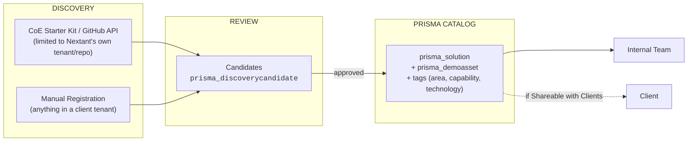

# PRISMA

**P**rototypes · **R**eferences · **I**nteractive **S**olutions & **M**odels · **A**utomations and Apps

   

> **Nextant LLC — Enterprise Architecture Proposal**
> A single, governed system of record for every solution Nextant has ever built — regardless of the technology behind it. PRISMA ends duplicated engineering effort internally, and arms client-facing teams with a curated, secure showcase of what the firm is capable of delivering.

---

## Table of Contents

1. [Purpose & Rationale](#1--purpose--rationale)
2. [Proposed Architecture](#2--proposed-architecture)
3. [Data Model](#3--data-model)
4. [Solution Lifecycle](#4--solution-lifecycle)
5. [Safeguarding Sensitive Data](#5--safeguarding-sensitive-data)
6. [Implementation Roadmap](#6--implementation-roadmap)
7. [Open Decisions](#7--open-decisions)

---

## 1 — Purpose & Rationale

Nextant has built a growing body of work across Power BI, Power Apps, AI agents, and automation — some of it living inside Nextant's own tenant, a substantial share of it living inside each client's tenant. No mechanism today lets anyone see, at a glance, what has been built, what it solves, or how mature it is. That blind spot carries a real cost: engineering time is spent rebuilding what already exists, and there is no showcase ready the moment a prospective client asks what Nextant can do.

| Objective | Description |
|---|---|
| **Internal Governance** | Surface every existing solution, its owner, and its maturity — before another one gets built from scratch. |
| **Commercial Showcase** | Arm client-facing teams with vetted, safe-to-share demonstrations of the full Nextant portfolio. |
| **Delivery Vehicle** | A **Power Apps Code App** reading and writing directly to Dataverse via the Web API / SDK. |

> **On the Initial Inventory**
> This document does not assume a complete, validated inventory of every solution Nextant has built. That gap is itself part of the problem this architecture is designed to close — no mechanism exists today to confirm how many solutions exist or where they all reside. Closing that gap is the explicit purpose of **Phases 0 and 1** of the roadmap (§6), combining manual registration with automated discovery.

---

## 2 — Proposed Architecture

The architecture rests on a single governing principle: **operational data is never centralized — only a descriptive record, its classification tags, and a curated demonstration asset are.** Every solution stays exactly where it lives today; PRISMA exists purely as an index and a showcase layer on top.

*Only the record and its demonstration asset ever cross layers — the underlying operational data never does.*

### The Rule That Decides: Automatic vs. Manual

What determines whether a solution can be discovered automatically is never the technology behind it — Power BI, an AI agent, or an app. It is **whose tenant or repository the solution lives in.**

| Location | Discovery Method | Example |
|---|---|---|
| Nextant's own tenant or repository | 🟢 **Automatic** — CoE Starter Kit / GitHub API | Internal tools, prototypes, in-house sandboxes |
| Client tenant or infrastructure | 🟠 **Manual** — Code App intake form | A Power BI solution built and deployed inside a client's environment |
| Outside any tenant (on-prem, other cloud) | 🟠 **Manual** | Bespoke internal solutions independent of Microsoft |

---

## 3 — Data Model

This model builds directly on the schema already defined, with two additions: a field identifying where each solution lives, and a candidate table governing how automatically-discovered records enter the system.

| Table | Type | Purpose |
|---|---|---|
| `prisma_specializationarea` | Reference | The library's top-level categories — AI & Automation, Data Solutions, and the like. |
| `prisma_capability` | Reference | Function-based filter tags, independent of the underlying technology. |
| `prisma_technology` | Reference | An open-vocabulary technology tag — deliberately left ungoverned. |
| `prisma_solution` | **Core** | The record of record for each solution: what it is, who owns it, how mature it is, and how it may be shared. |
| `prisma_demoasset` | Child | The demonstration itself — a file, a URL, or a video — tagged with its sample-data level. |
| `prisma_discoverycandidate` | **New** | The intake queue: candidates surfaced automatically or manually, held pending formal admission to the catalog. |

### Two Fields on `prisma_solution` That Must Not Be Confused

| Field | Purpose | Values |
|---|---|---|
| `Origin / Ecosystem` | The technology behind the solution — drives showcase categorization. | Power Platform · Azure AI Foundry · Copilot Studio · Internal/Custom · Other |
| `Location / Tenant` | Where the solution resides — drives the discovery method. | Nextant Tenant · Client Tenant · External Infrastructure |

---

## 4 — Solution Lifecycle

**Maturity Level** — describes the solution's own stage of development:

`Idea` → `Prototype` → `Client Demo` → **`In Production`** → ~~`Retired`~~

**Publication Status** — independent of maturity; a prototype can be published internally long before it ever reaches production:

`Draft` → `Pending Review` → **`Published`** → ~~`Retired`~~

---

## 5 — Safeguarding Sensitive Data

The `Sample Data Level` field forces a deliberate, record-by-record decision on whether a demonstration asset contains fictional, partially real, or real data. `Shareable with Clients` then governs whether that record may ever leave Nextant.

For a Power BI report holding sensitive client figures, the demonstration asset is **never** the original report — it is a synthetic reconstruction that preserves the same visual structure and narrative, or a recorded walkthrough.

> The demonstration proves the capability. It never exposes the data.

---

## 6 — Implementation Roadmap

| Phase | Duration | Scope |
|---|---|---|
| **0 — Foundation** | 1–2 weeks | Build the six Dataverse tables in sequence: reference tables → global choices → `prisma_solution` → native N:N relationships → `prisma_demoasset` → `prisma_discoverycandidate`. |
| **1 — Manual Registration** | 2–3 weeks | Ship the Code App intake form so any team can register a solution by hand. This phase alone already covers every case — including everything living inside a client's tenant. |
| **2 — Internal Automated Discovery** | 3–4 weeks | Deploy the CoE Starter Kit inside Nextant's own tenant and a GitHub scan, both feeding `prisma_discoverycandidate` — strictly for what lives inside Nextant. |
| **3 — The Showcase** | 2–3 weeks | Build the library view, filterable by area, capability, and technology, surfacing only what has been published. |
| **4 — Ongoing Governance** | Continuous | Establish security roles and a recurring review cycle for stale or ownerless records. |

---

## 7 — Open Decisions

- [ ] **Security roles.** Who may create or edit records, who may only read what's published, and who holds authority to approve candidates and change publication status.
- [ ] **Technology-tag governance.** Whether `prisma_technology` stays fully open, or eventually needs curation to prevent duplicates such as "Power Apps" versus "PowerApps."
- [ ] **Catalog ownership.** Who is accountable for reviewing candidates and keeping the library current over time.

---

Nextant LLC · PRISMA Architecture Proposal · v1.0
