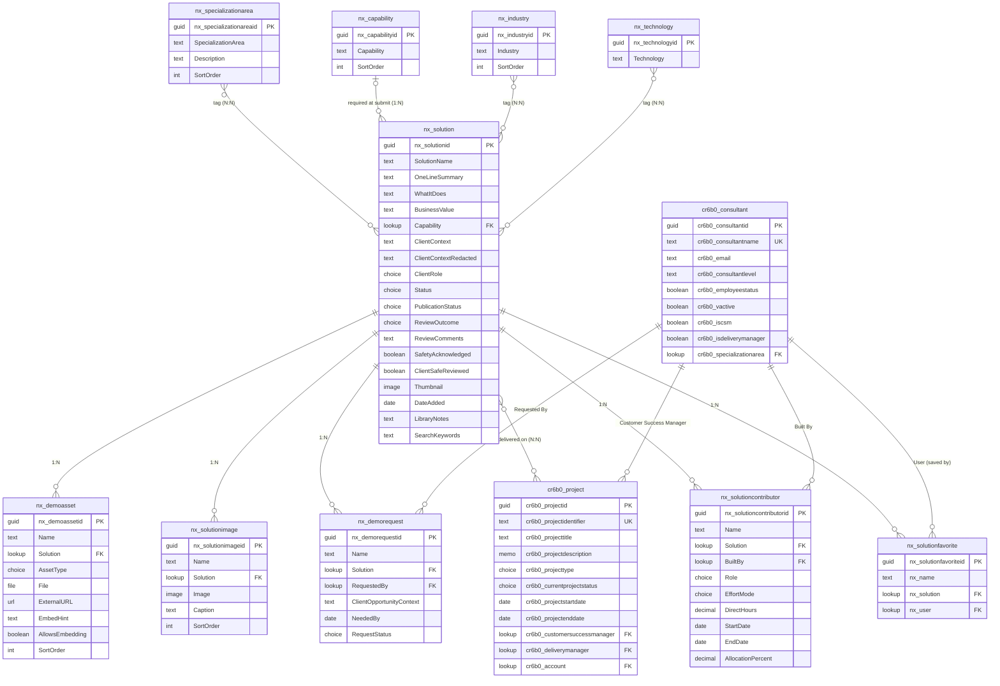
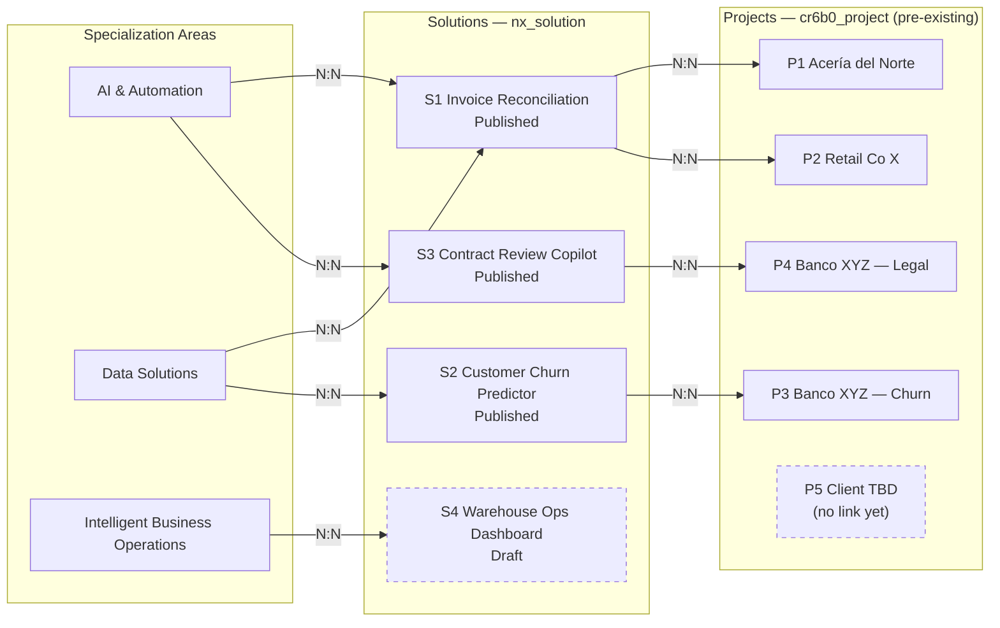
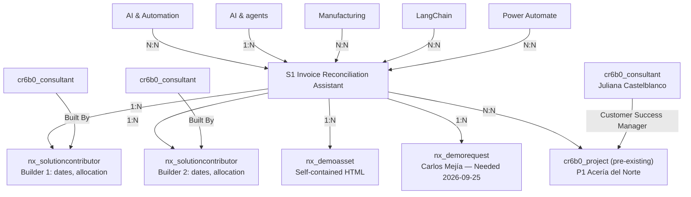

# Nextant Solution Library — Dataverse schema (v2)

**Status:** Authoritative two-field story model with approved private upload-session and SHA-256 resume extension; story-column retirement deployed and metadata verified; annotated with live logical names and types from `PRISMA_Dev` (see [Live Dataverse reference](#live-dataverse-reference)); acceptance and remaining UI parity pending · **Last updated:** 2026-09-23

This is the current, agreed model. It replaces [nextant-solution-library-dataverse-schema.md](nextant-solution-library-dataverse-schema.md) (v1). `SpecializationArea`, `Industry` and `Technology` are **native N:N**, while `Capability` is a single-valued lookup. Solution narratives use **What It Does** and **Business Value** only. The existing `cr6b0_project` table separates the reusable solution from evidence of delivery; its fixed columns are not modified. Solution-to-Project remains a **native N:N** relationship with no custom junction table.

**Changed in this round (2026-09-23), read back from Nextant Pulse:**
1. `nx_specializationarea` moved from a 1:N lookup to a **native N:N** with `nx_solution` (`nx_Solution_nx_SpecializationArea_nx_SpecializationArea`). The `nx_solution.nx_specializationarea` lookup column has been **deleted**. See [Known divergences](#known-divergences-from-this-document): no values were carried over, and the plugins still reference the deleted column.
2. `nx_solution.nx_clientrole` (**Client Role**) added, a local choice.
3. `nx_solutioncontributor.nx_role` (**Role**: CSM · Consultant) added, a local choice.
4. New table **`nx_solutionfavorite`**: per-person favorite Solutions, linked to `nx_solution` and `cr6b0_consultant`. It is UserOwned and not used by the app yet. See [its section](#nx_solutionfavorite--per-person-favorites).

**Changed in the previous round (2026-09-21):**
1. `nx_capability` moved from native N:N to a **1:N** relationship — each `nx_solution` now carries a single `Capability` lookup, same shape as `SpecializationArea`.
2. `nx_businesscalendar` and `nx_businesscalendarholiday` are **removed**, along with the contributor's `Business Calendar` lookup. US federal holiday exclusions are retained in code for 2020-2035; this overrides the earlier weekday-only proposal. See the updated derivation below.
3. Every PRISMA-owned lookup that pointed to the platform `systemuser` table (`Built By` on `nx_solutioncontributor`, `Requested By` on `nx_demorequest`) now points to a new custom table, **`cr6b0_consultant`**. On the pre-existing `cr6b0_project`, `cr6b0_customersuccessmanager` already points there; `cr6b0_deliverymanager` still points at `systemuser` and is out of scope.
4. `nx_project` is renamed to **`cr6b0_project`** throughout — same pre-existing, fixed-column table, correct name.
5. `Solution` ↔ `Project` no longer goes through a custom junction table (`nx_solutionproject` is **dropped**); it is now a **native N:N** relationship between `nx_solution` and `cr6b0_project`, since the link carries no attributes of its own.
6. `Review Outcome` and `Review Comments` are added to `nx_solution`. Drafts permit missing summary/capability and effort inputs; completeness is enforced at submit/publication through controlled transitions. No review-history table is added.

## Private upload protocol extension

Approved and deployed on 2026-09-22 under [ADR-0009](../architecture/decisions/adr-0009-mediated-media-and-publication-access.md). `nx_uploadsession` is organization-owned and accessible only to trusted server/admin operations; it is not a code-app data source. Its identifiers are canonical GUID strings for a bounded private protocol, not new business relationships. Bytes stay in the existing File/Image columns; no draft JSON or review-history table is added.

| Logical column | Type / limit | Purpose |
|---|---|---|
| `nx_uploadsessionid` | Platform GUID | Session identity |
| `nx_name` | Text 100 | Generated protocol label |
| `nx_parentid`, `nx_callerid`, `nx_targetid` | Text 36 each | Server-bound Solution, initiating systemuser and media GUIDs |
| `nx_kind` | Text 20 | Validated `image` or `attachment` |
| `nx_filename`, `nx_mime` | Text 200 / 120 | Validated file metadata |
| `nx_token` | Multiline text 10000 | Private continuation token, cleared on finalization; never returned |
| `nx_sha256` | Text 64, optional | Lowercase digest of exact upload bytes for new resumable sessions; legacy sessions remain null and cannot resume |
| `nx_bytes`, `nx_received`, `nx_nextblock` | Whole number, 0-524288000 | Declared bytes, received bytes, sequential next block |
| `nx_expires` | Time-zone-independent date/time | UTC two-hour unfinished-upload deadline |
| `nx_complete` | Boolean, default false | Finalized file validated and shared read-only |

Gallery/attachment rows are owned by the empty Media Custodian team. Finalized rows are shared read-only with the owner; approval shares them and their Solution/contributors with Published Readers. Removal is mediated while Draft. Existing reference tables, Consultant and Project remain UserOwned and unchanged; organization ownership below was an earlier design assumption, not a migration instruction. Full deployed roles are in the [security model](../architecture/security-model.md).

## Conventions

**Power Platform context:** `PRISMA_Dev` already exists in **Nextant Pulse** (`ce09ad9b-57d1-e5df-9400-8ce973c86213`). See [environment and solution details](../architecture/technical-architecture.md#environment-and-solution). This records the solution's existence, not completion or inclusion of the tables below. Confirm its publisher prefix before creating new components; the solution name alone does not establish that prefix.

The [legacy v1 entry point](nextant-solution-library-dataverse-schema.md) was synchronized with this model on 2026-09-18 at the user's request. It retains its original layout but is no longer an unchanged historical snapshot; this v2 document remains authoritative. References to v1 below describe its original design history.

- **Primary key vs. primary name** — every table gets an auto-generated GUID key (e.g. `nx_solutionid`) plus a required text *primary name* column, used as its display label in lookups.
- **System columns are automatic** — `createdon`, `createdby`, `modifiedon`, `modifiedby`, `ownerid`, `statecode`/`statuscode` exist on every table without being modeled.
- **Ownership** — all 11 original business tables are live **user/team-owned**, including references, Consultant and Project. The 2026-09-23 `nx_solutionfavorite` table is also UserOwned, which keeps favorites private per person. Preserve these existing tables and use Global reference Read privileges. Only the private `nx_uploadsession` extension is organization-owned. Media has the dedicated non-member team owner; credit does not imply ownership.
- **One single-valued tag, three multi-valued tags** — at submit/publication each `Solution` points to exactly one `Capability` through its lookup column. Capability may be empty in Draft. `SpecializationArea`, `Industry` and `Technology` are **native N:N** relationships: a solution can carry several of each, and Dataverse creates and manages the intersect tables. None of the three needs a hand-built junction table.
- **`cr6b0_project` is fixed** — it already exists in Dataverse with its own columns. Nothing new gets added to it, and it gets no new lookup pointing out of it either. Where a Solution needs to link to *several* Projects (and vice versa), a **native N:N** relationship connects `nx_solution` and `cr6b0_project` directly — no hand-built junction table, since the link carries no attributes of its own.
- **Governance** — `SpecializationArea`, `Capability`, and `Industry` are governed (only the Librarian adds new values). `Technology` is open (anyone adds a value inline; the Librarian periodically merges duplicates).
- **Builder credit is multi-person** — `nx_solutioncontributor` carries one row per Solution/person, including that person's effort inputs. It replaces the single `Built By` lookup and `Effort / Time to Deploy` choice on `nx_solution`; it is not a native N:N because the relationship has attributes. Credit is independent of `ownerid` and does not grant access.

---

## Visual schema

`SpecializationArea`, `Industry` and `Technology` are native Dataverse many-to-many relationships with `nx_solution`. Their intersect tables exist but are platform-managed and not modeled here. `Solution` ↔ `cr6b0_project` is also a native N:N (the link has no attributes), so it needs no custom junction table either. `Capability` is the only single-valued 1:N lookup on `nx_solution`.

`cr6b0_project` stays untouched — no lookup added to it, no lookup pointing out of it. The native N:N relationship lets one `Solution` link to several `Project` rows (and, structurally, vice versa), without either of those two tables needing a multi-valued column of their own.

`cr6b0_project` and `cr6b0_consultant` are drawn with their **live logical names**, not business labels, because they are pre-existing tables this schema never designs — their columns are whatever Dataverse already carries. Both boxes are **excerpts**: `cr6b0_project` has roughly ninety columns of its own (pricing, approvals, resourcing, opportunity links) and `cr6b0_consultant` about thirty; only the identifiers, the person links and the columns PRISMA actually reads are shown. `cr6b0_consultant.cr6b0_specializationarea` points at a **different** specialization-area table outside this solution, not at `nx_specializationarea`. `systemuser` is deliberately **not** drawn: `cr6b0_project.cr6b0_deliverymanager` still points at the platform user table, but that link belongs to the source system and PRISMA never reads it, so it stays in the `cr6b0_project` column table below rather than in the model diagram. Read the consultant migration as covering the lookups PRISMA owns, not every lookup on a pre-existing table.

---

## Reference tables

Shared vocabularies retain live user/team ownership with Global Read privileges. `Capability` connects through a single lookup. `SpecializationArea`, `Industry` and `Technology` are native N:N tags.

### `nx_specializationarea`

| Column | Logical name | Type | Required | Notes |
|---|---|---|---|---|
| Specialization Area *(primary name)* | `nx_specializationareaname` | StringType | Yes | AI & Automation · Data Solutions · Intelligent Business Operations |
| Description | `nx_description` | StringType | No | Powers the per-tab note in the public app |
| Sort Order | `nx_sortordernumber` | IntegerType | No |  |

Native N:N with `nx_solution` (since 2026-09-23; it was a 1:N lookup before). A solution can carry several specialization areas. The relationship is `nx_Solution_nx_SpecializationArea_nx_SpecializationArea`, with intersect `nx_Solution_nx_SpecializationArea`. The earlier rule of exactly one required area at submit/publication becomes **at least one**. Dataverse can't make an N:N required, so the transition handlers must enforce it, and they don't do so yet (see [Known divergences](#known-divergences-from-this-document)). No maximum has been set.

### `nx_capability`

Reintegrated after review — dropped from the first v2 draft, brought back with a narrower scope than v1: it only connects to `nx_solution`, nothing else. As of this round, single-valued rather than N:N.

| Column | Logical name | Type | Required | Notes |
|---|---|---|---|---|
| Capability *(primary name)* | `nx_capabilityname` | StringType | Yes | "AI & agents", "Planning & analytics", etc. |
| Sort Order | `nx_sortordernumber` | IntegerType | No | Controls chip order |

1:N with `nx_solution` — each solution has exactly one capability at submit/publication, set via a lookup column on `nx_solution`. Drafts may leave it empty. Not connected to `cr6b0_project`.

### `nx_industry`

| Column | Logical name | Type | Required | Notes |
|---|---|---|---|---|
| Industry *(primary name)* | `nx_industryname` | StringType | Yes | "Financial services", "Manufacturing", etc. Seed a **"Cross-industry"** value for industry-agnostic solutions |
| Sort Order | `nx_sortordernumber` | IntegerType | No |  |

Native N:N with `nx_solution` — a solution can carry several industries. Tagging at least one industry (or "Cross-industry") is expected in practice, but enforced at review, not schema-level — Dataverse can't make an N:N relationship required.

### `nx_technology`

| Column | Logical name | Type | Required | Notes |
|---|---|---|---|---|
| Technology *(primary name)* | `nx_technologyname` | StringType | Yes | Open vocabulary — "React", "Power BI", "LangChain". Grows organically. |

Native N:N with `nx_solution` — a solution can carry several technologies.

### `cr6b0_consultant` — person reference

Pre-existing table in the environment, adopted rather than designed here — earlier rounds called it "new", which it is not. It replaces the PRISMA-owned lookups that used to point at the platform `systemuser` table: `Built By` on `nx_solutioncontributor` and `Requested By` on `nx_demorequest`. On `cr6b0_project`, `cr6b0_customersuccessmanager` also points here.

It carries about thirty columns of its own. The ones PRISMA reads or depends on:

| Column | Logical name | Type | Required | Notes |
|---|---|---|---|---|
| Consultant Name *(primary name)* | `cr6b0_consultantname` | StringType | Yes | Display name in every person picker. Alternate key `cr6b0_consultantnamekey` |
| Email | `cr6b0_email` | StringType | — | Read for contributor identity in the person picker and published detail |
| Employee Status | `cr6b0_employeestatus` | BooleanType | — | The person picker lists only `statecode eq 0 and cr6b0_employeestatus eq true` |
| V-Active | `cr6b0_vactive` | BooleanType | — | Separate activity flag on the table; not the picker filter |
| Consultant Level | `cr6b0_consultantlevel` | StringType | — | Not read by the app |
| IsCSM / IsDeliveryManager | `cr6b0_iscsm`, `cr6b0_isdeliverymanager` | BooleanType | — | Role flags owned by the source table, not by PRISMA |
| Specialization Area | `cr6b0_specializationarea` | LookupType | — | Points at a **different** specialization-area table outside this solution — **not** `nx_specializationarea` |

Its remaining columns (hire/end dates, manager aliases, allocation rollups, credentials) belong to the source system and are neither read nor written here. Required levels are whatever the table already enforces; PRISMA sets none.

---

## Main table

### `nx_solution`

The reusable offering — the unit of value shown to a CSM.

| Column | Logical name | Type | Required | Notes |
|---|---|---|---|---|
| Solution Name *(primary name)* | `nx_solutionname` | StringType | Yes | Authored nonblank name required for draft saves; legacy `Untitled solution` is not accepted |
| One-line Summary | `nx_onelinesummary` | StringType | At submit/publication | Optional column metadata so incomplete drafts can be saved; nonblank at the transition boundary |
| What It Does | `nx_whatitdoes` | StringType | No |  |
| Business Value | `nx_businessvalue` | StringType | No |  |
| Capability | `nx_capability` | LookupType → `nx_capability` | At submit/publication | Single-valued; optional column metadata for Draft, exactly one governed value at submit/publication |
| Client / Context | `nx_clientcontext` | StringType | No | Freeform for now; revisit as a lookup if reporting by client is needed later. **Internal-only** — never rendered in present mode |
| Client Context (Redacted) | `nx_clientcontextredacted` | StringType | Conditional | The only context shown in present mode; required at submission when Client / Context is populated. Never infer or scrub names automatically. |
| Client Role | `nx_clientrole` | PicklistType (local) | No | Added 2026-09-23. Client stakeholder roles, from Chief of Staff and C-suite to Other; values under [Choice values](#choice-values). No default. Not read by the app yet |
| Status | `nx_status` | PicklistType (global) | Yes | Idea / concept · Working prototype · Client demo · Live in production · Retired |
| Publication Status | `nx_publicationstatus` | PicklistType (global) | Yes | Default Draft. Draft · Pending review · Published · Retired. Protected; controlled transition handler writes after caller authorization; only Librarian may request publication |
| Review Outcome | `nx_reviewoutcome` | PicklistType (local) | Yes | Default None. None · Changes requested · Approved. Latest librarian decision; preserved on contributor edits/resubmission, not proof of current approval. Protected write; readable by owner/authorized editors and Librarian, not CSM |
| Review Comments | `nx_reviewcomments` | StringType | On return | Latest contributor-facing feedback, trimmed; nonblank when returning, optional on approval. Protected write through review transition; readable by owner/authorized editors and Librarian, not CSM |
| Safety Acknowledged | `nx_safetyacknowledged` | BooleanType | Yes | Default false. Contributor acknowledges authorized, anonymized client-visible content before entry; must be true at submit and renewed on edit. Replaces sharing/sample-data classifications. |
| Client Safe Reviewed | `nx_clientsafereviewed` | BooleanType | Yes | Default false. Protected write; only an authorized librarian approval may set true. Transition handler clears on material edits/return. Present eligibility requires this, Safety Acknowledged and Published, never Review Outcome alone |
| Thumbnail | `nx_image` | ImageType | No |  |
| Date Added | `nx_dateadded` | DateTimeType (Date Only) | No |  |
| Library Notes | `nx_librarynote` | StringType | No | **Field-level security** — separate internal editorial notes, not contributor feedback; Librarian-controlled write |
| Search Keywords | `nx_searchkeywords` | StringType | No | Editorial boost terms not naturally present in the visible narrative text |

Links to `nx_capability` through the single-valued lookup column above. `SpecializationArea`, `Industry` and `Technology` are **not columns**. They attach through native N:N relationships (multi-valued tags, several per solution). Its link to `cr6b0_project` (potentially several) is also a native N:N relationship, not a column here.

Builders and effort now live in `nx_solutioncontributor`, not columns on `nx_solution`. Total effort is derived from its contributor rows.

### Draft and transition contract

Use the same Solution and child tables for drafts and submitted records; no draft table, JSON payload column or review-history table is introduced. `ownerid` determines ownership, not builder credit or the PoC's email key. My submissions queries records the caller owns or is authorized to edit under the agreed team-ownership policy; it does not equate `createdby` with the current owner.

Every draft save requires an authored, nonblank solution name of at most 100 characters, not the legacy reserved label `Untitled solution`. Existing unnamed drafts remain readable and must be renamed before saving again. At draft creation, supply a valid maturity default, Publication Status Draft, Review Outcome None, and both safety booleans false. Summary and Capability use optional column metadata. Drafts may omit contributors/images entirely; contributor rows require a selected person, parent, generated name and effort mode, but active effort inputs can remain null until submission. Empty person-picker rows are UI-only and are not written to Dataverse. Blank numeric/date inputs map to null, never zero, NaN or empty-string dates. Supplied values must still satisfy column types, lengths, ranges, lookup validity and unique-person constraints; invalid editor values stay client-side for correction.

At submit and publication, synchronously validate authored name (not the reserved label), summary, at least one specialization area, exactly one capability, at least one unique contributor with complete valid maturity-selected effort, fresh safety acknowledgment, anonymous context when Client / Context is set, and one to six stored detail images. Complete all required file uploads before the transition. App validation improves usability but is not the production enforcement boundary.

| Operation | Authorized caller and source | Result and protected fields |
|---|---|---|
| Save draft | Contributor with edit rights on new/Draft/Pending review/Published record; Librarian | Draft; Client Safe Reviewed false; retain latest review outcome/comments; material changes require renewed acknowledgment before submit |
| Submit | Contributor with edit rights on Draft/Pending review/Published record; Librarian | Pending review after full validation; Client Safe Reviewed false; retain latest review outcome/comments |
| Return | Librarian, Pending review only | Draft; Review Outcome Changes requested; nonblank Review Comments (maximum 4000); both safety booleans false |
| Approve | Librarian, Pending review only | Full validation plus independent client-safe confirmation; Published; Client Safe Reviewed true; Review Outcome Approved; replace Review Comments, or clear when blank |

The Changes requested queue is `Publication Status = Draft AND Review Outcome = Changes requested`. After resubmission the latest outcome may still be Changes requested, but the record belongs in Pending review. An edited formerly approved record may retain outcome Approved while being Draft/Pending and not client-safe-reviewed. Approval is determined only by the current publication/safety fields. Read-only opening of an editor changes nothing. Retirement/reactivation is a separate librarian operation, not an implicit save/submit path.

Use the synchronous, authorized, version-checked production operations in [ADR-0008](../architecture/decisions/adr-0008-controlled-submission-transitions.md). Direct record or child writes must not bypass withdrawal/review invalidation. Notifications remain asynchronous and non-authoritative. None of these Dataverse APIs or security registrations is implemented by the mock PoC.

**PoC mapping and migration:** `reviewOutcome`/`reviewComments` map to the two new columns; the local email owner must later resolve to `ownerid`, not a new email ownership column. Existing browser envelopes with the old `changesRequested` key are normalized on load, copying their legacy feedback from `libraryNotes` and retaining the original notes to avoid data loss. Unmarked Library Notes are not guessed to be feedback. Records already carrying Review Outcome are left unchanged. The normalized shape is stored on its next successful explicit save; no live Dataverse migration occurs. The PoC still preserves incomplete raw editor inputs locally; a future Dataverse adapter must apply the null/child-row rules above. Its legacy capability array permits exactly one selected value for new/edit submissions and must map to the single lookup; static catalogue examples are not silently reclassified.

Review Comments hold only the latest decision. Reviewer identity, timestamps and full history require a separately agreed audit design; `modifiedby`/`modifiedon` are not a substitute because later contributor edits change them.

---

## Tables related to Solution

### `nx_solutioncontributor` — builders and effort

One row per person credited on a Solution. User/team-owned, with access aligned to the parent Solution. A required lookup does **not** automatically inherit Dataverse security: configure and validate ownership/sharing so child rows cannot expose unpublished parent information. The Solution owner/team and Librarian manage these rows; merely being selected in `Built By` grants no permissions.

| Column | Logical name | Type | Required | Notes |
|---|---|---|---|---|
| Name *(primary name)* | `nx_contributorname` | StringType | Yes | Auto-generated display label from Solution/person; truncate to 100 characters, never use as identity |
| Solution | `nx_solution` | LookupType → `nx_solution` | Yes | Parent reusable offering |
| Built By | `nx_builtby` | LookupType → `cr6b0_consultant` | Yes | One credited person; multiple people require multiple rows |
| Role | `nx_role` | PicklistType (local) | No | Added 2026-09-23. CSM · Consultant. No default |
| Effort Mode | `nx_effortmode` | PicklistType (local) | Yes | Direct for Idea / concept and Working prototype; Calendar for Client demo and Live in production. Validate against parent maturity. Retired records retain their last valid mode. |
| Direct Hours | `nx_directhours` | DecimalType | At submit/publication in Direct mode | Nullable in Draft; finite and nonnegative when supplied. Include preparation/discovery. Zero is valid; empty is not zero |
| Start Date | `nx_startdate` | DateTimeType (Date Only) | At submit/publication in Calendar mode | Nullable in Draft; inclusive first date |
| End Date | `nx_enddate` | DateTimeType (Date Only) | At submit/publication in Calendar mode | Nullable in Draft; inclusive last date, not before Start Date at validation |
| Allocation (%) | `nx_allocationpercent` | DecimalType | At submit/publication in Calendar mode | Nullable in Draft; constant allocation; zero permitted |

No `Business Calendar` lookup or calendar tables. Calendar mode uses one code-based US federal holiday policy, with no calendar selector — `usBusinessCalendar(2020, 2035)` in `app/src/lib/effort.ts`, called by the connected app in `app/connected/src/draftGraph.ts`. The `BusinessCalendar` type and the `calendarId` field in `app/src/types.ts` are code-level constructs belonging to that function, **not Dataverse columns**; the schema-shaped-mock rule does not apply to them. See [ADR-0007](../architecture/decisions/adr-0007-contributor-effort.md).

**Role (`nx_role`)** marks the solution's CSM separately from the consultants who built it. The CSM lives in the same child table, so it is read back with the other contributors. Because of the alternate key below, one person holds one role per Solution. Rules for CSM rows are **not yet defined**: whether they carry effort, how many are allowed, and whether they count toward the contributor minimum (see [Still open](#still-open)).

Alternate key: `(Solution, Built By)` enforces one effort record per person per Solution — deployed as `nx_solutioncontributorkey` (`nx_builtby` + `nx_solution`). Require at least one complete contributor at submit/publication; a 1:N relationship cannot itself enforce a minimum child count. Validate only the active mode: direct hours in Direct mode, or dates/allocation in Calendar mode. Maturity changes preserve draft inputs but change the active mode for every contributor; never use stale inactive values in totals. Conditional validation must be enforced on all production writes, not just the UI.

**Derived values, not editable columns:**

- `Business Days`: count Monday-Friday dates between Start Date and End Date, **inclusive**, excluding observed nationwide US federal holidays under the [OPM schedule](https://www.opm.gov/policy-data-oversight/pay-leave/federal-holidays/). Calculate holidays in code for supported dates 2020-01-01 through 2035-12-31; reject invalid dates, reversed ranges, and dates outside coverage rather than falling back to weekdays. Date-only arithmetic must not shift with time zone or daylight-saving changes.
- Apply holiday rules appropriate to each year, including Juneteenth from 2021 onward. Fixed-date holidays on Saturday are observed Friday; those on Sunday are observed Monday. Include observed dates in range even when the holiday's nominal date belongs to an adjacent year (for example, New Year's Day 2022 observed on 2021-12-31). State-specific, company, and regional-only holidays are not included. No calendar records or contributor calendar IDs are stored.
- `Effort Hours`: for Calendar-mode contributors, `round(Business Days * 8 * AllocationPercent / 100, 2)`. Apply rounding only after the multiplication.
- In Direct mode, `Effort Hours` equals validated `Direct Hours`; business days do not apply.
- `Total Effort Hours`: sum the rounded contributor hours, displayed to at most two decimals. Different people working simultaneously contribute separately; this is not elapsed duration. Do not combine their allocations before applying their individual date ranges.

Example: 2026-09-07 through 2026-09-18 contains ten weekdays minus Labor Day on September 7, giving nine business days. At allocation 50%, the contribution is `9 * 8 * 0.5 = 36 hours`. A second person at 100% over the same nine business days adds 72 hours, for 108 total hours. A same-day non-holiday weekday counts as one; a weekend-only or holiday-only range yields zero.

Calendar-mode hours represent capacity; Direct-mode hours represent reported effort. Neither is a timesheet system or an estimate of deployment lead time. Demo effort is not a production estimate. Allocation changes within a person's period and cross-solution over-allocation/capacity checks remain out of scope. The app calculates from loaded contributor data; no Dataverse calculated-column capability or stored total is assumed. See [ADR-0007](../architecture/decisions/adr-0007-contributor-effort.md).

**Migration:** create a contributor row for each former `nx_solution.Built By` value. Dates and allocation require explicit confirmation; do not infer them from the old Days/Weeks/Months choice. Keep legacy values during a real migration until backfill is verified, then retire the old lookup/choice and any unused global choice. The PoC's dates and allocations are illustrative, not historical work records. The connected app already applies the code-based 2020-2035 policy. The look-and-feel PoC in `app/src/` still carries a single hardcoded 2026 holiday list for its illustrative totals; that is a PoC data detail, not a schema question, and its calendar identifiers are code-level, not columns to migrate. No live integration or deployment is authorized by this policy change.

### `nx_solutionfavorite` — per-person favorites

Created 2026-09-23 in the maker portal. It will back a future "My favorites" view: each person saves the solutions they like and sees their own list. The app does not use it yet: it isn't a connected-app data source, and no plugin or security privilege is configured. One row per person per saved Solution. The table is **UserOwned**, and `ownerid` is the signed-in account that created the row. With user-level (Basic) privileges, that makes each person's list private. `nx_user` records *which consultant* saved the solution; `ownerid` controls *who can read* the row.

| Column | Logical name | Type | Required | Notes |
|---|---|---|---|---|
| Name *(primary name)* | `nx_name` | StringType | No (metadata) | Display label, for example "{Solution name} — {Consultant name}". Never used as identity |
| Solution | `nx_solution` | LookupType → `nx_solution` | Yes (ApplicationRequired) | The saved Solution |
| User | `nx_user` | LookupType → **`cr6b0_consultant`** | Yes (ApplicationRequired) | The consultant who saved it. Despite the label "User", it points at `cr6b0_consultant`, **not** `systemuser` |
| Saved on | `createdon` (system) | — | — | When the solution was saved. Not a custom column |

Alternate key `nx_SolutionUser` (`nx_solutionuser`) = `nx_solution` + `nx_user`, so a consultant can save the same Solution only once. The key is Active.

**Relationship behavior** (verified 2026-09-23):

| Relationship | Delete | Assign / Share / Unshare / Reparent | Why |
|---|---|---|---|
| `nx_solutionfavorite_Solution_nx_solution` | **Cascade** (Archive: Cascade) | NoCascade | Deleting a Solution removes its favorites. This is the table's single parental relationship. Sharing must **not** cascade: approval shares a Solution with Published Readers, and a cascading share would expose every person's favorites of it |
| `nx_solutionfavorite_User_cr6b0_consultant` | RemoveLink | NoCascade | Dataverse allows only one parental relationship per table, and any Delete = Cascade makes a relationship parental, so this one can't cascade. Restrict is avoided because it would block deletions in the source consultant table. If a consultant is deleted, their favorites keep an empty `nx_user`; readers ignore such rows, and cleanup is a later job |

**Intended behavior once the app uses it (not yet implemented):**

- The signed-in account maps to its consultant by `cr6b0_email`. An account with no active consultant row can't save favorites.
- Saving creates a row and un-saving deletes it. Rows are never updated.
- A server-side rule should force `nx_user` to the caller's consultant, and should allow saving only Published solutions. Until that exists, nothing stops a caller from saving a favorite in someone else's name.
- A solution that is later withdrawn or retired keeps its favorite rows, but the reader no longer has access to it, so "My favorites" hides it.
- Favorite counts are a candidate signal for a future "top ranking". Because rows are private, counts across people must come from an elevated server-side aggregate, not from client reads.

### `nx_demoasset` — the demo

The curated asset a CSM opens. New submissions offer HTML, video and one-pager/slides, alongside images in `nx_solutionimage`. Legacy URL and desktop types remain readable but are deferred for new submissions. Files stay in Dataverse; no SharePoint storage.

| Column | Logical name | Type | Required | Notes |
|---|---|---|---|---|
| Name *(primary name)* | `nx_demoassetid1` | StringType | Yes |  |
| Solution | `nx_solution` | LookupType → `nx_solution` | Yes |  |
| Asset Type | `nx_assettype` | PicklistType (local) | Yes | Self-contained HTML · Hosted web app (URL) · Power Apps · Power BI · Desktop app or script · Video walkthrough · One-pager / slide |
| File | `nx_filemedia` | FileType | Conditional | Required for newly submitted HTML, video and one-pager/slides. PoC fileData/htmlContent are in-memory stand-ins for this payload, not extra Dataverse columns. |
| External URL | `nx_externalurl` | StringType (URL format) | No | For hosted/embedded links |
| Embed Hint | `nx_embedhint` | MemoType | No | The "sign-in may stall in this frame" style note shown in the viewer |
| Allows Embedding | `nx_allowsembedding` | BooleanType | No |  |
| Sort Order | `nx_sortorder` | IntegerType | No |  |

### `nx_solutionimage` — the gallery

Detail images beyond the optional thumbnail. New submissions require one to six gallery rows before submission/publication; the thumbnail does not satisfy that minimum. Existing catalogue examples may predate this rule. Enforce the child-count constraint at the application/platform write boundary. Required lookup to `nx_solution`; access aligned to the parent.

| Column | Logical name | Type | Required | Notes |
|---|---|---|---|---|
| Name *(primary name)* | `nx_solutionimagename` | StringType | Yes | Auto: "{Solution name} — image {n}" |
| Solution | `nx_solution` | LookupType → `nx_solution` | Yes |  |
| Image | `nx_imagefile` | ImageType | Yes | The screenshot payload; enable "can store full images" so the detail page isn't limited to the thumbnail rendition |
| Caption | `nx_caption` | StringType | No | Shown under the image in the gallery |
| Sort Order | `nx_sortorder` | IntegerType | No | Gallery display order |

### `nx_demorequest` — the live-demo ask

The "request a live demo" escape hatch, and a signal of which solutions the business actually pulls on. Required lookup to `nx_solution`; inherits the parent's visibility rules.

| Column | Logical name | Type | Required | Notes |
|---|---|---|---|---|
| Name *(primary name)* | `nx_demorequestname` | StringType | Yes | Auto: "{Solution name} — {Requester}" |
| Solution | `nx_solution` | LookupType → `nx_solution` | Yes |  |
| Requested By | `nx_requestedby` | LookupType → `cr6b0_consultant` | Yes |  |
| Client / Opportunity Context | `nx_clientopportunitycontext` | MemoType | No |  |
| Needed By | `nx_neededby` | DateTimeType (Date Only) | No |  |
| Request Status | `nx_requeststatus` | PicklistType (local) | Yes | New · Acknowledged · Scheduled · Delivered · Declined |

### `cr6b0_project` — the evidence (already exists in Dataverse, fixed columns)

`cr6b0_project` isn't being designed in this document — it already exists as a table in Dataverse, and its columns don't change here at all. It carries roughly ninety columns spanning pricing, approvals, resourcing and opportunity links. The identifying columns, the two person links and the fields relevant to PRISMA:

| Column | Logical name | Type | Notes |
|---|---|---|---|
| Project Identifier *(primary name)* | `cr6b0_projectidentifier` | StringType | The table's primary name. Alternate key `cr6b0_projectidentifierkey` |
| Project Title | `cr6b0_projecttitle` | StringType | What the app actually displays for a linked project; falls back to `Untitled project ({id})` when blank |
| Project Description | `cr6b0_projectdescription` | MemoType | Not read by the app |
| Project Type | `cr6b0_projecttype` | PicklistType | Source-system choice; PRISMA does not interpret its values |
| Current Project Status | `cr6b0_currentprojectstatus` | PicklistType | Source-system choice |
| Project Start / End Date | `cr6b0_projectstartdate`, `cr6b0_projectenddate` | DateTimeType | Delivery dates on the project, unrelated to contributor effort dates |
| Customer Success Manager | `cr6b0_customersuccessmanager` | LookupType → `cr6b0_consultant` | The person link already aligned with the consultant migration |
| Delivery Manager | `cr6b0_deliverymanager` | LookupType → `systemuser` | Still points at the platform user table. It belongs to the pre-existing table and is out of scope for the consultant migration — not a leftover to clean up here |
| Account | `cr6b0_account` | LookupType → `account` | Client of record in the source system |

The app reads only `cr6b0_projectid` and `cr6b0_projecttitle` (`app/connected/src/draftGraph.ts`, `backend/Prisma.Plugins/PublishedApi.cs`); everything else above is documented so the table is recognizable, not because PRISMA consumes it.

There is no column literally named `Project Owner`. Earlier drafts of this document used that label for the person link on `cr6b0_project`, and the visual schema carried it until this round; the columns above are what the table actually carries.

It gets **no** new lookup column — not to `nx_solution`, not to `nx_technology`. Its link to `nx_solution` is modeled as a native N:N relationship (see below), not a column on either fixed table.

### `Solution` ↔ `cr6b0_project` — linking Solutions to delivery evidence

A **native N:N** Dataverse relationship, not a custom junction table — the link carries no attributes of its own (no dates, no notes), so the platform-managed intersect is enough. It lets one `Solution` connect to several `Project` rows and vice versa — the reuse signal (G4): the same reusable Solution, delivered to more than one client.

A `Project` not yet linked to any Solution simply has no relationship row — that absence *is* the Librarian's classification queue.

### Intake triage: not every legacy record gets linked to a Solution

Nextant already has systems of record for delivered work — the BPM Project Inventory (SharePoint), individual GitHub repos, and whatever the equivalent turns out to be for Data Solutions. Linking one of those Project rows to a Solution is a deliberate decision, gated by four questions asked at intake:

1. Is there (or could there easily be) a presentable asset — not just internal automation glue?
2. Could the same approach be repeated for a different client?
3. Would an external prospect recognize the problem it solves?
4. Can it be described without breaking confidentiality? (Contributor safety acknowledgment and librarian-controlled client-safe review on `nx_solution`.)

A row that fails this — internal tooling maintenance, one-off support tied to a single stakeholder relationship, culture/ops apps with no sales relevance — never gets linked, or stays in its source system entirely. Nothing here needs to catch up to it; the source system keeps existing independently, and PRISMA doesn't replace it.

---

## Live Dataverse reference

Mechanical detail read back from the deployed `PRISMA_Dev` solution in **Nextant Pulse** (`ce09ad9b-57d1-e5df-9400-8ce973c86213`) on 2026-09-22, so the design tables above can keep business names while code has exact identifiers. Regenerate with `pac solution export --name PRISMA_Dev` and read `customizations.xml`; the same names appear in `app/connected/.power/schemas/dataverse/` and the generated models.

The per-column **Logical name** and **Type** cells in the tables above come from this same source. Column *lengths* in the Type/Notes text remain design intent and are deliberately not synchronized.

### Tables

| Logical name | Schema name | Entity set (OData) | Primary id | Primary name | Ownership |
|---|---|---|---|---|---|
| `nx_solution` | `nx_Solution` | `nx_solutions` | `nx_solutionid` | `nx_solutionname` | UserOwned |
| `nx_solutioncontributor` | `nx_SolutionContributor` | `nx_solutioncontributors` | `nx_solutioncontributorid` | `nx_contributorname` | UserOwned |
| `nx_demoasset` | `nx_DemoAsset` | `nx_demoassets` | `nx_demoassetid` | `nx_demoassetid1` | UserOwned |
| `nx_solutionimage` | `nx_solutionimage` | `nx_solutionimages` | `nx_solutionimageid` | `nx_solutionimagename` | UserOwned |
| `nx_demorequest` | `nx_DemoRequest` | `nx_demorequests` | `nx_demorequestid` | `nx_demorequestname` | UserOwned |
| `nx_specializationarea` | `nx_SpecializationArea` | `nx_specializationareas` | `nx_specializationareaid` | `nx_specializationareaname` | UserOwned |
| `nx_capability` | `nx_Capability` | `nx_capabilities` | `nx_capabilityid` | `nx_capabilityname` | UserOwned |
| `nx_industry` | `nx_Industry` | `nx_industries` | `nx_industryid` | `nx_industryname` | UserOwned |
| `nx_technology` | `nx_Technology` | `nx_technologies` | `nx_technologyid` | `nx_technologyname` | UserOwned |
| `cr6b0_consultant` | `cr6b0_Consultant` | `cr6b0_consultants` | `cr6b0_consultantid` | `cr6b0_consultantname` | UserOwned |
| `cr6b0_project` | `cr6b0_Project` | `cr6b0_projects` | `cr6b0_projectid` | `cr6b0_projectidentifier` | UserOwned |
| `nx_solutionfavorite` | `nx_solutionfavorite` | `nx_solutionfavorites` | `nx_solutionfavoriteid` | `nx_name` | UserOwned |
| `nx_uploadsession` | `nx_UploadSession` | `nx_uploadsessions` | `nx_uploadsessionid` | `nx_name` | **OrgOwned** |

Two naming warts worth knowing rather than fixing: `nx_demoasset`'s primary name is `nx_demoassetid1`, not `nx_demoassetname`; and Sort Order is `nx_sortordernumber` on the reference tables but `nx_sortorder` on `nx_demoasset` and `nx_solutionimage`.

### Choice values

Integers, not labels, are what a write must send. Unknown values must fail explicitly rather than defaulting.

| Column | Scope | Values |
|---|---|---|
| `nx_solution.nx_status` | Global | 125060000 Live in production · 125060001 Idea / concept · 125060002 Client demo · 125060003 Retired · 125060004 Working prototype |
| `nx_solution.nx_publicationstatus` | Global | 125060000 Published · 125060001 Retired · 125060002 Pending review · 125060003 Draft |
| `nx_solution.nx_reviewoutcome` | Local | 125060000 None · 125060001 Changes requested · 125060002 Approved |
| `nx_solution.nx_clientrole` | Local | 125060000 Chief of Staff · 125060001 Chief Executive Officer (CEO) · 125060002 Chief Information Officer (CIO) · **125060008** Chief Operating Officer (COO) · **125060009** Chief Financial Officer (CFO) · 125060003 Enterprise Architect · 125060004 Solution Architect · 125060005 Product Owner · 125060006 Project Manager · 125060007 Business Unit Leader · 125060010 Operation Manager · 125060011 IT Manager · 125060012 Director · 125060013 Other |
| `nx_solutioncontributor.nx_effortmode` | Local | 125060000 direct · 125060001 calendar |
| `nx_solutioncontributor.nx_role` | Local | 125060000 CSM · 125060001 Consultant |
| `nx_demoasset.nx_assettype` | Local | 125060000 Self-contained HTML file · 125060001 Video walkthrough only · 125060002 Client-ready one-pager / slide · 125060003 Power BI · 125060004 Desktop app or script · **125060007** Hosted web app (URL) · **125060008** Power Apps |
| `nx_demorequest.nx_requeststatus` | Local | 125060000 New · 125060001 Acknowledged · 125060002 Scheduled · 125060003 Delivered · 125060004 Declined |

`nx_assettype` is not contiguous: 125060005 and 125060006 are unused. `nx_clientrole` is listed in display order, and COO/CFO (125060008/125060009) sit between CIO and Enterprise Architect. Never derive a choice value from its ordinal position. The live `nx_clientrole` label for Director has a trailing space (`"Director "`), so compare labels trimmed, or better, compare values. The two effort-mode labels are lowercase (`direct`, `calendar`) in Dataverse.

### Relationship schema names

Native N:N relationships must be addressed by these exact names; the plugins already use them.

| Relationship | Between | Intersect entity |
|---|---|---|
| `nx_Solution_nx_SpecializationArea_nx_SpecializationArea` | `nx_solution` ↔ `nx_specializationarea` | `nx_Solution_nx_SpecializationArea` |
| `nx_Solution_nx_Industry_nx_Industry` | `nx_solution` ↔ `nx_industry` | `nx_Solution_nx_Industry` |
| `nx_Solution_nx_Technology_nx_Technology` | `nx_solution` ↔ `nx_technology` | `nx_Solution_nx_Technology` |
| `nx_Solution_cr6b0_Project_cr6b0_Project` | `nx_solution` ↔ `cr6b0_project` | `nx_Solution_cr6b0_Project` |

### Alternate keys

| Key | Table | Attributes |
|---|---|---|
| `nx_solutioncontributorkey` | `nx_solutioncontributor` | `nx_builtby` + `nx_solution` |
| `cr6b0_consultantnamekey` | `cr6b0_consultant` | `cr6b0_consultantname` |
| `cr6b0_projectidentifierkey` | `cr6b0_project` | `cr6b0_projectidentifier` |
| `nx_solutionuser` (schema `nx_SolutionUser`) | `nx_solutionfavorite` | `nx_solution` + `nx_user` |

### Known divergences from this document

Reviewed and accepted, not defects:

- Column lengths in Dataverse are largely 850 (text) and 4000 (multiline); the design lengths above were not applied and are not enforced at the column level.
- Required levels do not match the Required column above — notably `nx_capability` is `ApplicationRequired` in Dataverse while drafts may leave it empty. `ApplicationRequired` is not enforced on SDK writes, so the draft plugin is unaffected; a model-driven form would be.
- `cr6b0_consultant` and `cr6b0_project` carry many columns of their own beyond the ones documented above, and `cr6b0_consultant.cr6b0_specializationarea` points to a **different** table of that name, outside this solution. Both are treated as independent, pre-existing tables; the sections above list their identifiers, person links and the columns PRISMA reads, not their full column sets.
- `nx_solution.nx_image`, `nx_sortordernumber`, `nx_solution.nx_clientrole`, `nx_solutioncontributor.nx_role` and all of `nx_demorequest` exist in Dataverse but are not read by the connected app yet.

**Open after the 2026-09-23 changes (these are defects, not accepted divergences):**

- **The deployed plugins and the published connected app still use the deleted `nx_solution.nx_specializationarea` lookup.** The source code has moved to the N:N but is **not yet deployed**: areas are now part of the draft graph (`nx_SaveDraftGraph` / `nx_GetDraftGraph` `areaIds`), not of `nx_SaveCoreDraft`. Graph reads, submission summaries and the catalogue return areas primary first (ascending `nx_sortordernumber`). Submit and approval require at least one active area. The editor allows up to 3 (the PoC assumption, still open). Until the plugins are redeployed and the connected app is republished, together, the live app's Library load, draft list/save/reopen, submit and approval keep failing. The generated `solutions` schema still lists the deleted column. It must be regenerated as a whole: a PAC 2.12.2 attempt stopped partway on the custom-API schemas and was reverted.
- **Test data only, no backfill needed.** The lookup was deleted without carrying its values to the N:N, so on 2026-09-23 the existing solutions have no linked areas. Every row in `PRISMA_Dev` is fake test data that can be deleted and recreated, so no migration is planned. Real data will be entered only after the app reads and writes the N:N.
- **The N:N relationship is not in `PRISMA_Dev`** (it only appears in Default). Add it before exporting or moving the solution.
- **`nx_solutionfavorite` naming and metadata, accepted:**
  - The person lookup is named `nx_user` ("User") even though it targets `cr6b0_consultant`.
  - The schema name is lowercase (`nx_solutionfavorite`).
  - `nx_name` is optional (length 850).
- **`nx_solutionfavorite` has no security or enforcement yet.** It isn't in any PRISMA role, it isn't a connected-app data source, and no plugin binds `nx_user` to the caller.
- **`nx_role` is not read or written by the app.** No layer knows the column yet: the contributor editor has no role selector, `ContributorInput` has no role field, and `DraftGraph.cs` doesn't write `nx_role` on Create/Update or select and return it on read. Graph saves update retained contributor rows with explicit columns only, so a role set in the maker portal **survives** an app save. It is lost only when a person is removed and re-added, because that deletes the row and creates a new one. New rows created by the app have a null role. Existing contributor rows are test data. All four layers must carry `nx_role` before real data is entered.

---

## Relationships summary

| From | To | Type |
|---|---|---|
| `nx_specializationarea` | `nx_solution` | Native N:N |
| `nx_capability` | `nx_solution` | 1:N |
| `nx_industry` | `nx_solution` | Native N:N |
| `nx_technology` | `nx_solution` | Native N:N |
| `nx_solution` | `cr6b0_project` | Native N:N |
| `nx_solution` | `nx_solutioncontributor` | 1:N |
| `cr6b0_consultant` | `nx_solutioncontributor` | 1:N (Built By) |
| `nx_solution` | `nx_demoasset` | 1:N |
| `nx_solution` | `nx_solutionimage` | 1:N |
| `nx_solution` | `nx_demorequest` | 1:N |
| `cr6b0_consultant` | `nx_demorequest` | 1:N (Requested By) |
| `cr6b0_consultant` | `cr6b0_project` | 1:N (`cr6b0_customersuccessmanager`) |
| `nx_solution` | `nx_solutionfavorite` | 1:N (parental: Delete Cascade, no share/assign cascade) |
| `cr6b0_consultant` | `nx_solutionfavorite` | 1:N (`nx_user`, Delete: RemoveLink) |

**13 tables:** the 11 original business tables (`nx_solution`, `nx_solutioncontributor`, four governed/tag reference tables, `nx_demoasset`, `nx_solutionimage`, `nx_demorequest`, existing `cr6b0_consultant` and `cr6b0_project`), private `nx_uploadsession`, and `nx_solutionfavorite` (2026-09-23). Platform-managed N:N intersect tables are excluded. Consultant/Project columns and security are unchanged. Connected owner edits currently require explicit withdrawal to Draft; librarian content editing, separate thumbnail/caption editing and solution deletion remain gaps against the target contract.

**Dropped from the first v2 draft, then reintegrated, then flattened this round:** `nx_capability` — brought back as a reference table scoped to a single connection (`nx_solution` only, not `cr6b0_project`), and as of this round a 1:N single-valued lookup rather than N:N.

**Reverted from the first v2 draft:** the flattening of `Industry` and `Technology` to single-valued lookups — both are back to native N:N as in v1, since a solution's profile routinely carries more than one of each. `Industry` also moved from required to optional-with-a-`Cross-industry`-value. (`Capability` took the opposite path this round — see above.)

**Dropped from the first v2 draft, and still dropped:** `nx_projectevidence` (no attachments table).

**Removed this round:** `nx_businesscalendar` and `nx_businesscalendarholiday`, not holiday exclusions. `nx_solutioncontributor.Business Days` retains observed US federal holiday exclusions, enforced in code for 2020-2035.

**Changed this round:** every lookup to the platform `systemuser` table now points to the new custom table `cr6b0_consultant`. `nx_project` is renamed `cr6b0_project` (same pre-existing table). The `Solution` ↔ `Project` connection is a **native N:N** relationship between `nx_solution` and `cr6b0_project` — no custom junction table, since the link carries no attributes of its own.

---

## Security model

| Role | `nx_solution` | `nx_demoasset` / `nx_solutionimage` | Reference tables | `nx_demorequest` | `Solution`↔`Project` N:N |
|---|---|---|---|---|---|
| Contributor | Create; Read/Write own; Read published | Same as parent | Read; Create on `nx_technology` only | Read own | Create; Read/Write own |
| CSM | Read published only | Read (published parents) | Read | Create; Read own | Read (context on Solution detail) |
| Librarian | Full | Full | Full | Full | Full |

Unpublished `nx_solution` rows stay invisible to CSMs at the platform level. Publication Status, Client Safe Reviewed, Review Outcome, Review Comments and Library Notes have the field permissions and controlled-write rules in the [security model](../architecture/security-model.md). Review fields and notes are excluded from the CSM/presentation projection. `cr6b0_project`'s own security model lives with the existing table, not here.

`nx_solutionfavorite` (**planned, not configured**): Contributor, CSM and Librarian get Create, Read and Delete at **User** depth only, with no Write, Assign or Share. Each person sees only their own favorites. Nobody, including the Librarian, reads other people's rows directly; aggregate counts go through a server-side operation.

`nx_solutioncontributor`: Contributor create/read/write/delete only where they can manage the parent Solution; CSM read only for published parents; Librarian full access. Per-person dates and allocations are omitted from present-mode rendering; builder names and total effort remain available. Present mode is not a security boundary for the bundled mock data.

## Still open

- Who creates the `Solution`↔`Project` N:N association — the Librarian during triage, or the Contributor who owns the Solution?
- Specialization areas per solution: is the minimum one at submit? Is there a maximum? Does the UI need a "primary" area for the card color and badge?
- `nx_clientrole`: what does it represent (the client stakeholder the solution targets?), is it required at submit, and is it shown in present mode?
- `nx_role` = CSM rows: do they carry effort, is there exactly one per solution, and do they count toward the contributor minimum?
- `nx_solutionfavorite`: should the ranking count favorites, and who sees the ranking? Who cleans up favorites with an empty `nx_user` after a consultant is deleted?

*(Resolved: `SpecializationArea` cardinality — changed to native N:N on 2026-09-23. `Industry` and `Technology` cardinality — settled as native N:N, multi-valued. `Capability` cardinality — settled as 1:N, single-valued. `cr6b0_project` + `Solution`↔`Project` link — confirmed in scope, native N:N, no junction table. `systemuser` lookups replaced by `cr6b0_consultant`. `nx_businesscalendar`/`nx_businesscalendarholiday` — removed from scope.)*

---

## Example: one Solution, several Projects, via the native N:N relationship

Each `Solution` has exactly one `Capability` and one or more `SpecializationArea` rows, and it can link to **several** `Project` rows directly — through the native N:N relationship, not through a junction table or a column on either fixed side.

S1 links to **both** P1 (Acería del Norte) and P2 (Retail Co X) — the reuse signal is back, carried by the native N:N relationship, not by either fixed table or a junction table. S4 (Draft) and P5 (no link yet) are dashed — the same two "pending" states as before, just represented as the *absence* of a relationship row rather than an empty lookup.

## Example: everything hanging off one Solution

Zooming into a single Solution (S1) shows every other table it touches: its capability lookup, its N:N tags (specialization areas included), the demo asset the CSM opens, a live-demo request raised against it, and — through the native N:N relationship — its delivery evidence.

One Solution row is the hub: the tags describe *what it is* (exactly one capability, plus as many specialization areas, industries and technologies as apply), while What It Does and Business Value describe its actions and benefits. `nx_demoasset` is *what a CSM can show*, `nx_demorequest` is *who's asking for a live one right now*, and the native N:N relationship to `cr6b0_project` is the bridge to *proof it already happened* — pointing at a table this schema never modifies directly.
