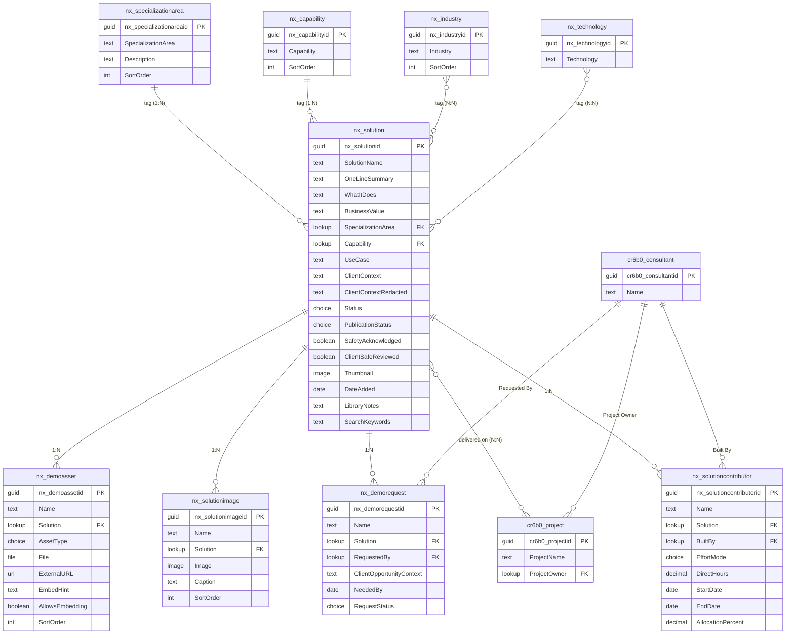
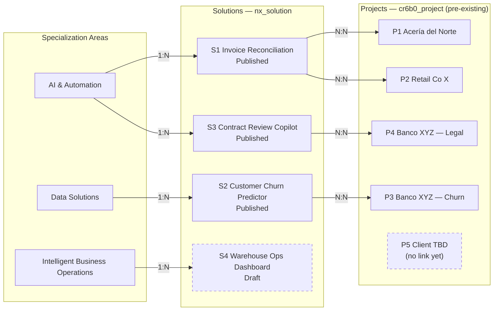
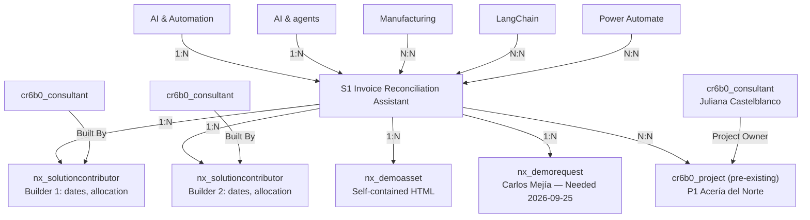

# Nextant Solution Library — Dataverse schema (v2)

**Status:** Authoritative agreed model; legacy schema companion synchronized; safety-first submission and maturity-based effort · **Last updated:** 2026-09-21

This is the current, agreed model. It replaces [nextant-solution-library-dataverse-schema.md](nextant-solution-library-dataverse-schema.md) (v1) — refined through several rounds of review: in v1, `Use Case` was already a plain field on `nx_solution` (not a governed table) and `Capability` was already a reference table with a native N:N to `nx_solution`; an earlier v2 draft flattened every tag relationship to a single-valued lookup, but that was reverted for `Industry` and `Technology` — they stay **native N:N** as in v1, while `SpecializationArea` and (as of this round) `Capability` are single-valued lookups; a `Project` concept was added (confirmed in scope) to separate "the reusable Solution" from "the evidence it's been built before" — the underlying table already exists in Dataverse with fixed columns as `cr6b0_project`, so it never gets touched directly; and Solution↔Project, which needed to stay many-sided, is a **native N:N** relationship (no attributes needed on the link itself, so no custom junction table).

**Changed in this round (2026-09-21):**
1. `nx_capability` moved from native N:N to a **1:N** relationship — each `nx_solution` now carries a single `Capability` lookup, same shape as `SpecializationArea`.
2. `nx_businesscalendar` and `nx_businesscalendarholiday` are **removed**. `nx_solutioncontributor` no longer carries a `Business Calendar` lookup, and `Business Days` is now a straight Monday–Friday count with no holiday exclusion — see the updated derivation below.
3. Every lookup that pointed to the platform `systemuser` table (`Built By`, `Requested By`, `Project Owner`) now points to a new custom table, **`cr6b0_consultant`**.
4. `nx_project` is renamed to **`cr6b0_project`** throughout — same pre-existing, fixed-column table, correct name.
5. `Solution` ↔ `Project` no longer goes through a custom junction table (`nx_solutionproject` is **dropped**); it is now a **native N:N** relationship between `nx_solution` and `cr6b0_project`, since the link carries no attributes of its own.

## Conventions

The [legacy v1 entry point](nextant-solution-library-dataverse-schema.md) was synchronized with this model on 2026-09-18 at the user's request. It retains its original layout but is no longer an unchanged historical snapshot; this v2 document remains authoritative. References to v1 below describe its original design history.

- **Primary key vs. primary name** — every table gets an auto-generated GUID key (e.g. `nx_solutionid`) plus a required text *primary name* column, used as its display label in lookups.
- **System columns are automatic** — `createdon`, `createdby`, `modifiedon`, `modifiedby`, `ownerid`, `statecode`/`statuscode` exist on every table without being modeled.
- **Ownership** — `Solution`, `SolutionContributor`, `DemoAsset`, `SolutionImage`, and `DemoRequest` are **user/team-owned** (row-level security, since different practices submit their own work). `SpecializationArea`, `Capability`, `Industry`, and `Technology` are **organization-owned** (shared reference data). `cr6b0_project` already exists in Dataverse — its ownership model is out of scope here. `cr6b0_consultant` is organization-owned.
- **Two single-valued tags, two multi-valued tags** — each `Solution` points to exactly one `SpecializationArea` and exactly one `Capability`, each via its own lookup column. `Industry` and `Technology` are **native N:N** relationships: a solution can carry several of each, and Dataverse creates and manages the intersect tables — no hand-built junction tables for these two.
- **`cr6b0_project` is fixed** — it already exists in Dataverse with its own columns. Nothing new gets added to it, and it gets no new lookup pointing out of it either. Where a Solution needs to link to *several* Projects (and vice versa), a **native N:N** relationship connects `nx_solution` and `cr6b0_project` directly — no hand-built junction table, since the link carries no attributes of its own.
- **Governance** — `SpecializationArea`, `Capability`, and `Industry` are governed (only the Librarian adds new values). `Technology` is open (anyone adds a value inline; the Librarian periodically merges duplicates).
- **Builder credit is multi-person** — `nx_solutioncontributor` carries one row per Solution/person, including that person's effort inputs. It replaces the single `Built By` lookup and `Effort / Time to Deploy` choice on `nx_solution`; it is not a native N:N because the relationship has attributes. Credit is independent of `ownerid` and does not grant access.

---

## Visual schema

`Industry` and `Technology` are native Dataverse many-to-many with `nx_solution` — the intersect tables exist but are platform-managed and not modeled here. `Solution` ↔ `cr6b0_project` is also a native N:N (no attributes on the link), so it needs no custom junction table either. `SpecializationArea` and `Capability` are both single-valued 1:N lookups on `nx_solution`.

`cr6b0_project` stays untouched — no lookup added to it, no lookup pointing out of it. The native N:N relationship lets one `Solution` link to several `Project` rows (and, structurally, vice versa), without either of those two tables needing a multi-valued column of their own.

---

## Reference tables

Shared, organization-owned vocabularies. `SpecializationArea` and `Capability` connect via a single lookup column on `nx_solution`; `Industry` and `Technology` connect as native many-to-many tags.

### `nx_specializationarea`

| Column | Type | Required | Notes |
|---|---|---|---|
| Specialization Area *(primary name)* | Text (100) | Yes | AI & Automation · Data Solutions · Intelligent Business Operations |
| Description | Text, multi-line (500) | No | Powers the per-tab note in the public app |
| Sort Order | Whole Number | No | |

1:N with `nx_solution` — each solution has exactly one specialization area, set via a lookup column on `nx_solution`.

### `nx_capability`

Reintegrated after review — dropped from the first v2 draft, brought back with a narrower scope than v1: it only connects to `nx_solution`, nothing else. As of this round, single-valued rather than N:N.

| Column | Type | Required | Notes |
|---|---|---|---|
| Capability *(primary name)* | Text (100) | Yes | "AI & agents", "Planning & analytics", etc. |
| Sort Order | Whole Number | No | Controls chip order |

1:N with `nx_solution` — each solution has exactly one capability, set via a lookup column on `nx_solution`, same shape as `SpecializationArea`. Not connected to `cr6b0_project`.

### `nx_industry`

| Column | Type | Required | Notes |
|---|---|---|---|
| Industry *(primary name)* | Text (100) | Yes | "Financial services", "Manufacturing", etc. Seed a **"Cross-industry"** value for industry-agnostic solutions |
| Sort Order | Whole Number | No | |

Native N:N with `nx_solution` — a solution can carry several industries. Tagging at least one industry (or "Cross-industry") is expected in practice, but enforced at review, not schema-level — Dataverse can't make an N:N relationship required.

### `nx_technology`

| Column | Type | Required | Notes |
|---|---|---|---|
| Technology *(primary name)* | Text (100) | Yes | Open vocabulary — "React", "Power BI", "LangChain". Grows organically. |

Native N:N with `nx_solution` — a solution can carry several technologies.

### `cr6b0_consultant` — person reference

New custom table. Replaces every lookup that used to point at the platform `systemuser` table (`Built By` on `nx_solutioncontributor`, `Requested By` on `nx_demorequest`, `Project Owner` on `cr6b0_project`).

| Column | Type | Required | Notes |
|---|---|---|---|
| Name *(primary name)* | Text (100) | Yes | Consultant's display name |

---

## Main table

### `nx_solution`

The reusable offering — the unit of value shown to a CSM.

| Column | Type | Required | Notes |
|---|---|---|---|
| Solution Name *(primary name)* | Text (100) | Yes | |
| One-line Summary | Text (200) | Yes | |
| What It Does | Text, multi-line (4000) | No | |
| Business Value | Text, multi-line (4000) | No | |
| Specialization Area | Lookup → `nx_specializationarea` | Yes | Single-valued |
| Capability | Lookup → `nx_capability` | Yes | Single-valued, as of this round |
| Use Case | Text (200) | No | The client-side framing of the problem — "reduce manual invoice handling", "forecast demand". Bridges how a client describes their pain and how Nextant describes its capability. |
| Client / Context | Text (200) | No | Freeform for now; revisit as a lookup if reporting by client is needed later. **Internal-only** — never rendered in present mode |
| Client Context (Redacted) | Text (200) | Conditional | The only context shown in present mode; required at submission when Client / Context is populated. Never infer or scrub names automatically. |
| Status | Choice — global | Yes | Idea / concept · Working prototype · Client demo · Live in production · Retired |
| Publication Status | Choice — global | Yes | Draft · Pending review · Published · Retired — **field-level security, Librarian-only write** |
| Safety Acknowledged | Yes/No | Yes | Default false. Contributor acknowledges authorized, anonymized client-visible content before entry; must be true at submit and renewed on edit. Replaces sharing/sample-data classifications. |
| Client Safe Reviewed | Yes/No | Yes | Default false. Librarian-only write with field-level security; clear on material edits. Present eligibility requires this, Safety Acknowledged and Published. Never derive approval from acknowledgment. |
| Thumbnail | Image | No | |
| Date Added | Date Only | No | |
| Library Notes | Text, multi-line (2000) | No | **Field-level security** — internal-only |
| Search Keywords | Text (500) | No | Editorial boost terms not naturally present in the visible text — distinct from Use Case, which frames the problem in the client's own words |

Links to `nx_specializationarea` and `nx_capability` via the two single-valued lookup columns above. `Industry` and `Technology` are **not columns** — they attach through native N:N relationships (multi-valued tags, several per solution). Its link to `cr6b0_project` (potentially several) is also a native N:N relationship, not a column here.

Builders and effort now live in `nx_solutioncontributor`, not columns on `nx_solution`. Total effort is derived from its contributor rows.

---

## Tables related to Solution

### `nx_solutioncontributor` — builders and effort

One row per person credited on a Solution. User/team-owned, with access aligned to the parent Solution. A required lookup does **not** automatically inherit Dataverse security: configure and validate ownership/sharing so child rows cannot expose unpublished parent information. The Solution owner/team and Librarian manage these rows; merely being selected in `Built By` grants no permissions.

| Column | Type | Required | Notes |
|---|---|---|---|
| Name *(primary name)* | Text (100) | Yes | Auto-generated display label from Solution/person; truncate to 100 characters, never use as identity |
| Solution | Lookup → `nx_solution` | Yes | Parent reusable offering |
| Built By | Lookup → `cr6b0_consultant` | Yes | One credited person; multiple people require multiple rows |
| Effort Mode | Choice: Direct / Calendar | Yes | Direct for Idea / concept and Working prototype; Calendar for Client demo and Live in production. Validate against parent maturity. Retired records retain their last valid mode. |
| Direct Hours | Decimal Number (2 decimal places, minimum 0) | Conditional | Required in Direct mode; finite and nonnegative. Include preparation/discovery. Zero is valid; empty is not zero. |
| Start Date | Date Only | Conditional | Required in Calendar mode; inclusive first date |
| End Date | Date Only | Conditional | Required in Calendar mode; inclusive last date, not before Start Date |
| Allocation (%) | Decimal Number (2 decimal places, 0-100) | Conditional | Required in Calendar mode; constant allocation; zero permitted |

No `Business Calendar` lookup — that table was removed from the model (see "Changed in this round" above); Calendar mode's `Business Days` is a plain Monday–Friday count over Start Date/End Date, no holiday exclusion.

Alternate key: `(Solution, Built By)` enforces one effort record per person per Solution. Require at least one complete contributor at submit/publication; a 1:N relationship cannot itself enforce a minimum child count. Validate only the active mode: direct hours in Direct mode, or dates/allocation in Calendar mode. Maturity changes preserve draft inputs but change the active mode for every contributor; never use stale inactive values in totals. Conditional validation must be enforced on all production writes, not just the UI.

**Derived values, not editable columns:**

- `Business Days`: count Monday-Friday dates between Start Date and End Date, **inclusive**. No holiday exclusion — the business-calendar/holiday concept was dropped from this model, so every weekday in range counts. Date-only arithmetic must not shift with time zone or daylight-saving changes.
- `Effort Hours`: for Calendar-mode contributors, `round(Business Days * 8 * AllocationPercent / 100, 2)`. Apply rounding only after the multiplication.
- In Direct mode, `Effort Hours` equals validated `Direct Hours`; business days do not apply.
- `Total Effort Hours`: sum the rounded contributor hours, displayed to at most two decimals. Different people working simultaneously contribute separately; this is not elapsed duration. Do not combine their allocations before applying their individual date ranges.

Example: 2026-09-07 through 2026-09-18 contains ten weekdays. At allocation 50%, the contribution is `10 * 8 * 0.5 = 40 hours`. A second person at 100% over the same ten business days adds 80 hours, for 120 total hours. A same-day weekday counts as one; a weekend-only range yields zero.

Calendar-mode hours represent capacity; Direct-mode hours represent reported effort. Neither is a timesheet system or an estimate of deployment lead time. Demo effort is not a production estimate. Allocation changes within a person's period and cross-solution over-allocation/capacity checks remain out of scope. The app calculates from loaded contributor data; no Dataverse calculated-column capability or stored total is assumed. See [ADR-0007](../architecture/decisions/adr-0007-contributor-effort.md).

**Migration:** create a contributor row for each former `nx_solution.Built By` value. Dates and allocation require explicit confirmation; do not infer them from the old Days/Weeks/Months choice. Keep legacy values during a real migration until backfill is verified, then retire the old lookup/choice and any unused global choice. The PoC's dates and allocations are illustrative, not historical work records. The legacy schema companion now reflects these rules too.

### `nx_demoasset` — the demo

The curated asset a CSM opens. New submissions offer HTML, video and one-pager/slides, alongside images in `nx_solutionimage`. Legacy URL and desktop types remain readable but are deferred for new submissions. Files stay in Dataverse; no SharePoint storage.

| Column | Type | Required | Notes |
|---|---|---|---|
| Name *(primary name)* | Text (100) | Yes | |
| Solution | Lookup → `nx_solution` | Yes | |
| Asset Type | Choice — global | Yes | Self-contained HTML · Hosted web app (URL) · Power Apps · Power BI · Desktop app or script · Video walkthrough · One-pager / slide |
| File | File | Conditional | Required for newly submitted HTML, video and one-pager/slides. PoC fileData/htmlContent are in-memory stand-ins for this payload, not extra Dataverse columns. |
| External URL | URL (500) | No | For hosted/embedded links |
| Embed Hint | Text, multi-line (500) | No | The "sign-in may stall in this frame" style note shown in the viewer |
| Allows Embedding | Yes/No | No | |
| Sort Order | Whole Number | No | |

### `nx_solutionimage` — the gallery

Detail images beyond the optional thumbnail. New submissions require one to six gallery rows before submission/publication; the thumbnail does not satisfy that minimum. Existing catalogue examples may predate this rule. Enforce the child-count constraint at the application/platform write boundary. Required lookup to `nx_solution`; access aligned to the parent.

| Column | Type | Required | Notes |
|---|---|---|---|
| Name *(primary name)* | Text (100) | Yes | Auto: "{Solution name} — image {n}" |
| Solution | Lookup → `nx_solution` | Yes | |
| Image | Image | Yes | The screenshot payload; enable "can store full images" so the detail page isn't limited to the thumbnail rendition |
| Caption | Text (200) | No | Shown under the image in the gallery |
| Sort Order | Whole Number | No | Gallery display order |

### `nx_demorequest` — the live-demo ask

The "request a live demo" escape hatch, and a signal of which solutions the business actually pulls on. Required lookup to `nx_solution`; inherits the parent's visibility rules.

| Column | Type | Required | Notes |
|---|---|---|---|
| Name *(primary name)* | Text (100) | Yes | Auto: "{Solution name} — {Requester}" |
| Solution | Lookup → `nx_solution` | Yes | |
| Requested By | Lookup → `cr6b0_consultant` | Yes | |
| Client / Opportunity Context | Text, multi-line (1000) | No | |
| Needed By | Date Only | No | |
| Request Status | Choice — global | Yes | New · Acknowledged · Scheduled · Delivered · Declined |

### `cr6b0_project` — the evidence (already exists in Dataverse, fixed columns)

`cr6b0_project` isn't being designed in this document — it already exists as a table in Dataverse, and its columns don't change here at all. The one connection that already lives on it:

- **Project Owner** — Lookup → `cr6b0_consultant`.

It gets **no** new lookup column — not to `nx_solution`, not to `nx_technology`. Its link to `nx_solution` is modeled as a native N:N relationship (see below), not a column on either fixed table.

### `Solution` ↔ `cr6b0_project` — linking Solutions to delivery evidence

A **native N:N** Dataverse relationship, not a custom junction table — the link carries no attributes of its own (no dates, no notes), so the platform-managed intersect is enough. It lets one `Solution` connect to several `Project` rows and vice versa — the reuse signal (G4): the same reusable Solution, delivered to more than one client.

A `Project` not yet linked to any Solution simply has no relationship row — that absence *is* the Librarian's classification queue.

### Intake triage: not every legacy record gets linked to a Solution

Nextant already has systems of record for delivered work — the BPM Project Inventory (SharePoint), individual GitHub repos, and whatever the equivalent turns out to be for Data Solutions. Linking one of those Project rows to a Solution is a deliberate decision, gated by four questions asked at intake:

1. Is there (or could there easily be) a presentable asset — not just internal automation glue?
2. Could the same approach be repeated for a different client?
3. Would an external prospect recognize the problem it solves?
4. Can it be described without breaking confidentiality? (Contributor safety acknowledgment and librarian-controlled client-safe review on `nx_solution`.)

A row that fails this — internal tooling maintenance, one-off support tied to a single stakeholder relationship, culture/ops apps with no sales relevance — never gets linked, or stays in its source system entirely. Nothing here needs to catch up to it; the source system keeps existing independently, and PRISMA doesn't replace it.

---

## Relationships summary

| From | To | Type |
|---|---|---|
| `nx_specializationarea` | `nx_solution` | 1:N |
| `nx_capability` | `nx_solution` | 1:N |
| `nx_industry` | `nx_solution` | Native N:N |
| `nx_technology` | `nx_solution` | Native N:N |
| `nx_solution` | `cr6b0_project` | Native N:N |
| `nx_solution` | `nx_solutioncontributor` | 1:N |
| `cr6b0_consultant` | `nx_solutioncontributor` | 1:N (Built By) |
| `nx_solution` | `nx_demoasset` | 1:N |
| `nx_solution` | `nx_solutionimage` | 1:N |
| `nx_solution` | `nx_demorequest` | 1:N |
| `cr6b0_consultant` | `nx_demorequest` | 1:N (Requested By) |
| `cr6b0_consultant` | `cr6b0_project` | 1:N (Project Owner) |

**11 tables in this model:** `nx_solution`, `nx_solutioncontributor`, `nx_specializationarea`, `nx_capability`, `nx_industry`, `nx_technology`, `nx_demoasset`, `nx_solutionimage`, `nx_demorequest`, `cr6b0_consultant`, and `cr6b0_project` (the last one pre-existing, fixed columns — connected to `nx_solution` only through the native N:N relationship, plus its own existing `Project Owner` lookup to `cr6b0_consultant`). The native N:N intersect tables (`Industry`, `Technology`, and now `Solution`↔`Project`) are platform-managed and don't count toward the build.

**Dropped before the original v1 spec:** `nx_usecase` as a governed table — the concept already lived as a plain `Use Case` field on `nx_solution` in v1 and remains so here.

**Dropped from the first v2 draft, then reintegrated, then flattened this round:** `nx_capability` — brought back as a reference table scoped to a single connection (`nx_solution` only, not `cr6b0_project`), and as of this round a 1:N single-valued lookup rather than N:N.

**Reverted from the first v2 draft:** the flattening of `Industry` and `Technology` to single-valued lookups — both are back to native N:N as in v1, since a solution's profile routinely carries more than one of each. `Industry` also moved from required to optional-with-a-`Cross-industry`-value. (`Capability` took the opposite path this round — see above.)

**Dropped from the first v2 draft, and still dropped:** `nx_projectevidence` (no attachments table).

**Removed this round:** `nx_businesscalendar` and `nx_businesscalendarholiday`. `nx_solutioncontributor.Business Days` is now a plain Monday–Friday count with no holiday exclusion.

**Changed this round:** every lookup to the platform `systemuser` table now points to the new custom table `cr6b0_consultant`. `nx_project` is renamed `cr6b0_project` (same pre-existing table). The `Solution` ↔ `Project` connection is a **native N:N** relationship between `nx_solution` and `cr6b0_project` — no custom junction table, since the link carries no attributes of its own.

---

## Security model

| Role | `nx_solution` | `nx_demoasset` / `nx_solutionimage` | Reference tables | `nx_demorequest` | `Solution`↔`Project` N:N |
|---|---|---|---|---|---|
| Contributor | Create; Read/Write own; Read published | Same as parent | Read; Create on `nx_technology` only | Read own | Create; Read/Write own |
| CSM | Read published only | Read (published parents) | Read | Create; Read own | Read (context on Solution detail) |
| Librarian | Full | Full | Full | Full | Full |

Unpublished `nx_solution` rows stay invisible to CSMs at the platform level. `Publication Status` and `Library Notes` carry field-level security. `cr6b0_project`'s own security model lives with the existing table, not here.

`nx_solutioncontributor`: Contributor create/read/write/delete only where they can manage the parent Solution; CSM read only for published parents; Librarian full access. Per-person dates and allocations are omitted from present-mode rendering; builder names and total effort remain available. Present mode is not a security boundary for the bundled mock data.

## Still open

- Who creates the `Solution`↔`Project` N:N association — the Librarian during triage, or the Contributor who owns the Solution?

*(Resolved: `Industry` and `Technology` cardinality — settled as native N:N, multi-valued. `Capability` cardinality — settled as 1:N, single-valued. `cr6b0_project` + `Solution`↔`Project` link — confirmed in scope, native N:N, no junction table. `systemuser` lookups replaced by `cr6b0_consultant`. `nx_businesscalendar`/`nx_businesscalendarholiday` — removed from scope.)*

---

## Example: one Solution, several Projects, via the native N:N relationship

Each `Solution` has exactly one `SpecializationArea` and one `Capability`, but can link to **several** `Project` rows directly — through the native N:N relationship, not through a junction table or a column on either fixed side.

S1 links to **both** P1 (Acería del Norte) and P2 (Retail Co X) — the reuse signal is back, carried by the native N:N relationship, not by either fixed table or a junction table. S4 (Draft) and P5 (no link yet) are dashed — the same two "pending" states as before, just represented as the *absence* of a relationship row rather than an empty lookup.

## Example: everything hanging off one Solution

Zooming into a single Solution (S1) shows every other table it touches: its specialization-area and capability lookups, its N:N tags, the demo asset the CSM opens, a live-demo request raised against it, and — through the native N:N relationship — its delivery evidence.

One Solution row is the hub: the tags describe *what it is* (exactly one specialization area, exactly one capability, plus as many industries and technologies as apply), with a plain `Use Case` text field for how the client would phrase the problem. `nx_demoasset` is *what a CSM can show*, `nx_demorequest` is *who's asking for a live one right now*, and the native N:N relationship to `cr6b0_project` is the bridge to *proof it already happened* — pointing at a table this schema never modifies directly.
