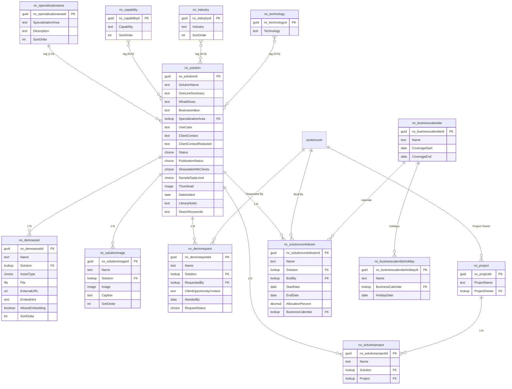
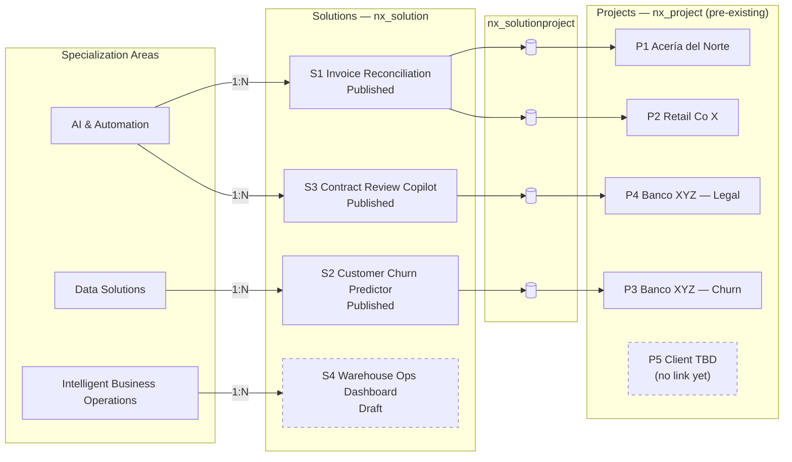
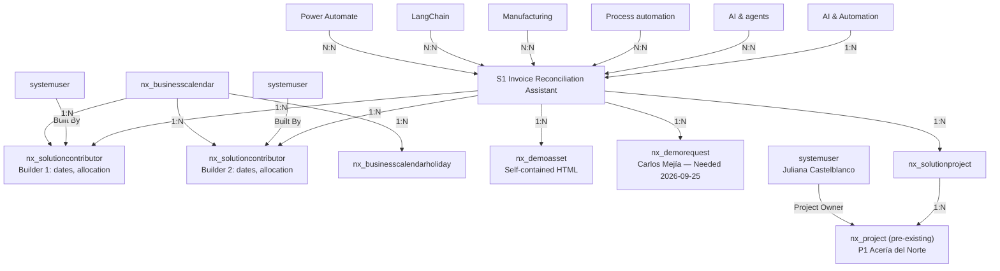

# Nextant Solution Library — Dataverse schema (v2)

**Status:** Authoritative agreed model; legacy schema companion synchronized · **Last updated:** 2026-09-18

This is the current, agreed model. It replaces [nextant-solution-library-dataverse-schema.md](nextant-solution-library-dataverse-schema.md) (v1) — refined through several rounds of review: in v1, `Use Case` was already a plain field on `nx_solution` (not a governed table) and `Capability` was already a reference table with a native N:N to `nx_solution`; an earlier v2 draft flattened every tag relationship to a single-valued lookup, but that was reverted for `Capability`, `Industry`, and `Technology` — they stay **native N:N** as in v1, while `SpecializationArea` alone remains a single-valued lookup; a `Project` concept was added (confirmed in scope) to separate "the reusable Solution" from "the evidence it's been built before" — though `nx_project` itself already exists in Dataverse with fixed columns, so it never gets touched directly; and Solution↔Project, which needed to stay many-sided, got its own junction table instead of a single lookup on either side.

## Conventions

The [legacy v1 entry point](nextant-solution-library-dataverse-schema.md) was synchronized with this model on 2026-09-18 at the user's request. It retains its original layout but is no longer an unchanged historical snapshot; this v2 document remains authoritative. References to v1 below describe its original design history.

- **Primary key vs. primary name** — every table gets an auto-generated GUID key (e.g. `nx_solutionid`) plus a required text *primary name* column, used as its display label in lookups.
- **System columns are automatic** — `createdon`, `createdby`, `modifiedon`, `modifiedby`, `ownerid`, `statecode`/`statuscode` exist on every table without being modeled.
- **Ownership** — `Solution`, `SolutionContributor`, `DemoAsset`, `SolutionImage`, `DemoRequest`, and `SolutionProject` are **user/team-owned** (row-level security, since different practices submit their own work). `SpecializationArea`, `Capability`, `Industry`, `Technology`, `BusinessCalendar`, and `BusinessCalendarHoliday` are **organization-owned** (shared reference data). `nx_project` already exists in Dataverse — its ownership model is out of scope here.
- **One single-valued tag, three multi-valued tags** — each `Solution` points to exactly one `SpecializationArea` via a lookup column. `Capability`, `Industry`, and `Technology` are **native N:N** relationships: a solution can carry several of each, and Dataverse creates and manages the intersect tables — no hand-built junction tables for these three.
- **`nx_project` is fixed** — it already exists in Dataverse with its own columns. Nothing new gets added to it, and it gets no new lookup pointing out of it either. Where a Solution needs to link to *several* Projects, a small junction table (`nx_solutionproject`) sits in between instead.
- **Governance** — `SpecializationArea`, `Capability`, `Industry`, `BusinessCalendar`, and its holiday rows are governed (only the Librarian adds new values). `Technology` is open (anyone adds a value inline; the Librarian periodically merges duplicates).
- **Builder credit is multi-person** — `nx_solutioncontributor` carries one row per Solution/person, including that person's effort inputs. It replaces the single `Built By` lookup and `Effort / Time to Deploy` choice on `nx_solution`; it is not a native N:N because the relationship has attributes. Credit is independent of `ownerid` and does not grant access.

---

## Visual schema

The three N:N tag relationships (`nx_capability`, `nx_industry`, `nx_technology`) are native Dataverse many-to-many — the intersect tables exist but are platform-managed and not modeled here.

`nx_project` stays untouched — no lookup added to it, no lookup pointing out of it. `nx_solutionproject` is the new junction table that lets one `Solution` link to several `Project` rows (and, structurally, vice versa), without either of those two tables needing a multi-valued column of their own.

---

## Reference tables

Shared, organization-owned vocabularies. `SpecializationArea` connects via a single lookup column on `nx_solution`; `Capability`, `Industry`, and `Technology` connect as native many-to-many tags.

### `nx_specializationarea`

| Column | Type | Required | Notes |
|---|---|---|---|
| Specialization Area *(primary name)* | Text (100) | Yes | AI & Automation · Data Solutions · Intelligent Business Operations |
| Description | Text, multi-line (500) | No | Powers the per-tab note in the public app |
| Sort Order | Whole Number | No | |

1:N with `nx_solution` — each solution has exactly one specialization area, set via a lookup column on `nx_solution`.

### `nx_capability`

Reintegrated after review — dropped from the first v2 draft, brought back with a narrower scope than v1: it only connects to `nx_solution`, nothing else.

| Column | Type | Required | Notes |
|---|---|---|---|
| Capability *(primary name)* | Text (100) | Yes | "AI & agents", "Planning & analytics", etc. |
| Sort Order | Whole Number | No | Controls chip order |

Native N:N with `nx_solution` only — a solution can carry several capabilities. Not connected to `nx_project`.

### `nx_industry`

| Column | Type | Required | Notes |
|---|---|---|---|
| Industry *(primary name)* | Text (100) | Yes | "Financial services", "Manufacturing", etc. Seed a **"Cross-industry"** value for industry-agnostic solutions |
| Sort Order | Whole Number | No | |

Native N:N with `nx_solution` — a solution can carry several industries. Tagging at least one industry (or "Cross-industry") is expected in practice, but enforced at review, not schema-level — Dataverse can't make an N:N relationship required.

### `nx_technology`

| Column | Type | Required | Notes |
|---|---|---|---|
| Technology *(primary name)* | Text (100) | Yes | Open vocabulary — "React", "Power BI", "LangChain". Grows organically. |

Native N:N with `nx_solution` — a solution can carry several technologies.

### `nx_businesscalendar` — business-day calendar version

Organization-owned, Librarian-managed. A calendar specifies Monday-Friday workdays and a complete holiday schedule for an explicit coverage period. Weekends and holidays are full non-working days; the working day is fixed at eight hours. Partial days, personal leave and alternative workweeks are not modeled.

| Column | Type | Required | Notes |
|---|---|---|---|
| Name *(primary name)* | Text (100) | Yes | Identifies the US calendar version or coverage, e.g. "US business calendar (2026)" |
| Coverage Start | Date Only | Yes | First date with a complete, reviewed holiday schedule |
| Coverage End | Date Only | Yes | Last covered date; must be on or after Coverage Start |

All contributors use the **US business calendar** automatically, with Monday-Friday workdays excluding observed US federal holidays. There is no calendar selector or alternative calendar policy. The PoC includes only `us-federal-2026` from the [OPM 2026 schedule](https://www.opm.gov/policy-data-oversight/pay-leave/federal-holidays/#url=2026), covering January 1-December 31, including July 3 as observed Independence Day. State-specific and company holidays are not included. Legacy mock records and restored session drafts are reassigned to this calendar and recalculated. The lookup remains for versioned coverage; production writers must enforce the US-only policy too.

A version may cover multiple years, but calculations must reject ranges extending outside its coverage. Freeze a calendar and its holidays once referenced: use a new version for extensions or corrections, and explicitly reassign contributions after review if recalculation is intended. Prevent deletion of referenced calendars. Production enforcement must cover non-UI writes too; no Dataverse automation is implemented by the mock PoC.

### `nx_businesscalendarholiday` — calendar exclusions

| Column | Type | Required | Notes |
|---|---|---|---|
| Name *(primary name)* | Text (100) | Yes | Holiday or observed-day label |
| Business Calendar | Lookup → `nx_businesscalendar` | Yes | The version whose working days this excludes |
| Holiday Date | Date Only | Yes | Must fall within calendar coverage; enter the observed date explicitly |

Organization-owned. Alternate key: `(Business Calendar, Holiday Date)` prevents duplicates. A holiday on Saturday/Sunday does not subtract another day. An observed weekday holiday is a separate explicit date, never inferred. The mock app projects these rows into the calendar's `holidays` date array.

---

## Main table

### `nx_solution`

The reusable offering — the unit of value shown to a CSM.

| Column | Type | Required | Notes |
|---|---|---|---|
| Solution Name *(primary name)* | Text (100) | Yes | |
| One-line Summary | Text (200) | Yes | |
| What It Does | Text, multi-line (4000) | No | |
| Business Value | Text, multi-line (4000) | No | |
| Specialization Area | Lookup → `nx_specializationarea` | Yes | Single-valued — the only single-valued tag |
| Use Case | Text (200) | No | The client-side framing of the problem — "reduce manual invoice handling", "forecast demand". Bridges how a client describes their pain and how Nextant describes its capability. |
| Client / Context | Text (200) | No | Freeform for now; revisit as a lookup if reporting by client is needed later. **Internal-only** — never rendered in present mode |
| Client Context (Redacted) | Text (200) | No | The client-safe substitute shown in present mode — "a national logistics provider". Required in practice whenever Shareable with Clients is "Yes, with names removed"; enforced at review, not schema-level |
| Status | Choice — global | Yes | Idea / concept · Working prototype · Client demo · Live in production · Retired |
| Publication Status | Choice — global | Yes | Draft · Pending review · Published · Retired — **field-level security, Librarian-only write** |
| Shareable with Clients | Choice — global | Yes | Yes · Yes, with names removed · No – internal only |
| Sample Data Level | Choice — global | Yes | Yes – all invented · Partly · No – real client data |
| Thumbnail | Image | No | |
| Date Added | Date Only | No | |
| Library Notes | Text, multi-line (2000) | No | **Field-level security** — internal-only |
| Search Keywords | Text (500) | No | Editorial boost terms not naturally present in the visible text — distinct from Use Case, which frames the problem in the client's own words |

Links to `nx_specializationarea` via the single lookup column above. `Capability`, `Industry`, and `Technology` are **not columns** — they attach through native N:N relationships (multi-valued tags, several per solution). Its link to `nx_project` (potentially several) goes through `nx_solutionproject` below, not a column here.

Builders and effort now live in `nx_solutioncontributor`, not columns on `nx_solution`. Total effort is derived from its contributor rows.

---

## Tables related to Solution

### `nx_solutioncontributor` — builders and effort

One row per person credited on a Solution. User/team-owned, with access aligned to the parent Solution. A required lookup does **not** automatically inherit Dataverse security: configure and validate ownership/sharing so child rows cannot expose unpublished parent information. The Solution owner/team and Librarian manage these rows; merely being selected in `Built By` grants no permissions.

| Column | Type | Required | Notes |
|---|---|---|---|
| Name *(primary name)* | Text (100) | Yes | Auto-generated display label from Solution/person; truncate to 100 characters, never use as identity |
| Solution | Lookup → `nx_solution` | Yes | Parent reusable offering |
| Built By | Lookup → `systemuser` | Yes | One credited person; multiple people require multiple rows |
| Start Date | Date Only | Yes | Inclusive first date of the person's contribution |
| End Date | Date Only | Yes | Inclusive last date; must be on or after Start Date |
| Allocation (%) | Decimal Number (2 decimal places, 0-100) | Yes | Constant allocation over this date range; 50 means half of each eight-hour business day; 0 is permitted |
| Business Calendar | Lookup → `nx_businesscalendar` | Yes | Automatically assigned US calendar version, not user-selectable; must cover the entire date range |

Alternate key: `(Solution, Built By)` enforces one effort record per person per Solution. At least one complete contributor is required before submission/publication; a 1:N relationship cannot itself enforce a minimum child count. Incomplete form drafts may be saved locally, but submission rejects missing people, duplicate people, invalid dates/calendars and invalid allocations. Enforce the same rules on all production writes, not only in the UI.

**Derived values, not editable columns:**

- `Business Days`: count Monday-Friday dates between Start Date and End Date, **inclusive**, excluding each distinct holiday in the automatically assigned US calendar. Date-only arithmetic must not shift with time zone or daylight-saving changes.
- `Effort Hours`: `round(Business Days * 8 * AllocationPercent / 100, 2)` for each contributor. Apply rounding only after the multiplication.
- `Total Effort Hours`: sum the rounded contributor hours, displayed to at most two decimals. Different people working simultaneously contribute separately; this is not elapsed duration. Do not combine their allocations before applying their individual date ranges/calendars.

Example: 2026-09-07 through 2026-09-18 contains ten weekdays. With September 7 excluded and allocation 50%, the contribution is `9 * 8 * 0.5 = 36 hours`. A second person at 100% over the same nine business days adds 72 hours, for 108 total hours. A same-day weekday counts as one; a weekend/holiday-only range yields zero.

These are capacity-based calculated hours, not actual time entries or an estimate of deployment lead time. Allocation changes within a person's period, cross-solution over-allocation checks and timesheets are outside this model. The app calculates from loaded contributor/calendar data; no Dataverse calculated-column capability or stored total is assumed. See [ADR-0007](../architecture/decisions/adr-0007-contributor-effort.md).

**Migration:** create a contributor row for each former `nx_solution.Built By` value. Dates and allocation require explicit confirmation; do not infer them from the old Days/Weeks/Months choice. Assign the US calendar version and verify coverage. Keep legacy values during a real migration until backfill is verified, then retire the old lookup/choice and any unused global choice. The PoC's dates and allocations are illustrative, not historical work records. Demo calendars have been removed; mock records and restored drafts use the OPM-based US calendar, which can change their calculated totals. The legacy schema companion now reflects these rules too.

### `nx_demoasset` — the demo

The curated, presentable asset a CSM opens and shows. Unchanged from v1. Required lookup to `nx_solution`; inherits the parent's visibility rules.

| Column | Type | Required | Notes |
|---|---|---|---|
| Name *(primary name)* | Text (100) | Yes | |
| Solution | Lookup → `nx_solution` | Yes | |
| Asset Type | Choice — global | Yes | Self-contained HTML · Hosted web app (URL) · Power Apps · Power BI · Desktop app or script · Video walkthrough · One-pager / slide |
| File | File | No | For self-contained HTML |
| External URL | URL (500) | No | For hosted/embedded links |
| Embed Hint | Text, multi-line (500) | No | The "sign-in may stall in this frame" style note shown in the viewer |
| Allows Embedding | Yes/No | No | |
| Sort Order | Whole Number | No | |

### `nx_solutionimage` — the gallery

Detail-page screenshots beyond the card thumbnail. Unchanged from v1. The `Thumbnail` image column on `nx_solution` stays the single card-grid hero image; this table carries as many captioned screenshots as the story needs. Required lookup to `nx_solution`; inherits the parent's visibility rules.

| Column | Type | Required | Notes |
|---|---|---|---|
| Name *(primary name)* | Text (100) | Yes | Auto: "{Solution name} — image {n}" |
| Solution | Lookup → `nx_solution` | Yes | |
| Image | Image | Yes | The screenshot payload; enable "can store full images" so the detail page isn't limited to the thumbnail rendition |
| Caption | Text (200) | No | Shown under the image in the gallery |
| Sort Order | Whole Number | No | Gallery display order |

### `nx_demorequest` — the live-demo ask

The "request a live demo" escape hatch, and a signal of which solutions the business actually pulls on. Required lookup to `nx_solution`; inherits the parent's visibility rules.

| Column | Type | Required | Notes |
|---|---|---|---|
| Name *(primary name)* | Text (100) | Yes | Auto: "{Solution name} — {Requester}" |
| Solution | Lookup → `nx_solution` | Yes | |
| Requested By | Lookup → `systemuser` | Yes | |
| Client / Opportunity Context | Text, multi-line (1000) | No | |
| Needed By | Date Only | No | |
| Request Status | Choice — global | Yes | New · Acknowledged · Scheduled · Delivered · Declined |

### `nx_project` — the evidence (already exists in Dataverse, fixed columns)

`nx_project` isn't being designed in this document — it already exists as a table in Dataverse, and its columns don't change here at all. The one connection that already lives on it:

- **Project Owner** — Lookup → `systemuser`, already on the existing table.

It gets **no** new lookup — not to `nx_solution`, not to `nx_technology`. Any new relationship to it is modeled from the other side, via the junction table below.

### `nx_solutionproject` — linking Solutions to delivery evidence

New table, fully ours to design (unlike `nx_project`). Its only job is to let one `Solution` connect to several `Project` rows — the reuse signal (G4): the same reusable Solution, delivered to more than one client.

| Column | Type | Required | Notes |
|---|---|---|---|
| Name *(primary name)* | Text (100) | Yes | Auto: "{Solution Name} — {Project Name}" |
| Solution | Lookup → `nx_solution` | Yes | |
| Project | Lookup → `nx_project` | Yes | |

One row = one link. A Solution with three delivered engagements gets three rows here, each pointing to the same Solution and a different Project. A `Project` not yet linked to any Solution simply has no row in this table — that absence *is* the Librarian's classification queue.

### Intake triage: not every legacy record gets linked to a Solution

Nextant already has systems of record for delivered work — the BPM Project Inventory (SharePoint), individual GitHub repos, and whatever the equivalent turns out to be for Data Solutions. Creating a `nx_solutionproject` row to link one of those Project rows to a Solution is a deliberate decision, gated by four questions asked at intake:

1. Is there (or could there easily be) a presentable asset — not just internal automation glue?
2. Could the same approach be repeated for a different client?
3. Would an external prospect recognize the problem it solves?
4. Can it be described without breaking confidentiality? (Answered via the `nx_solution`'s own `Shareable with Clients`.)

A row that fails this — internal tooling maintenance, one-off support tied to a single stakeholder relationship, culture/ops apps with no sales relevance — never gets a `nx_solutionproject` row, or stays in its source system entirely. Nothing here needs to catch up to it; the source system keeps existing independently, and PRISMA doesn't replace it.

---

## Relationships summary

| From | To | Type |
|---|---|---|
| `nx_specializationarea` | `nx_solution` | 1:N |
| `nx_capability` | `nx_solution` | Native N:N |
| `nx_industry` | `nx_solution` | Native N:N |
| `nx_technology` | `nx_solution` | Native N:N |
| `nx_solution` | `nx_solutioncontributor` | 1:N |
| `systemuser` | `nx_solutioncontributor` | 1:N (Built By) |
| `nx_businesscalendar` | `nx_solutioncontributor` | 1:N |
| `nx_businesscalendar` | `nx_businesscalendarholiday` | 1:N |
| `nx_solution` | `nx_demoasset` | 1:N |
| `nx_solution` | `nx_solutionimage` | 1:N |
| `nx_solution` | `nx_demorequest` | 1:N |
| `systemuser` | `nx_demorequest` | 1:N (Requested By) |
| `nx_solution` | `nx_solutionproject` | 1:N |
| `nx_project` | `nx_solutionproject` | 1:N |
| `systemuser` | `nx_project` | 1:N (Project Owner) |

**13 tables in this model:** `nx_solution`, `nx_solutioncontributor`, `nx_businesscalendar`, `nx_businesscalendarholiday`, `nx_specializationarea`, `nx_capability`, `nx_industry`, `nx_technology`, `nx_demoasset`, `nx_solutionimage`, `nx_demorequest`, `nx_solutionproject`, and `nx_project` (the last one pre-existing, fixed columns — connected only through the junction table and its own existing `Project Owner` lookup to `systemuser`). The three native N:N intersect tables are platform-managed and don't count toward the build.

**Dropped before the original v1 spec:** `nx_usecase` as a governed table — the concept already lived as a plain `Use Case` field on `nx_solution` in v1 and remains so here.

**Dropped from the first v2 draft, then reintegrated:** `nx_capability` — brought back as a reference table, scoped to a single connection (`nx_solution` only, not `nx_project`).

**Reverted from the first v2 draft:** the flattening of `Capability`, `Industry`, and `Technology` to single-valued lookups — all three are back to native N:N as in v1, since a solution's profile routinely carries more than one of each. `Industry` also moved from required to optional-with-a-`Cross-industry`-value.

**Dropped from the first v2 draft, and still dropped:** `nx_projectevidence` (no attachments table).

**Changed this round:** the `Solution` ↔ `Project` connection moved off both fixed tables' direct columns entirely and into a new junction table, `nx_solutionproject`. This restores the one-Solution-to-many-Projects reuse signal that a single lookup (on either side) couldn't carry, without ever touching `nx_project`'s fixed columns.

---

## Security model

| Role | `nx_solution` | `nx_demoasset` / `nx_solutionimage` | Reference tables | `nx_demorequest` | `nx_solutionproject` |
|---|---|---|---|---|---|
| Contributor | Create; Read/Write own; Read published | Same as parent | Read; Create on `nx_technology` only | Read own | Create; Read/Write own |
| CSM | Read published only | Read (published parents) | Read | Create; Read own | Read (context on Solution detail) |
| Librarian | Full | Full | Full | Full | Full |

Unpublished `nx_solution` rows stay invisible to CSMs at the platform level. `Publication Status` and `Library Notes` carry field-level security. `nx_project`'s own security model lives with the existing table, not here.

`nx_solutioncontributor`: Contributor create/read/write/delete only where they can manage the parent Solution; CSM read only for published parents; Librarian full access. Business calendars and holiday rows are readable by all internal roles and writable only by Librarians. Enforce calendar immutability and contributor uniqueness/validation at the platform boundary. Per-person dates, allocations and calendar breakdowns are omitted from present-mode rendering; builder names and total effort remain available. Present mode is not a security boundary for the bundled mock data.

## Still open

- Who creates the `nx_solutionproject` link — the Librarian during triage, or the Contributor who owns the Solution?

*(Resolved: `Capability`, `Industry`, and `Technology` cardinality — settled as native N:N, multi-valued. `nx_project` + `nx_solutionproject` — confirmed in scope.)*

---

## Example: one Solution, several Projects, via the junction table

Each `Solution` has exactly one `SpecializationArea`, but can now link to **several** `Project` rows again — through `nx_solutionproject`, not through a column on either fixed side.

S1 links to **both** P1 (Acería del Norte) and P2 (Retail Co X) — the reuse signal is back, carried by two separate `nx_solutionproject` rows, not by either fixed table. S4 (Draft) and P5 (no link yet) are dashed — the same two "pending" states as before, just represented as the *absence* of a junction row rather than an empty lookup.

## Example: everything hanging off one Solution

Zooming into a single Solution (S1) shows every other table it touches: its specialization-area lookup and N:N tags, the demo asset the CSM opens, a live-demo request raised against it, and — through the junction table — its delivery evidence.

One Solution row is the hub: the tags describe *what it is* (exactly one specialization area, plus as many capabilities, industries, and technologies as apply), with a plain `Use Case` text field for how the client would phrase the problem. `nx_demoasset` is *what a CSM can show*, `nx_demorequest` is *who's asking for a live one right now*, and `nx_solutionproject` is the bridge to *proof it already happened* — pointing at a `nx_project` row this schema never modifies directly.
