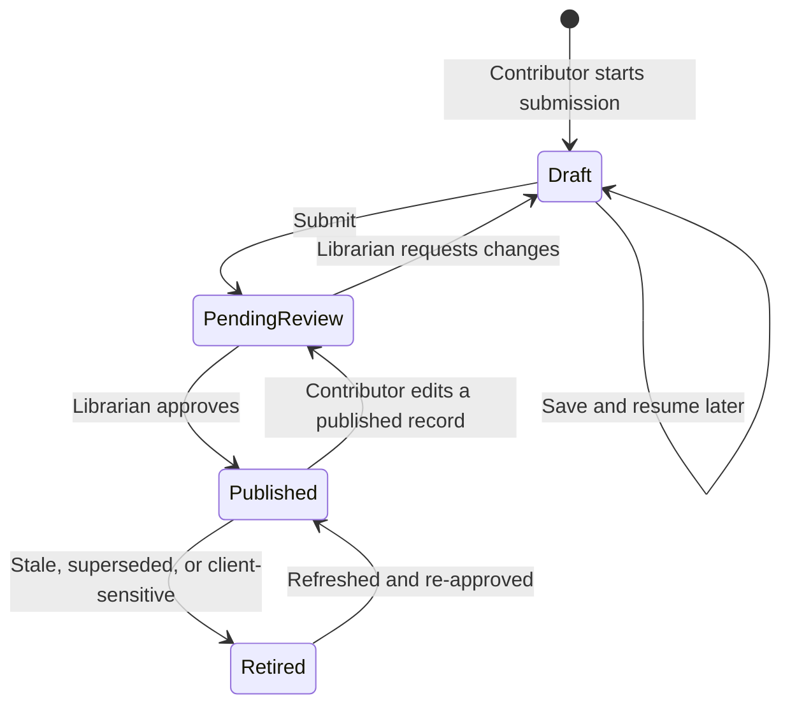
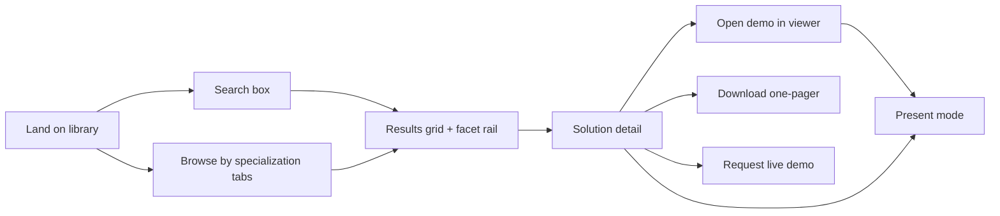
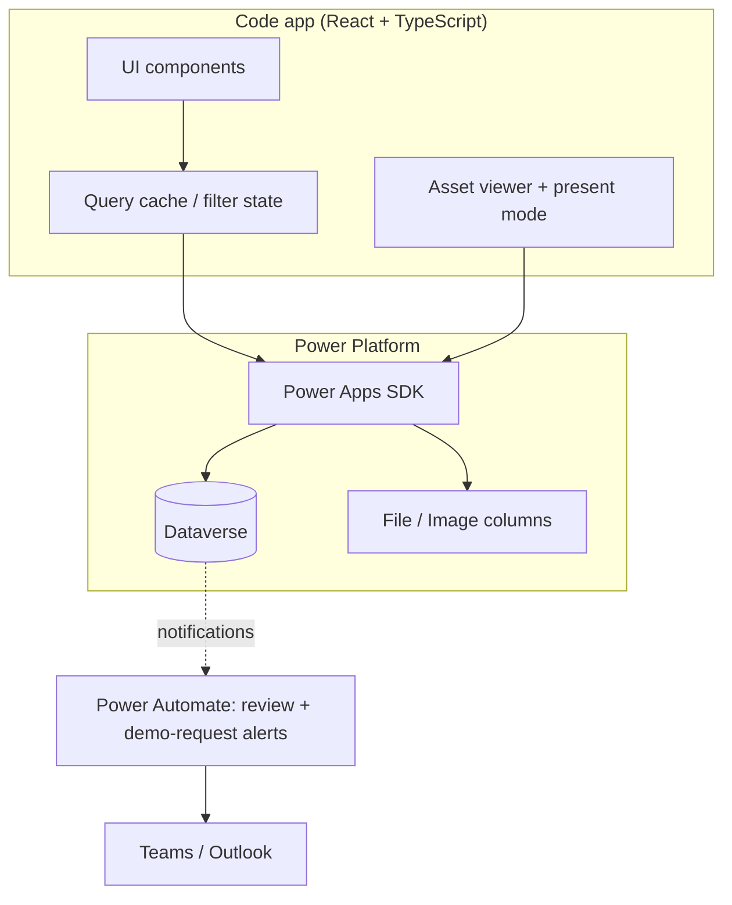

# PRISMA — Nextant Solution Library — End-to-End Design

**Status:** Draft for review · look-and-feel PoC implemented in [`app/`](../../app/README.md)
**Last updated:** 2026-09-16
**Owner:** _TBD_
**Related docs:** [Dataverse schema spec](../data_model/nextant-solution-library-dataverse-schema.md) · [Code app PoC](../../app/README.md) · [HTML prototype](../../examples/nextant-solution-library%201.html)

---

## 1. Purpose

Nextant builds a steady stream of PoCs, prototypes, demos and production solutions across its three Specialization Areas — AI & Automation, Data Solutions, and Intelligent Business Operations. Today that work is scattered across individual machines, team channels, and people's memories. When a Customer Success Manager sits down with a prospect, there is no reliable way to answer *"what have we already built that proves we can do this?"*

The Solution Library — branded **PRISMA** in the product — is an internal marketplace for that work. Builders publish what they made; a librarian curates it; CSMs browse, search, and present it live to clients.

### 1.1 Co-primary goals

All four carry equal weight in v1. They are not sequenced — the design must serve each.

| # | Goal | What "working" looks like |
|---|---|---|
| G1 | **CSM enablement** | A CSM can go from a client's problem statement to a presentable demo in under two minutes, without asking anyone for help. |
| G2 | **Knowledge capture** | Every PoC, demo, and solution built at Nextant has a durable record with an owner, an asset, and enough context to be understood by someone who wasn't there. |
| G3 | **Sales acceleration** | Demos are surfaced earlier and more often in the sales cycle; CSMs report the library materially helped in specific pursuits. |
| G4 | **Internal reuse** | Delivery teams check the library before building, and find prior art often enough to change what they build. |

### 1.2 Non-goals for v1

Explicitly out of scope. Listed so they can be declined quickly rather than re-litigated.

- CRM / Dynamics / opportunity-record integration
- Leadership analytics dashboard
- External or client-authenticated access (clients never log in)
- Ratings, comments, likes, or other social features
- Automated hosting or provisioning of demo environments

> Note the tension between "no client access" and the requirement for a client-facing present mode. These are compatible: the CSM is always the authenticated driver, screen-sharing their session. No client ever holds a credential or a link.

---

## 2. Users and roles

Three roles with genuinely distinct experiences. A person may hold more than one.

### 2.1 Contributor (Builder)

The consultant, engineer, or practice lead who built the thing.

- **Wants:** credit for their work, minimal paperwork, to stop re-explaining the same demo in Teams threads.
- **Does:** creates and edits their own solution records, uploads assets, submits for review.
- **Cannot:** publish their own work, edit other people's records.
- **Friction budget:** low. If submission takes more than ~10 minutes, they won't do it, and G2 fails.

### 2.2 CSM (Consumer)

The Customer Success Manager preparing for or sitting in a client conversation.

- **Wants:** to find the right proof point fast, understand it well enough to speak to it, and show it without looking unprepared.
- **Does:** searches, filters, browses, opens demos, enters present mode, downloads one-pagers, requests live demos from builders.
- **Cannot:** edit anything. Read-only on published records.
- **Context of use:** often minutes before a call; sometimes live on a screen-share with a client watching.

### 2.3 Librarian (Admin)

The small team that owns library quality.

- **Wants:** consistent, accurate, non-embarrassing entries; no stale content presented to clients.
- **Does:** reviews the submission queue, edits any record, sets publication status, manages reference data (capabilities, technologies, industries), retires stale entries.
- **Is the only role that can publish.** This is the quality gate that makes G3 safe — nothing reaches a client screen unreviewed.

---

## 3. Core workflows

### 3.1 Contribution → publication



**Guided multi-step submission form**, with draft saving at every step. The steps mirror how a builder actually thinks about their work, not how the database is shaped:

1. **What is it?** — Name, one-line summary, specialization area, status (idea / prototype / client demo / production / retired).
2. **What does it do and why does it matter?** — What It Does, Business Value, client problem it solves. This is the step CSMs depend on most and builders resent most, so it gets inline examples and an optional AI-assist to expand terse bullets into prose.
3. **Tag it** — Capabilities, technologies, industries, use-case tags. Type-ahead against existing values; new technologies can be created inline (that vocabulary is intentionally open), new capabilities and industries cannot (those are governed).
4. **Attach the demo** — One or more assets. The form adapts to asset type (see §3.3).
5. **Images** — One card thumbnail (optional; a generated per-specialization poster covers records without one) plus any number of captioned detail-page screenshots, stored in `nx_solutionimage` (see §6.1a).
6. **Safety & sharing** — Shareable with clients, sample data level, client/context. These questions are asked plainly because getting them wrong is the highest-consequence error in the system.
7. **Review & submit** — A preview of exactly how the card and detail page will look, then submit.

On submit the record moves to *Pending review* and the librarian queue is notified. Contributors can see the state of their own submissions at any time.

**Editing a published record** returns it to *Pending review* for material changes (summary, business value, assets, sharing flags) but not for trivial ones (typo in library notes). The librarian sees a diff of what changed.

### 3.2 Discovery → presentation (the CSM path)

This is the hero flow. Two entry points, converging on the same detail view.



**Search** is fast, forgiving, and matches across name, summary, what-it-does, business value, tags, and the editorial `Search Keywords` field. Results update as the CSM types. Zero-result states suggest relaxing the most restrictive active facet rather than showing an empty page.

**Facets** filter by specialization area, capability, technology, industry, solution status, and shareability. Facets are additive, show live counts, and are individually removable as chips. The active filter state is reflected in the URL so a CSM can bookmark or paste a filtered view into a Teams thread.

**Browse** is the alternative for CSMs who don't yet know what they're looking for: three specialization-area tabs, each with a short framing note and a visual card grid. Cards carry a thumbnail, name, one-liner, specialization colour coding, status badge, and capability chips — enough to triage without clicking.

**Solution detail** is the CSM's briefing document: what it does, business value, who built it (with a direct contact path), the client/context it came from, tags, and the asset list. Internal-only content (library notes) is visible here to internal viewers and never in present mode.

### 3.3 Demo assets

Asset handling is type-dependent. The CSM should never have to guess what will happen when they click.

| Asset type | In-app behaviour | Fallback |
|---|---|---|
| Self-contained HTML file | Render in the full-screen viewer directly from the Dataverse File column | Download the file |
| Hosted web app (URL) | Embed in the viewer if `Allows Embedding`; otherwise open in a new tab immediately | Pop-out, with the `Embed Hint` shown |
| Power Apps / Power BI | Deep-link out in a new tab (embedding is unreliable and auth-stalls inside frames) | Video walkthrough if one exists |
| Video walkthrough | Play inline in the viewer | Download |
| Desktop app or script | Not runnable in-app — show the video and a "request live demo" call to action | Contact the builder |
| Client-ready one-pager / slide | Download | — |

Every solution should have at least one asset a CSM can show *without any setup*. Where the primary asset can't be embedded, a video walkthrough acts as the universal fallback. The librarian enforces this at review.

**Request a live demo** creates a lightweight handoff: the CSM picks a solution, adds context (client, date, what they need to show), and the builder is notified. This is the escape hatch for solutions that can't be self-served, and it doubles as a signal of which solutions matter to the business (G3).

### 3.4 Present mode

One switch in the masthead, available from any page, flipped before the CSM shares their screen.

Present mode:

- **Suppresses internal-only content** — library notes, publication status, review history, builder-facing metadata.
- **Restricts the catalogue** to solutions flagged *Shareable with clients*. Internal-only solutions disappear from search and browse entirely while present mode is active, so there is no way to accidentally surface one.
- **Applies client-safe redaction** — where a solution is flagged *Yes, with names removed*, client names in the Client/Context field and body text are replaced with a generic descriptor ("a national logistics provider"). This requires a dedicated redacted variant of the client context field rather than runtime string-scrubbing, which is not trustworthy.
- **Changes the visual treatment** — larger type, minimal chrome, no filter rail by default, full-bleed demo viewer.

Present mode state is obvious and persistent (a clear banner, dismissible without leaving the mode — the masthead toggle stays lit) so a CSM is never unsure which mode they're in. Exiting requires a deliberate action.

---

## 4. Experience principles

1. **Two minutes to a demo.** Every design decision is measured against the CSM's time-to-present. Anything that adds a click to that path needs to earn it.
2. **Never embarrass a CSM in front of a client.** No broken embeds, no half-finished entries, no internal snark on screen, no real client data where it shouldn't be. This is why publication is gated and why present mode restricts rather than merely hides.
3. **Contribution must feel like credit, not paperwork.** Builders see their name on the card and their work in front of clients.
4. **Show, don't describe.** Cards are visual. Detail pages lead with the demo. The library is a showcase, not a spreadsheet with a stylesheet.
5. **The prototype's visual language is the baseline; the PoC is the current reference.** The HTML prototype establishes the palette (steel blue `#1C567C` from the wordmark, per-specialization accents) and typography (Schibsted Grotesk / Source Sans 3 / IBM Plex Mono), light and dark themes, and motion. The code app PoC evolves that into a liquid-glass system — translucent refractive surfaces over an aurora ground — with the PRISMA wordmark central to the identity. The production app matches the PoC.
6. **Accessible by default.** WCAG 2.1 AA: keyboard-navigable throughout, visible focus, reduced-motion respected, semantic landmarks. Already partially implemented in the prototype and not to be regressed.

---

## 5. Information architecture

```
/                       Library home — search, specialization tabs, card grid
/solutions              Full catalogue with facet rail (URL-encoded filter state)
/solutions/:id          Solution detail
/solutions/:id/demo     Full-screen asset viewer
/present                Present mode wrapper over browse + detail
/submit                 Guided submission form (Contributor)
/my-submissions         Contributor's own records and their states
/review                 Librarian queue
/admin/reference-data   Capabilities, industries, specialization areas, technologies
```

> **Routing note.** A published code app is served from `/play/e/{environmentId}/a/{appId}` and never owns the path segment, so these routes are implemented as hash routes. The PoC maps: home + catalogue → `#/` (one surface — search, tabs and facet rail share the grid), detail → `#/s/:id`, viewer → `#/s/:id/demo/:assetId`, submission → `#/submit`. Present mode is a mode over every route rather than a separate `/present` wrapper, which is what keeps its state persistent. `/my-submissions`, `/review` and `/admin/reference-data` are not yet in the PoC.

---

## 6. Data model

The [existing schema spec](../data_model/nextant-solution-library-dataverse-schema.md) is the foundation and has been updated with the deltas below.

### 6.1 New reference tables

| Table | Rationale |
|---|---|
| `nx_industry` | CSMs filter by industry constantly — it's the first question a client's context raises. Modeled as a table rather than a multi-select Choice because multi-select picklists can't be filtered efficiently and can't carry sort order. |
| `nx_usecase` | Bridges the gap between how a client describes their pain and how Nextant describes its capabilities. Governed vocabulary, seeded from real pursuits. |

Both join `nx_solution` via native N:N.

### 6.1a New child table: `nx_solutionimage`

Detail-page screenshots beyond the card thumbnail — the submission form collects them in a dedicated Images step. The `Thumbnail` column on `nx_solution` remains the single card-grid hero image; this table carries the captioned gallery rendered on the solution detail page. 1:N to `nx_solution`, visibility inherited from the parent. Full spec in the [schema doc](../data_model/nextant-solution-library-dataverse-schema.md).

### 6.2 Additions to `nx_solution`

| Column | Type | Rationale |
|---|---|---|
| Thumbnail | Image column | The card grid is the primary browse surface and needs a visual. A per-specialization generated placeholder covers records without one. |
| Effort / Time to Deploy | Choice — **global**, single-select | Days · Weeks · Months · Ongoing programme. CSMs get asked "how long would this take us?" in the same breath as "can you show me?" |
| Client Context (Redacted) | Single line of text (200) | Supplies the client-safe substitute string used in present mode. Filled in by the contributor or librarian when shareability is *Yes, with names removed*. |

### 6.3 New table: `nx_demorequest`

Supports the live-demo handoff (§3.3): solution, requester, client/opportunity context, needed-by date, and a request status (New · Acknowledged · Scheduled · Delivered · Declined).

### 6.4 Reference data governance

- **Governed (librarian-managed):** specialization areas, capabilities, industries, use-case tags. Contributors select from existing values only.
- **Open (contributor-extendable):** technologies. Grows organically; the librarian periodically merges duplicates.

> The full column-by-column spec, including field-level security requirements, now lives in the [schema spec](../data_model/nextant-solution-library-dataverse-schema.md).

---

## 7. Technical architecture

**Confirmed stack:** Power Platform code app (React + TypeScript) over Dataverse, Microsoft Entra ID SSO, internal Nextant users only, Nextant brand standards.

### 7.1 Shape



### 7.2 Key decisions

- **Dataverse is the single source of truth.** No separate search index in v1 (see §7.3).
- **Assets live in Dataverse File and Image columns.** No external blob storage, no separate hosting to provision. This is what makes self-contained HTML demos viable — the payload travels with the record.
- **Native N:N relationships** for solution↔capability, solution↔technology, solution↔industry, solution↔use-case. No hand-built junction tables.
- **Power Automate for notifications only** — review-queue alerts and demo-request handoffs to Teams/Outlook. No business logic lives in flows.
- **Present mode is enforced server-side as well as client-side.** The query issued in present mode filters on shareability at the Dataverse level, so a client-visible list can never contain an internal-only record even transiently.

### 7.3 Search approach

At the expected scale (~40 solutions year one), the entire published catalogue fits comfortably in memory. v1 loads published records once per session and performs search and faceting client-side. This makes search instant, makes typo-tolerance and multi-field matching trivial, and eliminates a class of latency problems in the hero flow.

The trade: this does not scale past a few thousand records. That's a deliberate, documented ceiling — revisit with Dataverse full-text search or an external index if the catalogue grows an order of magnitude beyond projections.

### 7.4 Security model

| Role | `nx_solution` | `nx_demoasset` / `nx_solutionimage` | Reference tables | `nx_demorequest` |
|---|---|---|---|---|
| Contributor | Create; Read/Write **own**; Read published (org) | Same as parent | Read; Create on `nx_technology` only | Read own |
| CSM | Read **published** only | Read (published parents) | Read | Create; Read own |
| Librarian | Full (org) | Full | Full | Full |

- `nx_solution` is user/team-owned; reference tables are organization-owned.
- **Publication status can only be written by the Librarian role.** This is enforced by a field-level security profile, not by UI affordance alone.
- `Library Notes` carries field-level security and is unreadable by the CSM role.
- Unpublished records are invisible to CSMs at the platform level — not merely filtered out in the UI.

---

## 8. Success metrics

| Goal | Metric | Year-one target |
|---|---|---|
| G2 | Solutions published | **40** |
| G2 | Specialization areas with ≥8 published solutions | All three |
| G1 | Monthly active CSMs | _TBD — set at pilot_ |
| G1 | Median time from landing to opening a demo | Under 2 minutes |
| G3 | Demos surfaced in active pursuits (self-reported) | _TBD_ |
| G3 | Live-demo requests raised through the app | _TBD_ |
| G4 | Reuse instances reported by delivery teams | _TBD_ |

The 40-solution target is the only firm number today. The remaining targets should be baselined during the pilot rather than guessed now; the instrumentation to measure them ships in v1 even though the targets don't.

---

## 9. Delivery phases

**Phase 1 — Foundation.** Dataverse schema including §6 deltas, security roles, reference data seeded, librarian-only bulk entry of an initial set of known solutions. Proves G2 is achievable before any CSM sees the app.

**Phase 2 — Discovery.** Card grid, specialization tabs, search, facets, solution detail, asset viewer. The CSM read path, end to end. Ported from the prototype's visual language.

**Phase 3 — Present mode.** Client-safe restriction, redaction, presentation chrome. Gated behind a deliberate review of the shareability flags on every published record.

**Phase 4 — Contribution.** Guided submission form, draft saving, review queue, notifications. Opens the library to the whole firm.

**Phase 5 — Handoff.** Demo requests, contributor dashboards, one-pager downloads.

Phases 2 and 3 are the ones that justify the project to a CSM; phase 4 is the one that keeps it alive. Neither can be dropped.

---

## 10. Risks

| Risk | Impact | Mitigation |
|---|---|---|
| **Contribution never happens** — builders don't submit, the library stays thin, CSMs stop visiting | Fatal to G2 and G4 | Seed 40 records via librarian bulk entry in phase 1 before opening submissions. Keep the form under 10 minutes. Make credit visible. Practice leads own a quota. |
| **Client data leaks into a client presentation** | Severe, reputational | Mandatory shareability and sample-data questions at submission; librarian review gate; server-side filtering in present mode; explicit redacted-context field |
| **Demos break silently** — hosted URLs rot, embeds start failing | Erodes CSM trust, which is unrecoverable | Periodic link-health check; `Allows Embedding` flag; video walkthrough as universal fallback; librarian-driven staleness review |
| **Librarian becomes a bottleneck** | Contributions queue up and stall | More than one librarian; SLA on review; auto-approve path for minor edits |
| **Stale content presented as current** | Undermines G3 | `Date Added` surfaced on cards; retirement workflow; annual re-confirmation prompt to the contributor |
| **Self-contained HTML assets carry active content** | Security exposure via embedded demo files | Render user-supplied HTML in a sandboxed iframe with a restrictive policy; librarian review of uploaded files; no same-origin access to the host app |

---

## 11. Open questions

1. Who owns the Librarian role, and how many people hold it?
2. How many CSMs are in the target audience, and what's the pilot group?
3. Is there a target launch date or a pursuit deadline driving timing?
4. Where does the initial set of 40 solutions come from — is there an existing inventory to import from the intake workbook?
5. What are the licensing implications of the code app for the full internal audience?
6. Should the demo-request handoff route to the builder directly, or to their practice lead?
7. Is there an existing Nextant one-pager template that the downloadable asset should conform to?
