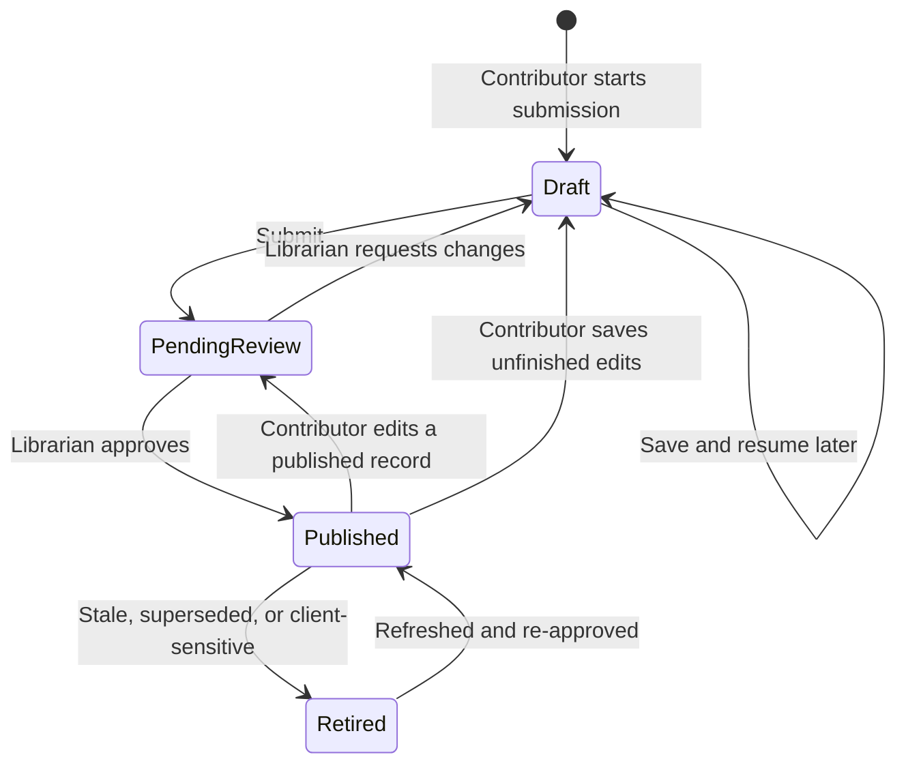
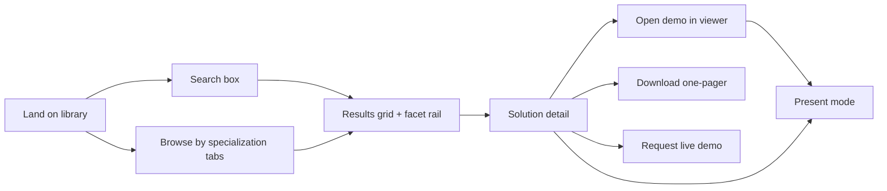
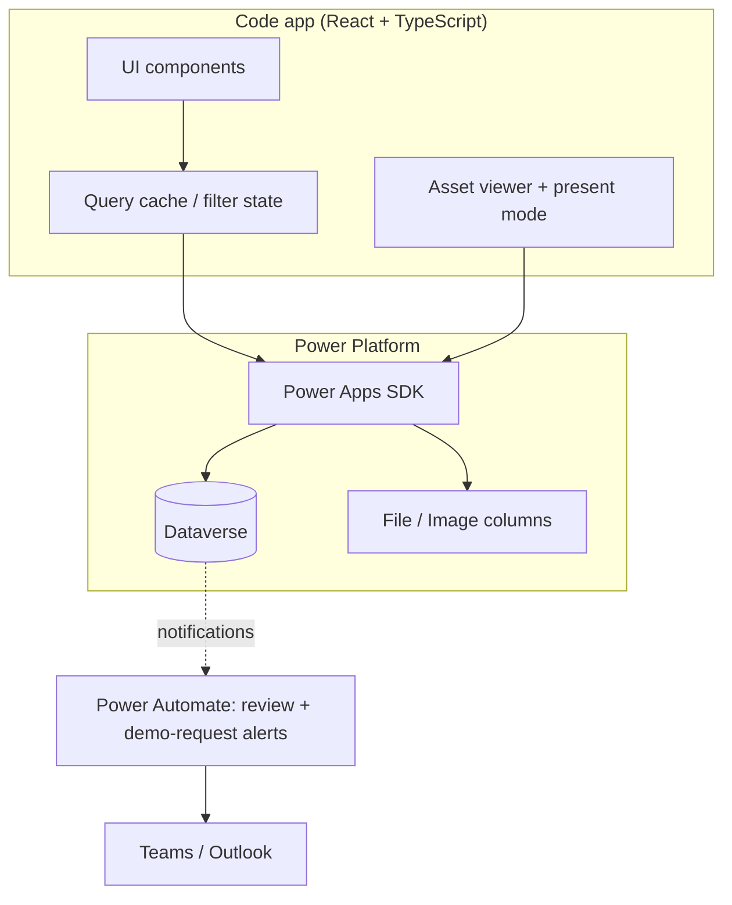

# PRISMA — Nextant Solution Library — End-to-End Design

**Status:** Agreed design; 200 MiB video preparation implemented locally; hosted compression, delivery/playback and least-privilege acceptance remain open
**Last updated:** 2026-09-22
**Owner:** _TBD_
**Related docs:** [Documentation map](../README.md) · [Dataverse schema spec (v2)](../data_model/SchemaV2.md) · [Code app PoC](../../app/README.md) · [HTML prototype](../../examples/nextant-solution-library%201.html)

---

## 1. Purpose

Nextant builds a steady stream of PoCs, prototypes, demos and production solutions across its three Specialization Areas — AI & Automation, Data Solutions, and Intelligent Business Operations. Today that work is scattered across individual machines, team channels, and people's memories. When a Customer Success Manager sits down with a prospect, there is no reliable way to answer *"what have we already built that proves we can do this?"*

The Solution Library — branded **PRISMA** in the product — is an internal marketplace for that work. Builders publish what they made; a librarian curates it; CSMs browse, search, and present it live to clients.

### 1.1 Co-primary goals

All four carry equal weight in v1. They are not sequenced — the design must serve each.

| # | Goal | What "working" looks like |
|---|---|---|
| G1 | **CSM enablement** | A CSM can go from a client's problem statement to a presentable demo in under two minutes, without asking anyone for help. |
| G2 | **Knowledge capture** | Every PoC, demo, and solution built at Nextant has a durable record with an owner, an asset, and enough context to be understood by someone who wasn't there. |
| G3 | **Sales acceleration** | Demos are surfaced earlier and more often in the sales cycle; CSMs report the library materially helped in specific pursuits. |
| G4 | **Internal reuse** | Delivery teams check the library before building, and find prior art often enough to change what they build. |

### 1.2 Non-goals for v1

Explicitly out of scope. Listed so they can be declined quickly rather than re-litigated.

- CRM / Dynamics / opportunity-record integration
- Leadership analytics dashboard
- External or client-authenticated access (clients never log in)
- Ratings, comments, likes, or other social features
- Automated hosting or provisioning of demo environments

> Note the tension between "no client access" and the requirement for a client-facing present mode. These are compatible: the CSM is always the authenticated driver, screen-sharing their session. No client ever holds a credential or a link.

---

## 2. Users and roles

Three roles with genuinely distinct experiences. A person may hold more than one.

### 2.1 Contributor (Builder)

The consultant, engineer, or practice lead who built the thing.

- **Wants:** credit for their work, minimal paperwork, to stop re-explaining the same demo in Teams threads.
- **Does:** creates and edits their own solution records, uploads assets, submits for review.
- **Cannot:** publish their own work, edit other people's records.
- **Friction budget:** low. If submission takes more than ~10 minutes, they won't do it, and G2 fails.

### 2.2 CSM (Consumer)

The Customer Success Manager preparing for or sitting in a client conversation.

- **Wants:** to find the right proof point fast, understand it well enough to speak to it, and show it without looking unprepared.
- **Does:** searches, filters, browses, opens demos, enters present mode, downloads one-pagers, requests live demos from builders.
- **Cannot:** edit anything. Read-only on published records.
- **Context of use:** often minutes before a call; sometimes live on a screen-share with a client watching.

### 2.3 Librarian (Admin)

The small team that owns library quality.

- **Wants:** consistent, accurate, non-embarrassing entries; no stale content presented to clients.
- **Does:** reviews the submission queue, edits any record, sets publication status, manages reference data (capabilities, technologies, industries), retires stale entries.
- **Is the only role that can publish.** This is the quality gate that makes G3 safe — nothing reaches a client screen unreviewed.

---

## 3. Core workflows

### 3.1 Contribution → publication



**Guided multi-step submission form**, with draft saving at every step. The steps mirror how a builder actually thinks about their work, not how the database is shaped:

1. **Before you start** — Required safety acknowledgment replaces the former sharing and sample-data classifications. Submit only authorized, client-safe descriptions and media using invented or anonymized data. Client identity is allowed only in the dedicated internal field. Acknowledgment is not approval.
2. **What is it?** — Name, summary, specialization area, capability (single-valued, same picker style as specialization area), maturity, optional internal client and separately authored anonymous presentation context. Require the anonymous context when a client is supplied. Credit at least one unique contributor, searchable by name/email. Ideas and working prototypes use direct hours per person; client demos and production use inclusive start/end dates and an allocation percentage, with calculated effort (Monday-Friday excluding observed US federal holidays, enforced in code) previewed per person and in total. Duplicate people are excluded; the PoC searches mock people rather than a live directory.
3. **What & why** — Separate actions/results from business value. Optional AI writing assistance is deferred; contributors may paste existing approved wording unchanged.
4. **Tag it** — Search capabilities, technologies and industries. Capabilities/industries remain governed; new technologies are allowed with case-insensitive duplicate prevention.
5. **Media** — Require one to six detail images, with optional captions. Thumbnail remains optional with generated-poster fallback. Optional videos, one-pagers/slides and self-contained HTML share this step. Capability-specific hints explain useful outcomes and confidentiality requirements.
6. **Review & submit** — Client-visible card preview plus a summary clearly separating internal client identity and anonymous context. Validate acknowledgment, contributor effort, client context and required images again at submit.

On submit the record moves to *Pending review*. The production workflow will notify the librarian; the PoC does not. Direct navigation connects the library, submission form and **My submissions**, with inspection and editing; no welcome screen. **Save draft & close** accepts incomplete records at any step. Explicit draft saves, submissions, review decisions and media persist in browser-local IndexedDB across reloads. Unsaved text has a tab-local backup; unsaved media remains in memory. Browser data can be cleared or evicted and does not sync across devices; this is not production persistence. Dataverse remains the only planned production persistence/storage service.

The local **Review queue** at `#/review` supports pending, changes-requested and published views, search and specialization filtering. A librarian preview can inspect the record and sandboxed attachments, explicitly confirm client safety to approve and publish, or return it to Draft with required comments. Contributors see the latest comments in My submissions and the editor and can resubmit. Review access is simulated for UI evaluation, not authorization; production requires Dataverse roles and field-level security. Review and contributor surfaces are inaccessible in present mode.

**Draft and review contract:** saving a draft requires an authored, nonblank solution name of at most 100 characters. The legacy reserved label `Untitled solution` is not accepted; existing unnamed drafts remain readable but must be named before saving again. Summary and capability may be absent in Draft; selected contributors may have incomplete effort inputs, and media is optional until submission. Submitting and approving both require a non-placeholder name, summary, exactly one capability, unique complete contributors, safety acknowledgment, anonymous context when a client is named, and one to six detail images. Production column constraints still apply to supplied values; empty person-picker rows remain UI state rather than Dataverse rows. See [schema validation](../data_model/SchemaV2.md#draft-and-transition-contract).

`Review Outcome` (None / Changes requested / Approved) and contributor-readable `Review Comments` (up to 4000 characters) are dedicated fields on Solution, separate from internal editorial Library Notes. They describe the latest decision, not current approval: contributor saves and resubmissions preserve them while clearing Client Safe Reviewed. Returned records are Draft + Changes requested and require fresh acknowledgment. Approval replaces the latest feedback, including clearing it when no comment is supplied. Review fields are excluded from the CSM projection and present mode. This is not review history; no new review table is introduced.

Production save/submit/review operations use synchronous Dataverse Custom APIs and plug-ins with caller authorization, state validation and optimistic concurrency. Contributors cannot write protected review/publication fields directly; only an explicit PRISMA Librarian role permits approval. These handlers are deployed in PRISMA_Dev, not SPA API routes. Approved pilot roles/profiles/readers membership are assigned. Submit, return, revise, resubmit, approve and withdraw passed using the privileged owner with an explicit Librarian role; parent/child reader shares were granted read-only and revoked. This does not establish effective non-admin access or separation between submitter and reviewer identities. See [lifecycle evidence](../workflows/contribution-and-review.md#verified-lifecycle), [assignments](../architecture/security-model.md#approved-pilot-assignments) and [ADR-0008](../architecture/decisions/adr-0008-controlled-submission-transitions.md).

**Connected implementation (2026-09-22):** the separate app saves core fields, contributor effort and native technology/industry/project links, uploads protected thumbnails, gallery images and attachments, and exposes My submissions, review, withdrawal and published detail/viewer routes. The six-step PoC submission layout, searchable contributor picker, chip selectors, card preview, card-based My submissions, detail panels and viewer frame are shared or reused. Continue and Save draft & close coordinate core/graph writes with exact confirmed versions; uploads retain their protected protocol. Final review requires fresh safety confirmation after edits/uploads. No mock data or local-save success fallback is introduced. Contributors edit only their own Drafts; explicit withdrawal restores Pending/Published/Retired records to Draft. Owner deletion in every state, Draft captions, inline technology creation and approved tab recovery are implemented. Visual reuse is not a claim of complete feature or authorization acceptance.

**UI/UX inheritance requirement:** PRISMA PoC is the interaction and presentation baseline for the connected PRISMA app, not just a visual reference. Reuse shared components for equivalent controls, states, navigation and layouts. Backend adapters may change persistence, enforce authorization and expose truthful loading/error/concurrency states; they must not silently remove working PoC interactions. A missing controlled API is an outstanding implementation requirement, not an accepted permanent UI reduction. PoC-only simulations (local publication, unrestricted review, inert notification/AI controls) must not be represented as real connected success.

| Surface | Connected parity and outstanding work |
|---|---|
| Library, themes, filters and present mode | Shared library and shell; present entry from an internal route returns to the library, with banner-aware sticky layout. Catalogue refreshes on return. Authorized contributor names enter search before rendering; cards hydrate credit and protected thumbnails. Populated published discovery and its performance still need live acceptance. |
| Guided submission | Both adapters now render the same safety, identity, story, contributor-row, review-summary, footer and success components extracted from the PoC. Layout, examples, field order, first-contributor retention and button states share one implementation. New connected drafts default to the readable AI specialization; untouched empty contributor placeholders do not block named draft saves, while authored effort without a person must be resolved. Current contributor defaults only on a unique readable email match. Inline technology creation, identity-scoped recovery and authoritative server totals retain their protected adapters. |
| Media | Both forms share stacked sections, captioned screenshots and attachment rows, now with drag handles and keyboard/tap move controls within each category. Connected reorder flushes captions and persists exact-version metadata immediately; uncertain responses require reopen. Ordering is disabled during unfinished uploads. Progress uses a themed rounded track, percent/byte counts and uploading/finalizing/incomplete states. Actual document delivery still needs browser acceptance. |
| Review and My submissions | Shared queue/card views and the PoC's review action panel. Submit/return/revise/resubmit/approve/withdraw passed with required feedback, renewed contributor safety and separate reviewer confirmation. Published library/detail/HTML viewer and present-mode redaction passed on one disposable solution. All five parent/child reader-team share masks changed from Read to zero on withdrawal. Non-admin effective access, cross-account review, revocation denial and retirement still require acceptance. |
| Detail and viewer | Shared detail panels and viewer frame; caller-readable contact, effort provenance and internal library notes are projected. Present mode omits email, per-person effort, projects and notes. Protected image/HTML viewing works; document actions use the SDK. Connected media now authors and edits hosted URLs, Power Apps, Power BI and desktop demonstration guidance through the protected asset transition. Hosted URLs support sandboxed preview and pop-out; Power Apps/BI open externally; desktop entries show arrangements without claiming a request was sent. Actual signed-in external launches, published reader access and revocation still need acceptance. |
| Confirmations and recovery | Shared themed modals cover withdrawal, retirement, removal, deletion, discard and restore, with focus containment, restoration and Escape cancellation. In-app navigation guards preserve edits until confirmed; browser-owned tab-close/reload warnings remain native. Recovery clears after successful save/submit, explicit discard, identity/authentication loss or present entry. External host sign-out is detected only when the app receives an authentication failure or reloads. |

Full UI/UX parity is **not accepted** until these gaps and the existing release gates are resolved. Present-mode filtering, independent approval, optimistic concurrency and protected media ownership must not be weakened to make a PoC control appear functional.

The connected project picker now allows zero or one selected project: choosing another replaces the selection. Existing multi-project drafts are retained and warned about until explicitly resolved in Tag it; explicit Save and final submission require one or none. This is a presentation/editor constraint, not a Dataverse N:N schema migration or a new backend authorization rule. Historical project associations are not deleted automatically.

The subsequent [eight-area acceptance pass](../workflows/contribution-and-review.md#eight-area-acceptance-pass) verified retirement/restoration, interrupted-upload cleanup, reload recovery and two-tab stale edit/approval rejection. A 12-record published catalogue improved from 7,992ms to 1,518ms through bounded parallel hydration; search/filtering measured 26-28ms. This is not a production-scale benchmark. Long uninterrupted card titles now wrap and video failures provide a download fallback. PDF/PPTX/video bytes round-tripped exactly, but integrated-browser OS downloads and playback remain unverified. URL storage initially rejected values over 100 despite 4000-character metadata; a separately approved [metadata repair](../architecture/technical-architecture.md#url-storage-repair) resolved it. Protected create/edit/readback now preserve 2000-character URLs and the full 230-character MyPortal link without truncation. External launch acceptance remains separate. All disposable fixtures were removed; no code app was published.

The source-level parity pass adds rendered UI/adapter-wiring checks (`npm run test:ui`) and regressions for connected card tags, named incomplete drafts and caption version chaining. Local Play verified protected PNG/HTML uploads, caption Save draft/reopen, Back navigation with a simultaneous summary edit, upload-time caption flush, fresh safety and stale-save rejection. The subsequent [lifecycle check](../workflows/contribution-and-review.md#verified-lifecycle) verified positive approval, published discovery/presentation, withdrawal and explicit share revocation, including a linked asset. Both disposable fixtures were removed and the three original drafts were unchanged. Checks used a privileged owner/Librarian, not least-privilege identities. Remaining adapter-visible differences include Dataverse checkpoints on Continue, final safety reconfirmation, withdrawal before editing non-Drafts, and additional Use case/Projects fields. These checks do not establish effective non-admin access or full acceptance.

Notifications, review diffs, librarian content editing and reference-data administration are future product work, not functioning PoC interactions silently removed from the connected app. Inert notification/AI simulations remain excluded. Recovery covers core text and contributor/tag/project selections only, not unsaved captions or media bytes; a changed server version cannot be overwritten by restoring a backup. See [ADR-0008](../architecture/decisions/adr-0008-controlled-submission-transitions.md).

**Approved media/access extension:** a private organization-owned `nx_uploadsession` table stores typed upload protocol state, not solution drafts or file payloads. Media is owned by the non-member **PRISMA Media Custodian** team; contributors receive read-only access after finalization. A separate **PRISMA Published Readers** team receives read-only Solution/contributor/media shares on approval, revoked on withdrawal/retirement. Both teams were created empty; user memberships remain administrator-managed. No Consultant/Project security or rows were changed. See [ADR-0009](../architecture/decisions/adr-0009-mediated-media-and-publication-access.md).

**Deployment separation (2026-09-21):** keep the existing **PRISMA PoC** live app as the mock-data UI test environment, including its browser-local submission/review simulations. Build **PRISMA** as a separate code app connected to the existing Dataverse tables in Nextant Pulse / `PRISMA_Dev`. Do not rename, reinitialize or repoint the PoC. Share the visual components, but isolate app configuration, generated services, build output and persistence. The connected app must not fall back to mock data or local-only saves. Full read/write contribution, media and authorized review must pass verification before its first publication; a read-only release is not the selected milestone. See the [integration plan](../architecture/technical-architecture.md#connected-app-integration-plan).

**Saving edits to a published record** removes it from the published catalogue and clears client-safe review approval: explicit draft saves return to *Draft*, while submitting returns to *Pending review*. Simply opening the editor does not withdraw a record. Require a fresh safety acknowledgment. Production librarian review will include a diff; librarian-only note corrections may remain published.

### 3.2 Discovery → presentation (the CSM path)

This is the hero flow. Two entry points, converging on the same detail view.



**Search** is fast, forgiving, and matches across name, summary, what-it-does, business value, tags, and the editorial `Search Keywords` field. Results update as the CSM types. Zero-result states suggest relaxing the most restrictive active facet rather than showing an empty page.

**Facets** filter by specialization area, capability, technology, industry and solution status (status is planned). Facets are additive, show live counts, and are individually removable as chips. The active filter state is reflected in the URL so a CSM can bookmark or paste a filtered view into a Teams thread.

**Browse** is the alternative for CSMs who don't yet know what they're looking for: three specialization-area tabs, each with a short framing note and a visual card grid. Cards carry a thumbnail, name, one-liner, specialization colour coding, status badge, and a capability badge — enough to triage without clicking.

**Solution detail** is the CSM's briefing document: what it does, business value, everyone who built it (with direct contact paths), total calculated effort hours, the client/context it came from, tags, and the asset list. Per-person dates, allocation, and effort breakdown are internal-only and omitted in present mode, alongside library notes and internal client identity. Present mode uses only the authored anonymous context, builder names and aggregate hours. Direct hours are reported effort; calendar-mode hours are capacity-based, not elapsed deployment time or a timesheet — and client-demo hours carry a warning that production delivery may take longer.

### 3.3 Demo assets

The connected Media step supports images, videos, one-pagers/slides and self-contained HTML, plus hosted URLs, Power Apps, Power BI and desktop/script demonstration guidance. Files and linked assets share the six-attachment limit. Linked assets use existing Dataverse type, URL, embedding and hint fields; create/edit is caller-owned Draft-only with exact parent versions and safety invalidation. URLs must use HTTPS without credentials; only hosted-web entries can opt into sandboxed embedding. Desktop entries require client-safe arrangements, no executable upload or web URL. The PoC submission form retains its original file-only authoring; its seeded catalogue continues to demonstrate the broader types. Actual demo-request delivery remains separate future work.

| Asset type | In-app behaviour | Fallback |
|---|---|---|
| Self-contained HTML file | Render in the full-screen viewer directly from the Dataverse File column | Download the file |
| Hosted web app (URL) | Embed in the viewer if `Allows Embedding`; otherwise open in a new tab immediately | Pop-out, with the `Embed Hint` shown |
| Power Apps / Power BI | Deep-link out in a new tab (embedding is unreliable and auth-stalls inside frames) | Video walkthrough if one exists |
| Video walkthrough | Play inline in the viewer | Download |
| Desktop app or script | Not runnable in-app; connected detail opens saved demo arrangements and explicitly sends no request | Contact the builder; optional video walkthrough |
| Client-ready one-pager / slide | Download | — |

New submissions require at least one detail image; images alone are sufficient. A thumbnail alone is not. The librarian reviews all client-visible media before publication. Capability-specific upload guidance should be validated with practice leads, especially data/BI and business teams.

Following explicit user approval, both runnable submission forms automatically attempt local compression for MP4/WebM videos from 200 MiB through the existing 500 MiB input limit. Smaller files are unchanged. Only a smaller validated output replaces the selected file; failures require an explicit original-file choice or cancellation before upload. No original file is overwritten. Progress/cancellation and wizard locking are shared; the single-file presentation excludes the encoder and offers original-file fallback. Hosted validation and GPL distribution review are release gates. Details and verification limits are owned by [demo assets](../workflows/demo-assets.md#automatic-video-preparation).

**Request a live demo (planned)** will create a lightweight handoff: the CSM picks a solution, adds context (client, date, what they need to show), and the builder is notified. The current connected desktop viewer only displays author-provided arrangements; it does not create a request or notify anyone. This future handoff is the escape hatch for solutions that can't be self-served and a signal of which solutions matter to the business (G3).

### 3.4 Present mode

One switch in the masthead, available from any page, flipped before the CSM shares their screen.

Present mode:

- **Suppresses internal-only content** — library notes, publication status, review history, builder-facing metadata.
- **Restricts the catalogue** before search/render to Published records with Safety Acknowledged and librarian-controlled Client Safe Reviewed both true. Unreviewed and pending records are never included.
- **Always excludes client identity** and project names. Present mode uses only the dedicated anonymous context field, never the internal client field. Body text and media must already be anonymized; no runtime string-scrubbing or automatic media redaction is implied.
- **Changes the visual treatment** — larger type, minimal chrome, no filter rail by default, full-bleed demo viewer.

Present mode state is obvious and persistent (a clear banner, dismissible without leaving the mode — the masthead toggle stays lit) so a CSM is never unsure which mode they're in. Exiting requires a deliberate action.

---

## 4. Experience principles

1. **Two minutes to a demo.** Every design decision is measured against the CSM's time-to-present. Anything that adds a click to that path needs to earn it.
2. **Never embarrass a CSM in front of a client.** No broken embeds, no half-finished entries, no internal snark on screen, no real client data where it shouldn't be. This is why publication is gated and why present mode restricts rather than merely hides.
3. **Contribution must feel like credit, not paperwork.** Builders see their name on the card and their work in front of clients.
4. **Show, don't describe.** Cards are visual. Detail pages lead with the demo. The library is a showcase, not a spreadsheet with a stylesheet.
5. **The prototype's visual language is the baseline; the PoC is the current reference.** The HTML prototype establishes the palette (steel blue `#1C567C` from the wordmark, per-specialization accents) and typography (Schibsted Grotesk / Source Sans 3 / IBM Plex Mono), light and dark themes, and motion. The code app PoC evolves that into a liquid-glass system — translucent refractive surfaces over an aurora ground — with the PRISMA wordmark central to the identity. The production app matches the PoC.
6. **Accessible by default.** WCAG 2.1 AA: keyboard-navigable throughout, visible focus, reduced-motion respected, semantic landmarks. Already partially implemented in the prototype and not to be regressed.

---

## 5. Information architecture

```
/                       Library home — search, specialization tabs, card grid
/solutions              Full catalogue with facet rail (URL-encoded filter state)
/solutions/:id          Solution detail
/solutions/:id/demo     Full-screen asset viewer
/present                Present mode wrapper over browse + detail
/submit                 Guided submission form (Contributor)
/my-submissions         Contributor's own records and their states
/review                 Librarian queue
/admin/reference-data   Capabilities, industries, specialization areas, technologies
```

> **Routing note.** A published code app is served from `/play/e/{environmentId}/a/{appId}` and never owns the path segment, so these routes are implemented as hash routes. The PoC maps: home + catalogue → `#/` (one surface — search, tabs and facet rail share the grid), detail → `#/s/:id`, viewer → `#/s/:id/demo/:assetId`, submission → `#/submit`. Present mode is a mode over every route rather than a separate `/present` wrapper, which is what keeps its state persistent. `/my-submissions`, `/review` and `/admin/reference-data` are not yet in the PoC.

---

## 6. Data model

The [schema spec (v2)](../data_model/SchemaV2.md) is the foundation and has been updated with the deltas below.

### 6.1 New reference tables

| Table | Rationale |
|---|---|
| `nx_industry` | CSMs filter by industry constantly — it's the first question a client's context raises. Modeled as a table rather than a multi-select Choice because multi-select picklists can't be filtered efficiently and can't carry sort order. |

It joins `nx_solution` via native N:N.

### 6.1a New child table: `nx_solutionimage`

Detail-page images collected in the unified Media step. Require one to six on new submissions; `Thumbnail` remains optional and separate. 1:N to `nx_solution`, with access aligned to the parent. Full spec in the [schema doc (v2)](../data_model/SchemaV2.md).

### 6.2 Additions to `nx_solution`

| Column | Type | Rationale |
|---|---|---|
| Thumbnail | Image column | The card grid is the primary browse surface and needs a visual. A per-specialization generated placeholder covers records without one. |
| Client Context (Redacted) | Single line of text (200) | The only context used in present mode; required at submission when the optional internal client field is populated. |
| Use Case | Single line of text (200) | Freeform client-side framing of the problem the solution addresses ("reduce manual invoice handling"). Originally a governed `nx_usecase` reference table joined via N:N; simplified to a text column to cut governance overhead. |

### 6.3 New table: `nx_demorequest`

Supports the live-demo handoff (§3.3): solution, requester, client/opportunity context, needed-by date, and a request status (New · Acknowledged · Scheduled · Delivered · Declined).

### 6.3a Contributors and effort

Replace the single `Built By` lookup and solution-wide `Effort / Time to Deploy` choice with `nx_solutioncontributor`: one row per Solution/person, with a `cr6b0_consultant` lookup, Date Only start/end dates, and allocation (0-100%). Contributor credit does not change record ownership or grant edit access.

Effort Mode follows maturity: Direct for ideas/prototypes, Calendar for client demos/production. Direct Hours is a nonnegative two-decimal input; dates/allocation are not required in Direct mode. Switching maturity preserves draft inputs but validates and totals only the active mode.

In Calendar mode, `Business Days` counts Monday-Friday within the inclusive date range, excluding observed US federal holidays calculated in code for 2020-2035. There are no calendar tables, calendar lookup, or calendar selector. Apply the federal holiday rules appropriate to each year; state-specific and company holidays are excluded from the policy. Per-person hours = business days × 8 × allocation / 100, rounded to two decimals; solution hours sum those rounded person totals. Reject invalid dates, reversed ranges, and dates outside supported coverage. Existing 2026 mock and restored-draft totals must remain unchanged.

The schema owns the full contract and migration notes; see [schema v2](../data_model/SchemaV2.md#nx_solutioncontributor--builders-and-effort) and [ADR-0007](../architecture/decisions/adr-0007-contributor-effort.md). The agreed code-based US calendar policy supersedes the weekday-only proposal while retaining the removal of calendar tables. The current mock app still uses its 2026 in-memory calendar; multi-year support and removal of calendar IDs remain pending implementation.

### 6.4 Reference data governance

- **Governed (librarian-managed):** specialization areas, capabilities, industries. Contributors select existing tags.
- **Open (contributor-extendable):** technologies. Grows organically; the librarian periodically merges duplicates.

> The full column-by-column spec, including field-level security requirements, now lives in the [schema spec (v2)](../data_model/SchemaV2.md).

---

## 7. Technical architecture

**Confirmed stack:** Power Platform code app (React + TypeScript) over Dataverse, Microsoft Entra ID SSO, internal Nextant users only, Nextant brand standards.

### 7.1 Shape



### 7.2 Key decisions

**Existing environment context:** The Power Platform solution `PRISMA_Dev` exists in **Nextant Pulse** (`ce09ad9b-57d1-e5df-9400-8ce973c86213`, not Nextant Pulse Prod). This is distinct from the **PRISMA PoC** code app and does not imply that planned Dataverse components are implemented. See [environment and solution details](../architecture/technical-architecture.md#environment-and-solution).

- **Dataverse is the single source of truth.** No separate search index in v1 (see §7.3).
- **Assets live in Dataverse File and Image columns.** No external blob storage, no separate hosting to provision. This is what makes self-contained HTML demos viable — the payload travels with the record.
- **Native N:N relationships** for solution↔technology, solution↔industry, and solution↔`cr6b0_project`. No hand-built junction tables for these — capability is a single-valued 1:N lookup, same shape as specialization area, not a tag; `nx_solutioncontributor` is a child table carrying per-person effort attributes because that relationship has attributes of its own.
- **Power Automate for notifications only** — review-queue alerts and demo-request handoffs to Teams/Outlook. No business logic lives in flows.
- **Present mode is enforced server-side as well as client-side.** The production query requires Published, Safety Acknowledged and Client Safe Reviewed, and omits internal client/project fields. The PoC mirrors this before render; bundled data is not protected by it.

### 7.3 Search approach

At the expected scale (~40 solutions year one), the entire published catalogue fits comfortably in memory. v1 loads published records once per session and performs search and faceting client-side. This makes search instant, makes typo-tolerance and multi-field matching trivial, and eliminates a class of latency problems in the hero flow.

The trade: this does not scale past a few thousand records. That's a deliberate, documented ceiling — revisit with Dataverse full-text search or an external index if the catalogue grows an order of magnitude beyond projections.

### 7.4 Security model

| Role | `nx_solution` | `nx_demoasset` / `nx_solutionimage` | Reference tables | `nx_demorequest` |
|---|---|---|---|---|
| Contributor | Create; Read/Write **own**; Read published (org) | Same as parent | Read; Create on `nx_technology` only | Read own |
| CSM | Read **published** only | Read (published parents) | Read | Create; Read own |
| Librarian | Full (org) | Full | Full | Full |

- `nx_solution` is user/team-owned; reference tables are organization-owned.
- **Only an authorized librarian can request publication.** Protected state changes go through synchronous, caller-authorized Dataverse transitions; contributors can request draft/submit without direct write permission on publication/review fields. See [ADR-0008](../architecture/decisions/adr-0008-controlled-submission-transitions.md).
- Review Outcome, Review Comments and Library Notes carry field-level security and are unreadable by the CSM role. Review feedback is readable on contributor-authorized rows and is separate from editorial notes.
- Unpublished records are invisible to CSMs at the platform level — not merely filtered out in the UI.

---

## 8. Success metrics

| Goal | Metric | Year-one target |
|---|---|---|
| G2 | Solutions published | **40** |
| G2 | Specialization areas with ≥8 published solutions | All three |
| G1 | Monthly active CSMs | _TBD — set at pilot_ |
| G1 | Median time from landing to opening a demo | Under 2 minutes |
| G3 | Demos surfaced in active pursuits (self-reported) | _TBD_ |
| G3 | Live-demo requests raised through the app | _TBD_ |
| G4 | Reuse instances reported by delivery teams | _TBD_ |

The 40-solution target is the only firm number today. The remaining targets should be baselined during the pilot rather than guessed now; the instrumentation to measure them ships in v1 even though the targets don't.

---

## 9. Delivery phases

**Phase 1 — Foundation.** Dataverse schema including §6 deltas, security roles, reference data seeded, librarian-only bulk entry of an initial set of known solutions. Proves G2 is achievable before any CSM sees the app.

**Phase 2 — Discovery.** Card grid, specialization tabs, search, facets, solution detail, asset viewer. The CSM read path, end to end. Ported from the prototype's visual language.

**Phase 3 — Present mode.** Client-safe restriction and presentation chrome, gated by deliberate client-safe review of every published record.

**Phase 4 — Contribution.** Guided submission form, draft saving, review queue, notifications. Opens the library to the whole firm.

**Phase 5 — Handoff.** Demo requests, contributor dashboards, one-pager downloads.

Phases 2 and 3 are the ones that justify the project to a CSM; phase 4 is the one that keeps it alive. Neither can be dropped.

---

## 10. Risks

| Risk | Impact | Mitigation |
|---|---|---|
| **Contribution never happens** — builders don't submit, the library stays thin, CSMs stop visiting | Fatal to G2 and G4 | Seed 40 records via librarian bulk entry in phase 1 before opening submissions. Keep the form under 10 minutes. Make credit visible. Practice leads own a quota. |
| **Client data leaks into a client presentation** | Severe, reputational | Upfront safety acknowledgment; librarian-controlled client-safe review; server-side filtering; client identity always internal; separately authored anonymous context |
| **Demos break silently** — hosted URLs rot, embeds start failing | Erodes CSM trust, which is unrecoverable | Periodic link-health check; `Allows Embedding` flag; video walkthrough as universal fallback; librarian-driven staleness review |
| **Librarian becomes a bottleneck** | Contributions queue up and stall | More than one librarian; SLA on review; auto-approve path for minor edits |
| **Stale content presented as current** | Undermines G3 | `Date Added` surfaced on cards; retirement workflow; annual re-confirmation prompt to the contributor |
| **Self-contained HTML assets carry active content** | Security exposure via embedded demo files | Render user-supplied HTML in a sandboxed iframe with a restrictive policy; librarian review of uploaded files; no same-origin access to the host app |

---

## 11. Open questions

1. Who owns the Librarian role, and how many people hold it?
2. How many CSMs are in the target audience, and what's the pilot group?
3. Is there a target launch date or a pursuit deadline driving timing?
4. Where does the initial set of 40 solutions come from — is there an existing inventory to import from the intake workbook?
5. What are the licensing implications of the code app for the full internal audience?
6. Should the demo-request handoff route to the builder directly, or to their practice lead?
7. Is there an existing Nextant one-pager template that the downloadable asset should conform to?
