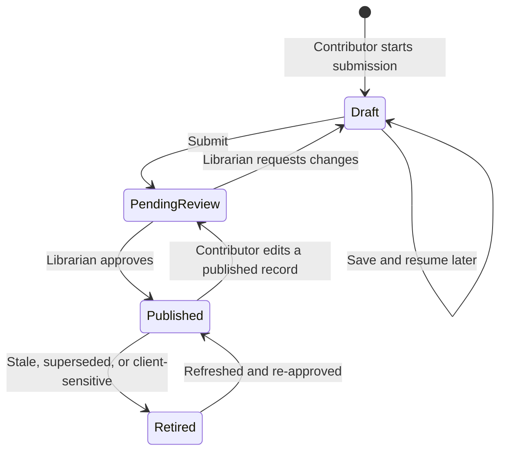

# Contribution & review workflow

**Status:** Draft for review, aligned with current contributor and calendar contracts · **Last updated:** 2026-09-18
**Source:** [End-to-end design §3.1](../design/end-to-end-design.md#31-contribution--publication) · Roles: [Contributor, Librarian](../design/end-to-end-design.md#2-users-and-roles)

## Lifecycle

Only the **Librarian** can publish — enforced by field-level security, not UI affordance ([security model](../architecture/security-model.md)).

## The submission form

Guided multi-step form with draft saving at every step. **Friction budget: under 10 minutes** — beyond that, builders stop submitting and G2 fails. Steps mirror how a builder thinks about their work, not how the database is shaped:

| Step | Collects | Notes |
|---|---|---|
| 1. What is it? | Name, one-line summary, specialization area, status, one or more builders | Per person: start/end dates and allocation %; US calendar assigned automatically without a selector; live business-day and hour totals |
| 2. What does it do and why does it matter? | What It Does, Business Value, client problem it solves | The step CSMs depend on most and builders resent most — gets inline examples and an optional AI-assist to expand terse bullets into prose |
| 3. Tag it | Capabilities, technologies, industries | Type-ahead against existing values. New technologies can be created inline; capabilities and industries cannot ([governance](../data_model/reference-data-governance.md)) |
| 4. Attach the demo | One or more assets | Form adapts to asset type ([demo assets](demo-assets.md)) |
| 5. Images | One card thumbnail (optional — generated poster covers records without one) + captioned detail screenshots (`nx_solutionimage`) | |
| 6. Safety & sharing | Shareable with clients, sample data level, client/context | Asked plainly — getting these wrong is the highest-consequence error in the system. If "Yes, with names removed": fill `Client Context (Redacted)` |
| 7. Review & submit | Preview of exactly how the card and detail page will look | |

On submit the record moves to *Pending review* and the librarian queue is notified (Power Automate → Teams/Outlook). Contributors can see the state of their own submissions at any time (`/my-submissions`).

Builder credit is a set of `nx_solutioncontributor` rows, not the submitter or record owner. Each person appears once. At least one complete row is required before submission; invalid/reversed dates, missing calendars, out-of-coverage dates and allocations outside 0-100% block progress. Allocation has at most two decimal places. Dates are inclusive; holidays come from the automatically assigned US calendar. Calculation and migration rules live in [schema v2](../data_model/SchemaV2.md#nx_solutioncontributor--builders-and-effort).

The mock form saves contributor inputs in the session draft, supports adding/removing people and shows aggregate hours on review. It does not create Dataverse records or send notifications. Old drafts acquire an initial contributor and need effort inputs before continuing.

The Person field searches available people by name or email, case-insensitively. Results exclude people already assigned to another contributor row. Select a result with a pointer or arrow keys followed by Enter; unmatched text is never stored as a person. Escape or leaving the field cancels the search and restores the committed selection. Selected people persist with the draft. This searches the mock people list, not a live directory.

## Editing a published record

| Change | Effect |
|---|---|
| Material — summary, business value, assets, sharing flags, contributor or effort inputs | Returns to *Pending review*; librarian sees a diff of what changed |
| Trivial — typo in library notes | Stays *Published* |

## Review (librarian side)

Detailed steps in the [librarian runbook](../operations/librarian-runbook.md). At review the librarian enforces:

- Every solution has at least one asset a CSM can show **without any setup** (video walkthrough as universal fallback).
- Shareability and sample-data flags are credible for the content.
- Uploaded HTML files are reviewed before publication (sandboxing is defence in depth, not a substitute).
- Entry quality — no half-finished entries or internal snark reach a client screen.
- At least one unique builder, valid inclusive dates and allocation, and a reviewed calendar version covering every contribution; calculated hours reflect those inputs, not the retired deployment-time category.
