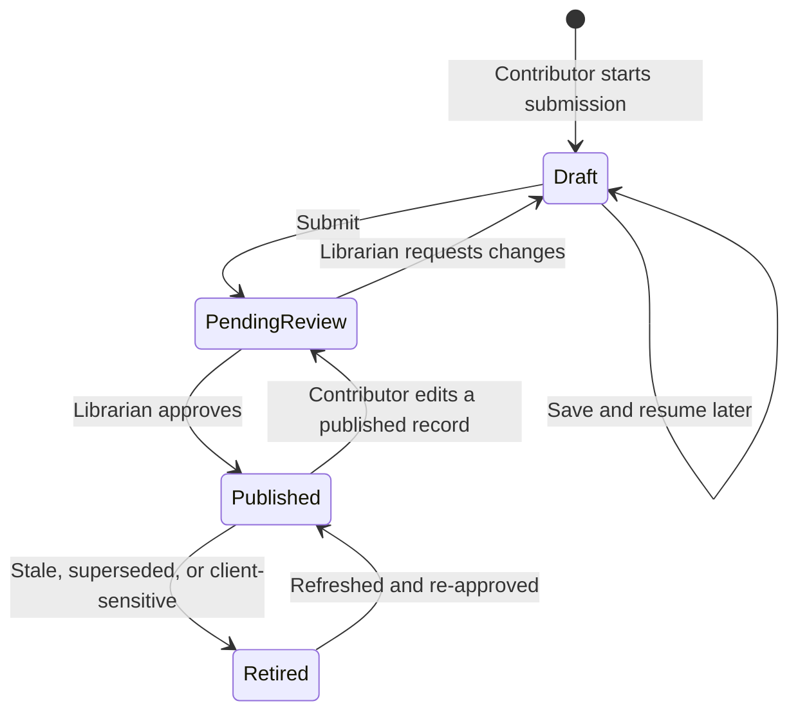

# Contribution & review workflow

**Status:** Agreed six-step submission implemented in the local PoC · **Last updated:** 2026-09-21
**Source:** [End-to-end design §3.1](../design/end-to-end-design.md#31-contribution--publication) · Roles: [Contributor, Librarian](../design/end-to-end-design.md#2-users-and-roles)

## Lifecycle

Only the **Librarian** can publish — enforced by field-level security, not UI affordance ([security model](../architecture/security-model.md)).

## The submission form

Guided multi-step form with draft saving at every step. **Friction budget: under 10 minutes** — beyond that, builders stop submitting and G2 fails. Steps mirror how a builder thinks about their work, not how the database is shaped:

| Step | Collects | Notes |
|---|---|---|
| 1. Before you start | Required safety acknowledgment | Replaces sharing/sample-data classifications; authorized, anonymized client-visible content; not review approval |
| 2. What is it? | Identity, maturity, contributors, internal client and anonymous context | Direct hours for ideas/prototypes; dates/allocation for demos/production. Anonymous context required if a client is supplied |
| 3. What & why | Actions/results and business value | Separate fields with examples; optional AI assistance deferred |
| 4. Tag it | Searchable capabilities, technologies, industries | New technologies allowed with case-insensitive deduplication; other lists governed |
| 5. Media | One to six required detail images; optional thumbnail, HTML, video and one-pager/slides | Images alone suffice. Capability-specific guidance; permission-dependent formats deferred |
| 6. Review & submit | Client-visible card and summary | Revalidate safety, identity/effort, anonymous context and required images |

On submit the record moves to *Pending review*. Production will notify the librarian (Power Automate); the PoC does not. Contributors inspect and edit their records at `#/my-submissions`, with editing at `#/submit/:id`. The library remains the first screen; no welcome page. Librarian UI design is deferred without removing the approval requirement.

Builder credit is independent of ownership. Require one or more unique people. Direct mode requires finite nonnegative hours with at most two decimals. Calendar mode retains valid inclusive dates, 0-100% allocation with two decimals, and a covered US calendar. Switching maturity preserves draft values and validates/totals only the active mode. Full contract: [schema v2](../data_model/SchemaV2.md#nx_solutioncontributor--builders-and-effort).

The PoC saves text drafts in tab storage, with separate keys for edits and the walkthrough. Media is memory-only. Submitted records and attachments survive navigation within the running app, but not reload. No Dataverse records, notifications or real review queue entries are created. The revised draft key avoids treating legacy sharing answers as acknowledgment.

The Person field searches available people by name or email, case-insensitively. Results exclude people already assigned to another contributor row. Select a result with a pointer or arrow keys followed by Enter; unmatched text is never stored as a person. Escape or leaving the field cancels the search and restores the committed selection. Selected people persist with the draft. This searches the mock people list, not a live directory.

## Editing a published record

| Change | Effect |
|---|---|
| Material — summary, business value, media, client context, contributor or effort inputs | Fresh acknowledgment; returns to Pending review and clears Client Safe Reviewed; production librarian sees a diff |
| Trivial — typo in library notes | Stays *Published* |

## Review (librarian side)

Detailed steps in the [librarian runbook](../operations/librarian-runbook.md). At review the librarian enforces:

- New submissions have at least one detail image. Images alone are sufficient, with optional other supported media.
- Safety acknowledgment is present and all client-visible content is authorized and anonymized; client identity remains internal.
- Uploaded HTML files are reviewed before publication (sandboxing is defence in depth, not a substitute).
- Entry quality — no half-finished entries or internal snark reach a client screen.
- At least one unique builder with valid effort for the maturity-selected mode. Only the librarian sets Client Safe Reviewed; acknowledgment never grants clearance.
