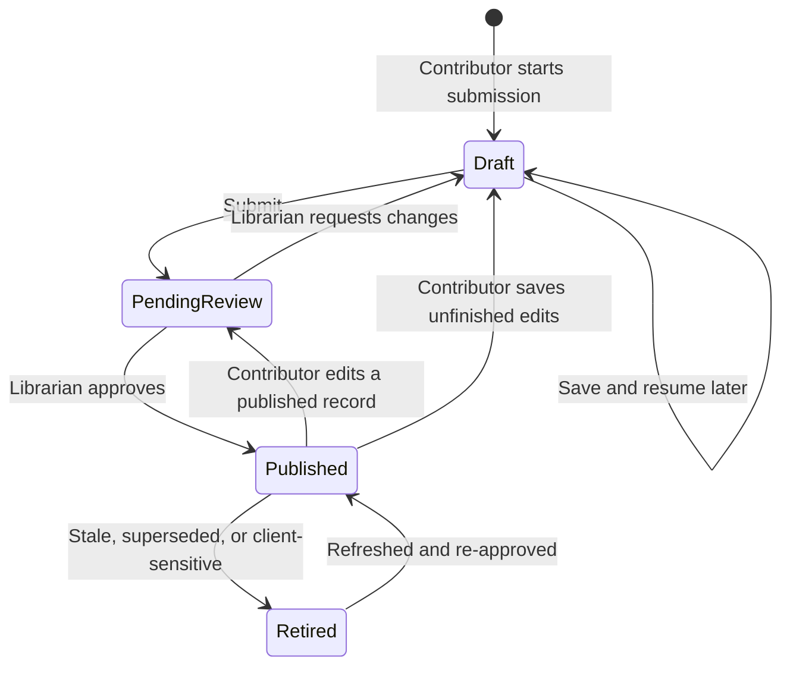

# Contribution & review workflow

**Status:** Shared guided workflow includes thumbnail/captions, technology creation, recovery and owner deletion; reviewer and least-privilege acceptance pending · **Last updated:** 2026-09-22
**Source:** [End-to-end design §3.1](../design/end-to-end-design.md#31-contribution--publication) · Roles: [Contributor, Librarian](../design/end-to-end-design.md#2-users-and-roles)

## Lifecycle

**Connected implementation:** core/graph/media saves and synchronous transitions are deployed. `#/my-submissions` lists all caller-owned states; `#/submission/:id` shows persisted details/feedback; `#/submit?draft=:id` edits owned Drafts. Pending/Published/Retired records require explicit withdrawal before editing. `#/review` and `#/review/:id` require the explicit PRISMA Librarian role, not administrator status alone. Approval requires independent client-safe confirmation; return requires comments. Published shares are granted/revoked through the empty, manually managed readers team. No users were assigned and no connected app was published. See [deployed permissions](../architecture/security-model.md#deployed-core-draft-scope).

Connected editing now follows the same six-step guided layout. Identity includes searchable contributors, Tag it uses reference chips, Media shows saved thumbnails and upload targets, and Review & submit shows the PoC card plus server-calculated total effort. Continue saves changes; Save draft & close works once the draft has an authored name and area. Core/graph operations are sequential, not one atomic transaction: a failed later operation keeps confirmed checkpoints and requires reopen before retry. Uploads remain server-mediated and may finish independently of a row transaction. Final safety confirmation is deliberately separate from the opening safety guidance. My submissions and detail/viewer reuse PoC components; reviewer queue uses matching status/search/area controls with server authorization.

Connected controls now include a dedicated protected thumbnail, caption save/discard, inline technology creation/reuse and confirmed owner deletion in every state. Unsaved core text and contributor/tag/project selections have user-approved tab recovery; changed server versions are never overwritten on restore and safety acknowledgment must be renewed. In-app navigation uses a themed discard confirmation. Notifications, reference-data administration, reorder controls and librarian content editing remain future product work, not working PoC form interactions. Successful librarian return/resubmit/approve and non-admin publication/revocation tests remain release gates.

Only the **Librarian** can request publication. Production enforcement combines field security with synchronous authorized transitions, not UI affordance ([security model](../architecture/security-model.md), [ADR-0008](../architecture/decisions/adr-0008-controlled-submission-transitions.md)).

## The submission form

Guided multi-step form with draft saving at every step. **Friction budget: under 10 minutes** — beyond that, builders stop submitting and G2 fails. Steps mirror how a builder thinks about their work, not how the database is shaped:

| Step | Collects | Notes |
|---|---|---|
| 1. Before you start | Required safety acknowledgment | Replaces sharing/sample-data classifications; authorized, anonymized client-visible content; not review approval |
| 2. What is it? | Identity, maturity, contributors, internal client and anonymous context | Direct hours for ideas/prototypes; dates/allocation for demos/production. Anonymous context required if a client is supplied |
| 3. What & why | Actions/results and business value | Separate fields with examples; optional AI assistance deferred |
| 4. Tag it | Exactly one capability; searchable technologies and industries | Capability required at submit, optional in Draft. New technologies allowed with case-insensitive deduplication; other lists governed |
| 5. Media | One to six required detail images; optional thumbnail, HTML, video and one-pager/slides | Images alone suffice. Capability-specific guidance; permission-dependent formats deferred |
| 6. Review & submit | Client-visible card and summary | Revalidate safety, identity/effort, anonymous context and required images |

On submit the record moves to *Pending review*. Production will notify the librarian (Power Automate); the PoC does not. Contributors inspect and edit their records at `#/my-submissions`, with editing at `#/submit/:id`. **Save draft & close** is available at every step and permits incomplete fields without publishing or entering the review queue. Drafts open directly in the editor; pending and published records can also be edited. The library remains the first screen; no welcome page. The local librarian workspace is available at `#/review`.

In the local PoC, **My submissions** also offers deletion of the current user's saved records in any publication state. Confirmation names the record and warns that deletion is permanent; published records are also removed from the library. The IndexedDB transaction checks the stored owner before removing the complete record and its embedded media. The UI removes the card only after commit; failure leaves it available for retry. Cancellation changes nothing. This is browser-local ownership checking, not production authorization; no Dataverse deletion policy or permissions are provisioned by this feature.

Connected **My submissions** uses the same confirmation and card interaction with a separate controlled Dataverse deletion contract: caller ownership, displayed exact version, publication-share revocation and parent/child/media/session cleanup. Shared references remain intact. An uncertain response requires refresh before another attempt. Privileged Draft deletion passed both backend smoke and browser Cancel/confirm/refresh checks; all-state policy tests do not replace pending least-privilege acceptance.

Builder credit is independent of ownership. Require one or more unique people with complete effort at submit/publication; drafts may be incomplete. Direct mode requires finite nonnegative hours with at most two decimals. Calendar mode retains valid inclusive dates, 0-100% allocation with two decimals, and the applicable US holiday policy. Switching maturity preserves draft values and validates/totals only the active mode. Full contract: [schema v2](../data_model/SchemaV2.md#nx_solutioncontributor--builders-and-effort).

Saving a draft requires an authored, nonblank solution name of at most 100 characters. The save button is disabled without a valid name, and the save operation independently enforces the rule. Legacy `Untitled solution` records reopen as an empty name input and must be named before saving again. Other draft fields can remain incomplete; the temporary session text backup is separate from saved drafts. Name/summary, one capability, contributors, safety, anonymous context and images are revalidated on both submit and approve. Production uses nullable submission-only columns and omits unselected-person rows, rather than manufacturing hours or placeholder people. The PoC retains raw draft editor inputs locally; Dataverse normalization and conditional validation follow the [draft contract](../data_model/SchemaV2.md#draft-and-transition-contract).

Explicit saves persist the complete record and its media in browser-local IndexedDB. Writes must complete before showing success or leaving the editor; storage errors leave the form open for retry. Image reads and attachment reads block saving until complete. Records survive navigation and reload on the same origin/browser profile, but are not shared across devices, backed up or guaranteed against browser eviction. Clearing site data removes them. Use only non-sensitive test material.

The editor retains a separate temporary text-only session backup for new forms; it is not the saved submission and excludes media. Opening an existing record restores its last explicit save. The standalone walkthrough remains separate and does not persist submissions. No Dataverse writes or notifications occur.

The Person field searches available people by name or email, case-insensitively. Results exclude people already assigned to another contributor row. Select a result with a pointer or arrow keys followed by Enter; unmatched text is never stored as a person. Escape or leaving the field cancels the search and restores the committed selection. Selected people persist with the draft. This searches the mock people list, not a live directory.

## Editing a published record

| Change | Effect |
|---|---|
| Material — summary, business value, media, client context, contributor or effort inputs | Fresh acknowledgment; submitting returns to Pending review; saving unfinished edits returns to Draft. Both clear Client Safe Reviewed and withdraw the record from the catalogue; production librarian sees a diff |
| Trivial — typo in library notes | Stays *Published* |

## Review (librarian side)

The PoC queue provides Pending review, Changes requested and Published filters, text search and specialization filtering. Inspect a record at `#/review/:id`; attachments use `#/review/:id/demo/:assetId` and return to review when closed. Approval requires full validation and explicit client-safe confirmation. Returning requires nonblank comments and moves the record to Draft with both safety booleans false, requiring fresh contributor acknowledgment.

Dedicated `reviewOutcome` (None / Changes requested / Approved) and `reviewComments` (maximum 4000 characters) map to Solution columns; Library Notes remain separate editorial content. Contributor saves preserve the last stored outcome/comments and cannot overwrite them. Resubmission retains the last decision but moves the row into Pending review; Changes requested filtering requires both Draft and that outcome. Approval replaces outcome/comments, clearing old comments when approval supplies none. These fields are latest feedback only, not an audit history.

Legacy browser records carrying the former `changesRequested` envelope key are normalized on load. Their feedback is copied from Library Notes without deleting the original notes; unmarked notes are not assumed to be feedback. The new shape persists on the next explicit save. No live Dataverse migration occurs.

Approval adds the local record to the published catalogue. Return comments appear in My submissions and the editor. The queue is a simulated librarian surface available to local evaluators, not role enforcement. Production authorization still requires Dataverse security. Present mode blocks review and contributor routes and removes internal notes before rendering published records.

Detailed steps in the [librarian runbook](../operations/librarian-runbook.md). At review the librarian enforces:

- New submissions have at least one detail image. Images alone are sufficient, with optional other supported media.
- Safety acknowledgment is present and all client-visible content is authorized and anonymized; client identity remains internal.
- Uploaded HTML files are reviewed before publication (sandboxing is defence in depth, not a substitute).
- Entry quality — no half-finished entries or internal snark reach a client screen.
- At least one unique builder with valid effort for the maturity-selected mode. Only the librarian sets Client Safe Reviewed; acknowledgment never grants clearance.
