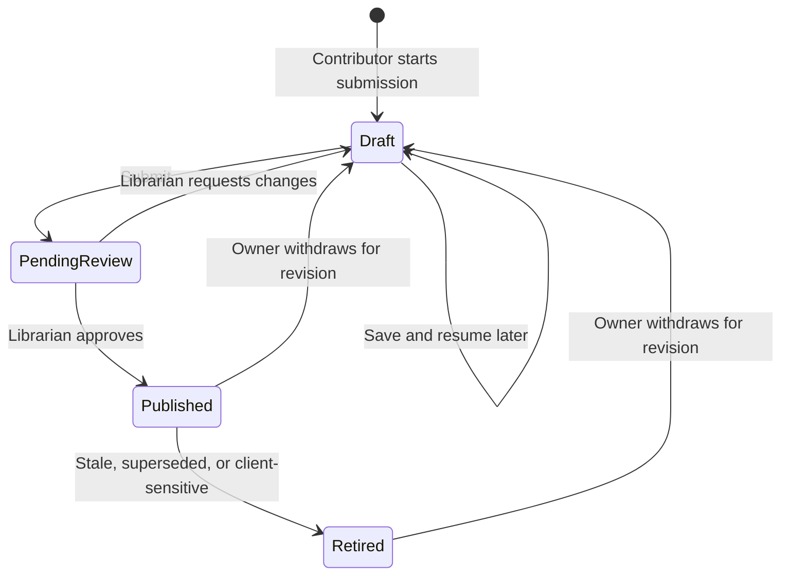

# Contribution & review workflow

**Status:** Deployed-app submission, return/revision, publication and present-mode workflow passed with one privileged account; non-admin and separate-reviewer gates remain · **Last updated:** 2026-09-22
**Source:** [End-to-end design §3.1](../design/end-to-end-design.md#31-contribution--publication) · Roles: [Contributor, Librarian](../design/end-to-end-design.md#2-users-and-roles)

## Lifecycle

**Connected implementation:** core/graph/media saves and synchronous transitions are deployed. `#/my-submissions` lists all caller-owned states; `#/submission/:id` shows persisted details/feedback; `#/submit?draft=:id` edits owned Drafts. Pending/Published/Retired records require explicit withdrawal before editing. `#/review` and `#/review/:id` require the explicit PRISMA Librarian role, not administrator status alone. Approval requires independent client-safe confirmation; return requires comments. Published shares are granted/revoked through the administrator-managed readers team. Approved additive pilot assignments now authorize Luis's Librarian queue and include Mauricio in Published Readers; existing admin privileges remain, so this is not least-privilege acceptance. The separate connected pilot is [published](../../app/README.md#pilot-deployment-2026-09-22). See [assignments and remaining gates](../architecture/security-model.md#approved-pilot-assignments).

Connected editing now follows the same six-step guided layout. Identity includes searchable contributors, Tag it uses reference chips, Media shows saved thumbnails and upload targets, and Review & submit shows the PoC card plus server-calculated total effort. Continue saves changes; Save draft & close works once the draft has an authored name and area. Core/graph operations are sequential, not one atomic transaction: a failed later operation keeps confirmed checkpoints and requires reopen before retry. Uploads remain server-mediated and may finish independently of a row transaction. Final safety confirmation is deliberately separate from the opening safety guidance. My submissions and detail/viewer reuse PoC components; reviewer queue uses matching status/search/area controls with server authorization.

Connected controls include a dedicated protected thumbnail, captions integrated with Save draft/Continue, drag/keyboard media ordering, themed upload progress, single-project selection, inline technology creation/reuse, linked assets and confirmed owner deletion. Unsaved core text and contributor/tag/project selections have user-approved tab recovery; changed server versions are never overwritten on restore and safety acknowledgment must be renewed. In-app navigation uses a themed discard confirmation. Notifications, reference-data administration and librarian content editing remain future product work. The functional lifecycle below passed; cross-account and non-admin publication/revocation tests remain release gates.

## Deployed interactive workflow

On 2026-09-22 the user requested a full interactive test from submission through final publication in the deployed **PRISMA** app (`cffbecd7-c927-474e-b6ed-6c7957ec74cb`), not Local Play. The existing production bundle `20260922t184755z2386ec2ff4` ran with the approved CSP configuration. All business operations used the rendered app controls; no direct SDK/API mutations, source substitutions or mock persistence were used.

The test solution **[PRISMA TEST] Hosted workflow 2026-09-22**, ID `3e16f641-b8b6-f111-aaac-6045bd049fba`, remains **Published** and **Client Safe Reviewed** for inspection. It has one contributor (Luis, 2.5 direct hours), AI & agents / Power Apps / IT tags, a synthetic thumbnail and screenshot, an interactive self-contained HTML demo, and a 56,310-byte captioned MP4. The internal marker `FICTIONAL-CLIENT-HOSTED-0922` is invented; a separate authored anonymous context is used in presentation. No existing submissions were edited or deleted.

| Stage | Observed result |
|---|---|
| Safety and creation | Continue disabled before opening acknowledgment. Identity, contributor effort, story and tags saved through wizard checkpoints to one draft ID. |
| Media | Thumbnail and screenshot uploaded and decoded at 960 x 600. Caption survived the following HTML upload. HTML and captioned MP4 finalized without app alerts. Small-video hashing/upload worked under the deployed CSP; compression was not triggered by this small file. |
| Save and reopen | Save draft & close returned to My submissions. Reopening retained name, summary, effort, internal/redacted context, story, caption and both attachments; opening safety acknowledgment reset. |
| Initial submission | Final Submit stayed disabled before the separate final safety confirmation. Submission entered Pending review and appeared in the librarian queue with one screenshot and two attachments; success explicitly said nothing was published. |
| Return and revision | Return disabled without comments; approval disabled without reviewer confirmation. Return with feedback restored Draft. Contributor editor showed that feedback, required fresh acknowledgment and saved the requested use-case revision. Resubmission retained feedback and showed the revision in Pending review. |
| Reviewer inspection | Saved HTML button changed Pending sample to Approved sample in the sandboxed viewer. Captioned MP4 offered full-file fallback for its extra subtitle track, then protected retrieval decoded 640 x 360 / 2 seconds with two caption cues. |
| Publication | After independent reviewer confirmation, Approve & publish succeeded. The review panel showed Published and Client review Cleared, with final comments saved. |
| Discovery and persistence | Library title search returned one result; the published `#/s/:id` detail loaded. A fresh frame reload retained the published detail and revised use case. |
| Present mode | Authored anonymous context replaced the internal marker. Review comments and individual effort detail were absent; contributor name and total 2.5 hours remained. Searching for the internal marker returned zero results; public-title search returned one. |
| Published viewers | Present-mode HTML remained interactive with `sandbox="allow-scripts"`; attempting parent DOM access was denied. Published/present MP4 full-file playback decoded with captions and, in the visible browser tab, played from zero to the ended event at 2 seconds without a media error. Audio was muted. |

HTML asset ID: `1c2c5786-b8b6-f111-aaac-6045bd049fba`. Video asset ID: `2034c28c-b8b6-f111-aaac-6045bd049fba`. Use the normal app library search to inspect the retained record; cleanup would deliberately unpublish/delete this test evidence and was not performed.

**Limits:** Luis acted as both owner and explicitly authorized Librarian while retaining administrator privileges. This is functional acceptance, not separate-identity review, cross-owner denial or effective least-privilege sharing/revocation. This pass did not test withdrawal/retirement, OS downloads, external links, large-file compression/resume, long-duration playback, audible output or the full codec/browser matrix. Keyboard Enter/Space and form filling drove actions; synthetic image/HTML Files were supplied through normal file-input change events and the existing MP4 through file selection. An integrated pointer click did not open the format selector, so full pointer acceptance is not claimed. Several automation waits used incorrect expected labels or matched nested cards; they were corrected after inspecting the actual UI without replaying completed writes. No runtime code changes, app uploads, backend deployments or permission/CSP changes were made during this workflow test.

## Verified lifecycle

On 2026-09-22 the user approved a scoped backend fix and a disposable lifecycle test in Nextant Pulse. Fixture `10a539ea-8ab6-f111-aaac-6045bd049fba` contained invented internal context, a separate anonymous description, one contributor (3.5 hours), a PNG screenshot, sandboxed HTML and a hosted link. Luis exercised both the owner and explicitly assigned Librarian roles while retaining System Administrator. This verifies workflow behavior, not separation of duties or least privilege.

- Submit entered Pending review and appeared in the queue. Return was disabled without comments; approval was disabled without reviewer confirmation.
- Return stored feedback, restored Draft, and cleared acknowledgment/clearance. The contributor editor displayed feedback; revising and resubmitting retained it and required fresh acknowledgment.
- Approval stored the revised review outcome/comments, Published state and clearance. Linked assets now validate saved fields without file-download initialization; uploaded files still verify stored byte size. The regression fix passed all 40 backend tests and was deployed with approval to the existing assembly.
- Library search found the published fixture; detail and the sandboxed HTML viewer loaded. Present mode omitted the internal marker, review feedback and individual effort while retaining anonymous context and 3.5 total hours. The integrated browser's visibility wait timed out once, but direct frame inspection confirmed the loaded demo and `sandbox="allow-scripts"`.
- Dataverse access records showed Read (`accessrightsmask=1`, inherited mask `0`) for PRISMA Published Readers on the solution, contributor, screenshot, HTML asset and hosted-link asset. Owner withdrawal returned Draft, cleared safety/clearance, removed catalogue eligibility and caused published-detail reads to fail. All five explicit and inherited share masks then read `0`; Dataverse retained the zero-mask records.
- Controlled deletion removed the fixture. Independent queries found no remaining contributor, image, demo-asset or private upload-session rows. Exactly three original drafts remain and the review queue is empty. Neither app was published; no permissions were changed during this test.

Still open: actual non-admin contributor/reader sessions, cross-owner denials, effective file/row access after revocation, separate-identity review and hosted-app acceptance. The later single-account checks below cover retirement, a small populated catalogue and additional failure paths, with explicit limitations.

## Eight-area acceptance pass

On 2026-09-22, the user requested all eight pre-pilot test areas. The main fixture `c5e69c9c-8cb6-f111-aaac-6045bd049fba` and 12 labeled `[PRISMA PERF]` solutions were created through controlled APIs. Published fixtures were temporarily readable by Published Readers. All 13 were subsequently deleted through controlled owner deletion; original drafts `046500ed-1ab6-f111-aaac-6045bd049fba`, `45dc1e23-1bb6-f111-aaac-6045bd049fba` and `595ea718-1cb6-f111-aaac-6045bd049fba` remain. Review queue is empty, and the main fixture's private sessions query returned no rows. Generated local PDF/PPTX/video/axe files were removed before production builds. No app upload, backend deployment or permission/schema changes occurred during this pass.

| Area | Result | Evidence and remaining limits |
|---|---|---|
| 1. Retirement/restoration | Passed | UI retirement removed catalogue eligibility and clearance; parent/contributor/image/thumbnail reader share masks became zero. Direct Retired-to-Approved was rejected. Owner withdrawal reset acknowledgment; fresh submit/approve restored publication. A backend regression covers the same state/version rules. |
| 2. Documents/video/thumbnail | Partial | Generated one-page PDF (974 bytes) and PPTX (45,562 bytes) round-tripped through Dataverse with exact SHA-256 matches. Image and thumbnail decoded at 640x360. Keyboard Download reached `Download started`, but no browser download event or OS-delivered file was observable. Both generated and CC0 reference WebM round-tripped exactly; playback failed with FFmpeg demuxer errors even when the reference file was loaded directly, bypassing Dataverse and the PRISMA viewer. Shared video UI now exposes an error and download fallback, verified live. Successful playback and actual file delivery require another browser. |
| 3. Failure/recovery | Partial | Upload aborted after Begin reopened as incomplete with zero received bytes; a second upload was rejected; wizard Continue stayed disabled until confirmed removal. Unsaved text survived reload and required explicit Restore. Stale recovery detected the newer server version. Lost-after-commit response/no-retry behavior and late media acknowledgment rejection have deterministic tests. An attempted live module interception did not affect the UI's module instance and is explicitly not a passed lost-response test. Actual two-hour expiry, quota exhaustion and live reload during an in-flight save remain untested. |
| 4. Two-tab concurrency | Passed | Both tabs loaded one version; Tab A saved, Tab B's stale write was rejected, edits remained visible and retries locked. Reload prevented stale backup restoration. A Pending reviewer snapshot could not approve after Tab A returned the record; reopening displayed the new Draft/feedback. Same identity in two sessions, not cross-user security acceptance. |
| 5. Populated performance | Improved/limited | Twelve published records across three areas issued 39 data requests. Sequential hydration measured 7,992 ms (UI 8,597 ms); four-record bounded batches measured 1,518 ms (settled UI 1,943 ms). Search/combined filtering measured 26-28 ms. Order, cancellation, fail-closed behavior and a maximum 12 simultaneous hydration requests are regression-tested. This is a single local warm-run comparison, not a production SLA, cold-start benchmark or 40+ record load test. N+1 request count remains. |
| 6. Accessibility/responsive | Partial | axe-core 4.10.3 reported no automated WCAG A/AA violations on light/dark library and identity form; contrast remained incomplete on translucent surfaces. Dialog initial Cancel focus, Tab containment, Escape and keyboard-opener focus restoration passed. Reduced-motion durations became 0.000001s. A 100-character unbroken title clipped; shared card/detail wrapping was fixed and mobile recheck showed no internal overflow. App content fits 365px; outer Power Apps host still overflows to 546px at 390px viewport. Screen-reader, full manual contrast and full pointer acceptance remain open. |
| 7. External launches | Persistence repaired; launch unverified | Initially the 163-character MyPortal URL failed with `0x80090429` despite 4000 metadata. Subsequent separately approved [storage repair](../architecture/technical-architecture.md#url-storage-repair) resolved the effective 100-character limit. Protected create/edit/readback now preserve the original full 230-character URL and 2000-character boundary. Direct MyPortal navigation previously loaded signed in, but keyboard launch from PRISMA still exposed no new-tab event in the integrated browser. No Power BI report URL was supplied. |
| 8. Regression coverage | Passed for added checks | Added retirement/restoration, bounded hydration/order/cancellation, committed-response loss/no retry, late media cancellation, long-title wrapping and accessible video rendering checks. Suites: 16 PoC + 38 connected + 9 rendered UI + 41 backend = 104 tests. Reusable document generator and read-only published/editable column diagnostic were added. These checks do not turn the partial/blocked rows above into passes. |

Fixture generator: `node app/scripts/generate-acceptance-fixtures.mjs <temporary-tools-directory> <output-directory>`, using isolated `pdf-lib@1.17.1` and `pptxgenjs@4.0.1`, validates PDF/ZIP structure and emits a checksum manifest. The CC0 reference video was `https://interactive-examples.mdn.mozilla.net/media/cc0-videos/flower.webm`; no external video is bundled with the app. `Prisma.Deploy ... inspect-asset-columns` reads published and editable metadata only. Do not invoke `apply` or change schema to repair the URL mismatch without approval and a platform diagnosis.

Only the **Librarian** can request publication. Production enforcement combines field security with synchronous authorized transitions, not UI affordance ([security model](../architecture/security-model.md), [ADR-0008](../architecture/decisions/adr-0008-controlled-submission-transitions.md)).

## The submission form

Guided multi-step form with draft saving at every step. **Friction budget: under 10 minutes** — beyond that, builders stop submitting and G2 fails. Steps mirror how a builder thinks about their work, not how the database is shaped:

| Step | Collects | Notes |
|---|---|---|
| 1. Before you start | Required safety acknowledgment | Replaces sharing/sample-data classifications; authorized, anonymized client-visible content; not review approval |
| 2. What is it? | Identity, maturity, contributors, internal client and anonymous context | Direct hours for ideas/prototypes; dates/allocation for demos/production. Anonymous context required if a client is supplied |
| 3. What & why | Actions/results and business value | Separate fields with examples; optional AI assistance deferred |
| 4. Tag it | Exactly one capability; searchable technologies and industries | Capability required at submit, optional in Draft. New technologies allowed with case-insensitive deduplication; other lists governed |
| 5. Media | One to six required detail images; optional thumbnail, HTML, video and one-pager/slides | Images alone suffice. Capability-specific guidance; permission-dependent formats deferred |
| 6. Review & submit | Client-visible card and summary | Revalidate safety, identity/effort, anonymous context and required images |

On submit the record moves to *Pending review*. Production will notify the librarian (Power Automate); the PoC does not. Contributors inspect and edit their records at `#/my-submissions`, with editing at `#/submit/:id`. **Save draft & close** is available at every step and permits incomplete fields without publishing or entering the review queue. Drafts open directly in the editor; pending and published records can also be edited. The library remains the first screen; no welcome page. The local librarian workspace is available at `#/review`.

In the local PoC, **My submissions** also offers deletion of the current user's saved records in any publication state. Confirmation names the record and warns that deletion is permanent; published records are also removed from the library. The IndexedDB transaction checks the stored owner before removing the complete record and its embedded media. The UI removes the card only after commit; failure leaves it available for retry. Cancellation changes nothing. This is browser-local ownership checking, not production authorization; no Dataverse deletion policy or permissions are provisioned by this feature.

Connected **My submissions** uses the same confirmation and card interaction with a separate controlled Dataverse deletion contract: caller ownership, displayed exact version, publication-share revocation and parent/child/media/session cleanup. Shared references remain intact. An uncertain response requires refresh before another attempt. Privileged Draft deletion passed both backend smoke and browser Cancel/confirm/refresh checks; all-state policy tests do not replace pending least-privilege acceptance.

Builder credit is independent of ownership. Require one or more unique people with complete effort at submit/publication; drafts may be incomplete. Direct mode requires finite nonnegative hours with at most two decimals. Calendar mode retains valid inclusive dates, 0-100% allocation with two decimals, and the applicable US holiday policy. Switching maturity preserves draft values and validates/totals only the active mode. Full contract: [schema v2](../data_model/SchemaV2.md#nx_solutioncontributor--builders-and-effort).

Saving a draft requires an authored, nonblank solution name of at most 100 characters. The save button is disabled without a valid name, and the save operation independently enforces the rule. Legacy `Untitled solution` records reopen as an empty name input and must be named before saving again. Other draft fields can remain incomplete; the temporary session text backup is separate from saved drafts. Name/summary, one capability, contributors, safety, anonymous context and images are revalidated on both submit and approve. Production uses nullable submission-only columns and omits unselected-person rows, rather than manufacturing hours or placeholder people. The PoC retains raw draft editor inputs locally; Dataverse normalization and conditional validation follow the [draft contract](../data_model/SchemaV2.md#draft-and-transition-contract).

Explicit saves persist the complete record and its media in browser-local IndexedDB. Writes must complete before showing success or leaving the editor; storage errors leave the form open for retry. Image reads and attachment reads block saving until complete. Records survive navigation and reload on the same origin/browser profile, but are not shared across devices, backed up or guaranteed against browser eviction. Clearing site data removes them. Use only non-sensitive test material.

The editor retains a separate temporary text-only session backup for new forms; it is not the saved submission and excludes media. Opening an existing record restores its last explicit save. The standalone walkthrough remains separate and does not persist submissions. No Dataverse writes or notifications occur.

The Person field searches available people by name or email, case-insensitively. Results exclude people already assigned to another contributor row. Select a result with a pointer or arrow keys followed by Enter; unmatched text is never stored as a person. Escape or leaving the field cancels the search and restores the committed selection. Selected people persist with the draft. This searches the mock people list, not a live directory.

## Editing a published record

| Change | Effect |
|---|---|
| Material — summary, business value, media, client context, contributor or effort inputs | Fresh acknowledgment; submitting returns to Pending review; saving unfinished edits returns to Draft. Both clear Client Safe Reviewed and withdraw the record from the catalogue; production librarian sees a diff |
| Trivial — typo in library notes | Stays *Published* |

## Review (librarian side)

The PoC queue provides Pending review, Changes requested and Published filters, text search and specialization filtering. Inspect a record at `#/review/:id`; attachments use `#/review/:id/demo/:assetId` and return to review when closed. Approval requires full validation and explicit client-safe confirmation. Returning requires nonblank comments and moves the record to Draft with both safety booleans false, requiring fresh contributor acknowledgment.

Dedicated `reviewOutcome` (None / Changes requested / Approved) and `reviewComments` (maximum 4000 characters) map to Solution columns; Library Notes remain separate editorial content. Contributor saves preserve the last stored outcome/comments and cannot overwrite them. Resubmission retains the last decision but moves the row into Pending review; Changes requested filtering requires both Draft and that outcome. Approval replaces outcome/comments, clearing old comments when approval supplies none. These fields are latest feedback only, not an audit history.

Legacy browser records carrying the former `changesRequested` envelope key are normalized on load. Their feedback is copied from Library Notes without deleting the original notes; unmarked notes are not assumed to be feedback. The new shape persists on the next explicit save. No live Dataverse migration occurs.

Approval adds the local record to the published catalogue. Return comments appear in My submissions and the editor. The queue is a simulated librarian surface available to local evaluators, not role enforcement. Production authorization still requires Dataverse security. Present mode blocks review and contributor routes and removes internal notes before rendering published records.

Detailed steps in the [librarian runbook](../operations/librarian-runbook.md). At review the librarian enforces:

- New submissions have at least one detail image. Images alone are sufficient, with optional other supported media.
- Safety acknowledgment is present and all client-visible content is authorized and anonymized; client identity remains internal.
- Uploaded HTML files are reviewed before publication (sandboxing is defence in depth, not a substitute).
- Entry quality — no half-finished entries or internal snark reach a client screen.
- At least one unique builder with valid effort for the maturity-selected mode. Only the librarian sets Client Safe Reviewed; acknowledgment never grants clearance.
