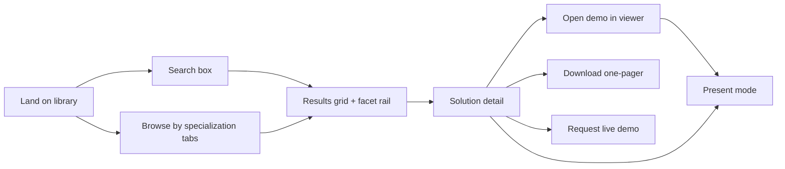

# Discovery & presentation — the CSM hero flow

**Status:** Aligned with client-safe review and maturity-based effort · **Last updated:** 2026-09-21
**Source:** [End-to-end design §3.2](../design/end-to-end-design.md#32-discovery--presentation-the-csm-path)
**Measure:** problem statement → presentable demo in **under two minutes**, unaided (G1). Anything that adds a click to this path needs to earn it.

## Flow

## Search

- Fast and forgiving; results update as the CSM types.
- Matches across: name, summary, what-it-does, business value, all builder names, tags, and the editorial `Search Keywords` field.
- **Zero-result states** suggest relaxing the most restrictive active facet rather than showing an empty page.

## Facets

- Filter by: specialization area, capability, technology and industry; solution-status facets are planned. Present eligibility is enforced before search, not a user-selectable sharing facet.
- Additive, live counts, individually removable as chips.
- Active filter state is reflected in the URL — bookmarkable, pasteable into a Teams thread.

## Browse

For CSMs who don't yet know what they're looking for: three specialization-area tabs, each with a short framing note and a visual card grid. Cards carry a thumbnail (or generated poster), name, one-liner, specialization colour coding, status badge, and capability chips — enough to triage without clicking.

## Solution detail

The CSM's briefing document:

- What it does and business value
- Everyone who built it, with individual contact paths
- The client/context it came from
- Tags and the asset list ([demo assets](demo-assets.md))
- Total calculated effort hours, summed across contributors; not elapsed deployment time
- Per-person dates, allocation, business calendar and calculated hours, omitted in present mode ([calculation contract](../data_model/SchemaV2.md#nx_solutioncontributor--builders-and-effort))
- Internal-only content (library notes) — visible to internal viewers, **never in present mode**

From here: open the demo in the viewer, download the one-pager, [request a live demo](demo-requests.md), or enter [present mode](present-mode.md).

## PoC mapping

| Piece | File |
|---|---|
| Search | [`app/src/lib/search.ts`](../../app/src/lib/search.ts) |
| URL filter state | [`app/src/lib/router.ts`](../../app/src/lib/router.ts) |
| Grid, tabs, facets, zero-result | [`app/src/views/LibraryView.tsx`](../../app/src/views/LibraryView.tsx) |
| Detail | [`app/src/views/DetailView.tsx`](../../app/src/views/DetailView.tsx) |
