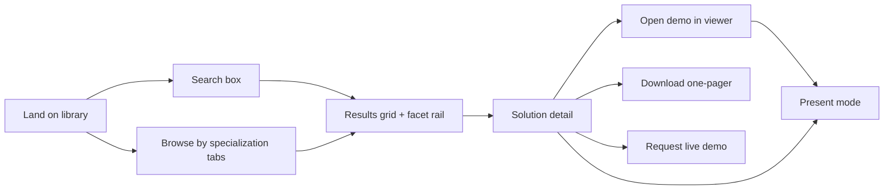

# Discovery & presentation — the CSM hero flow

**Status:** Aligned with client-safe review and minimum-hours effort; presentation download added; CSM derived from the consultant level (2026-10-08) · **Last updated:** 2026-10-08
**Source:** [End-to-end design §3.2](../design/end-to-end-design.md#32-discovery--presentation-the-csm-path)
**Measure:** problem statement → presentable demo in **under two minutes**, unaided (G1). Anything that adds a click to this path needs to earn it.

## Flow

```mermaid
flowchart LR
    A[Land on library] --> B[Search box]
    A --> C[Browse by specialization tabs]
    B --> D[Results grid + facet rail]
    C --> D
    D --> E[Solution detail]
    E --> F[Open demo in viewer]
    E --> G[Download one-pager]
    E --> H[Request live demo]
    F --> I[Present mode]
    E --> I
```

## Search

- Fast and forgiving; results update as the CSM types.
- Matches across: name, summary, what-it-does, business value, all builder names, tags, and the editorial `Search Keywords` field.
- **Zero-result states** suggest relaxing the most restrictive active facet rather than showing an empty page.

## Facets

- Filter by: specialization area, capability, technology and industry; solution-status facets are planned. Present eligibility is enforced before search, not a user-selectable sharing facet.
- Additive, live counts, individually removable as chips.
- Active filter state is reflected in the in-app URL hash. In the published app the player hides that hash, so views are shared as play links carrying `?route=` ([ADR-0003](../architecture/decisions/adr-0003-hash-routing.md)); solution detail pages have **Copy link**.

## Browse

For CSMs who don't yet know what they're looking for: three specialization-area tabs, each with a short framing note and a visual card grid. Cards carry a thumbnail (or generated poster), name, one-liner, specialization colour coding, status badge, and capability chips — enough to triage without clicking.

## Solution detail

The CSM's briefing document:

- What it does and business value
- Everyone who built it, with individual contact paths
- The client/context it came from
- Tags and the asset list ([demo assets](demo-assets.md))
- Total calculated effort hours, summed across contributors; not elapsed deployment time
- Per-person minimum hours and total effort, omitted in present mode ([effort contract](../data_model/SchemaV2.md#nx_solutioncontributor--builders-and-effort))
- Internal-only content (library notes) — visible to internal viewers, **never in present mode**

From here: open the demo in the viewer, download the one-pager, download a presentation, [request a live demo](demo-requests.md), or enter [present mode](present-mode.md).

### Download presentation

Connected PRISMA only. **Download presentation** sits beside Copy link on a published solution and builds a six-slide PRISMA × Nextant `.pptx` from the solution's own fields; the CSM picks the Dark or Light template. Field-to-slide mapping and limits: [`tools/pptx-template/PRISMA_Field_Map.md`](../../tools/pptx-template/PRISMA_Field_Map.md).

- Offered only for published solutions with Client review = Cleared, and never in present mode.
- Never exports effort hours, builder names, estimated cost, projects or library notes. The CSM (the contributor whose consultant-directory level, `cr6b0_consultantlevel`, names customer success) is the only person named, with the presenter (the signed-in user).
- Built in the browser: the deck module, JSZip and the chosen template load only on click, so the hero flow carries no extra weight. Images come through the protected media path; WebP/AVIF are redrawn as PNG.
- Text that would overflow its fixed box shrinks (down to 60% of the template size).
- Every slide carries speaker notes built from the same fields; slide 5's notes list each demo's full link to paste if a button does not open. The slide 6 chip shows the solution name and links the full, untruncated PRISMA URL.
- Slide 5 lists demo videos (up to 3), interactive demos (up to 2) and supporting material (up to 3) in columns; a kind with nothing is dropped and the rest share the width.
- Each row's button says what it does: Play (video), Open (HTML, links) or Download (any other file). A file is never linked directly, since that would put a storage URL in the deck; its link opens the PRISMA viewer with `?download=1`, which starts the download once on arrival (the viewer's Download button stays for a blocked one).
- Demo rows link back to the demo in PRISMA, so they need a Nextant sign-in; the deck is for presenting live, not for sending to clients as a standalone demo. Demo titles use the caption or the file name without its extension until a title field exists ([Q19](../delivery/decision-log.md)).

## PoC mapping

| Piece | File |
|---|---|
| Search | [`app/src/lib/search.ts`](../../app/src/lib/search.ts) |
| URL filter state | [`app/src/lib/router.ts`](../../app/src/lib/router.ts) |
| Grid, tabs, facets, zero-result | [`app/src/views/LibraryView.tsx`](../../app/src/views/LibraryView.tsx) |
| Detail | [`app/src/views/DetailView.tsx`](../../app/src/views/DetailView.tsx) |
